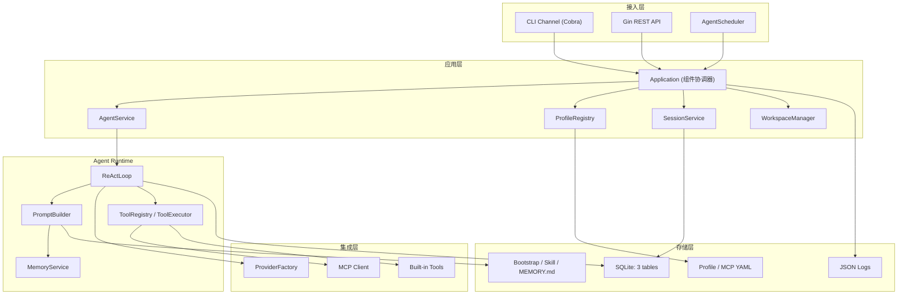
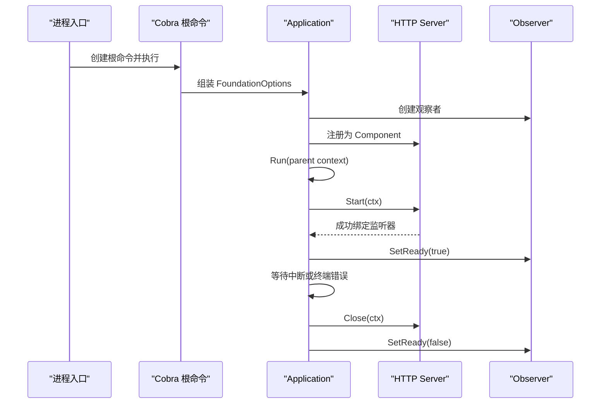
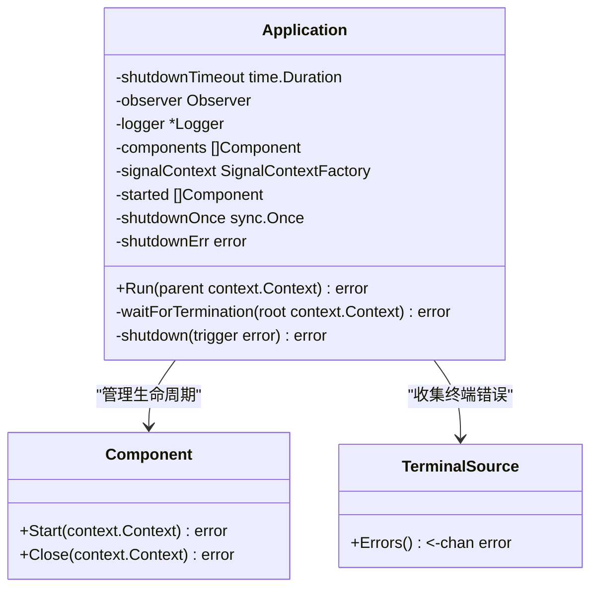
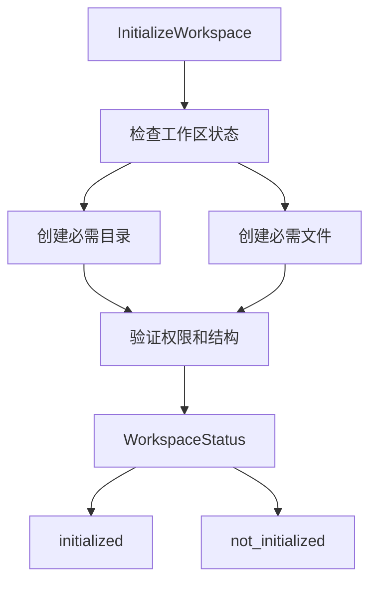
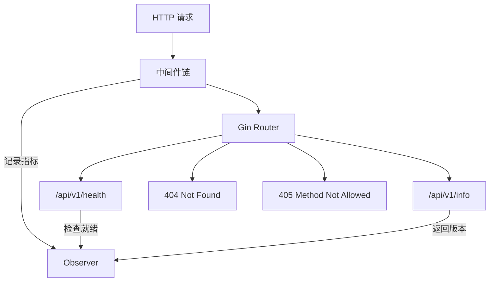
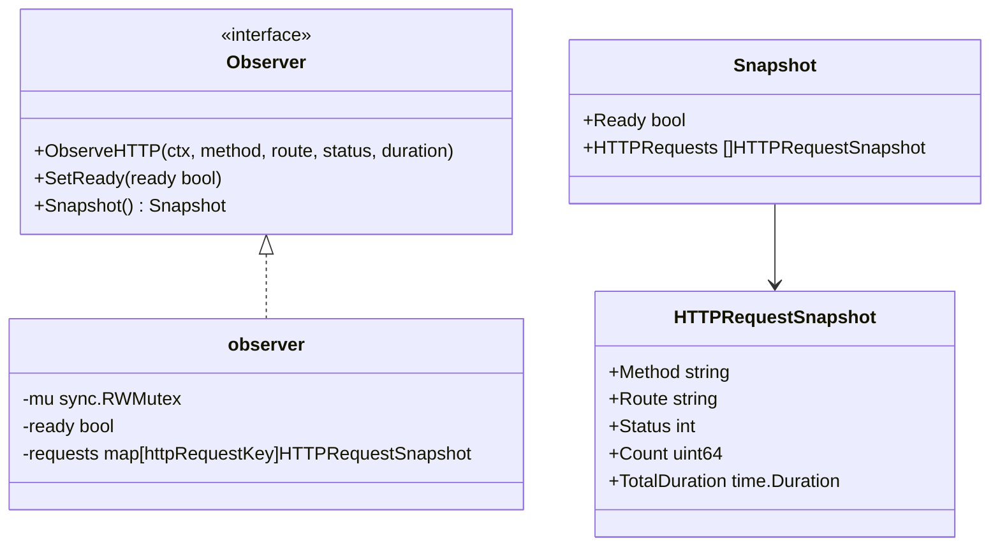
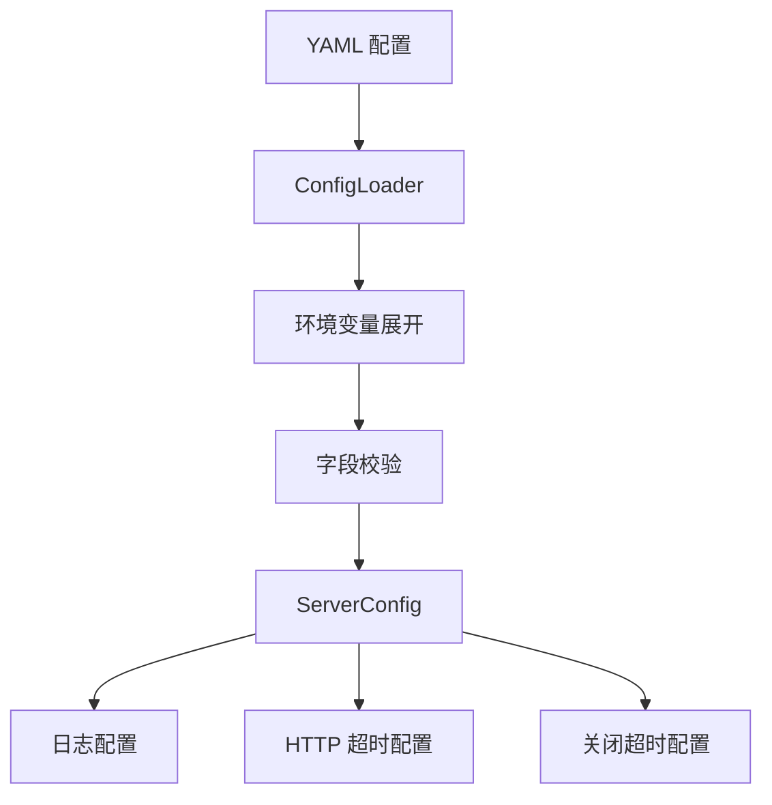
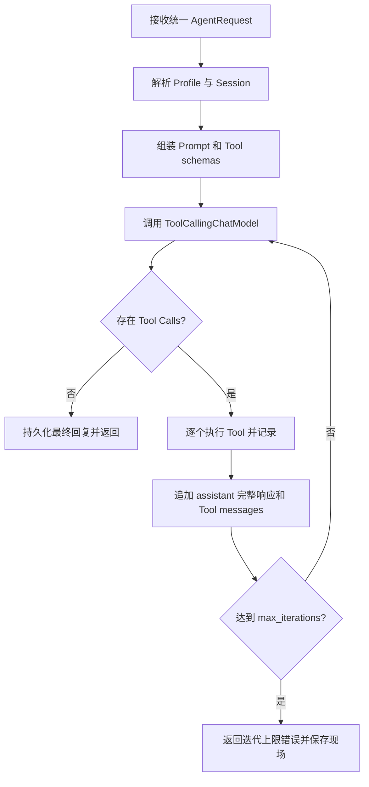
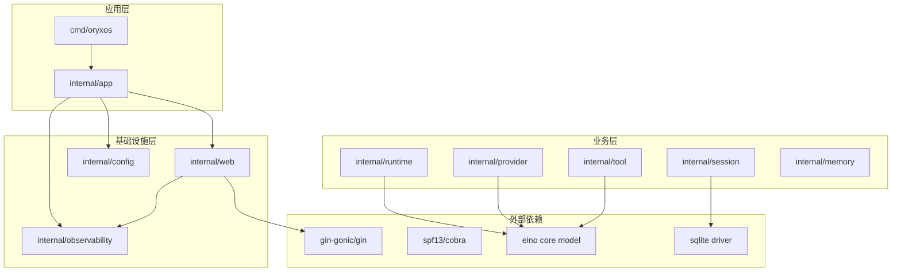

# OryxOS 架构概述

<cite>
**本文引用的文件**   
- [main.go](file://cmd/oryxos/main.go)
- [root.go](file://cmd/oryxos/root.go)
- [commands.go](file://cmd/oryxos/commands.go)
- [workspace.go](file://cmd/oryxos/workspace.go)
- [application.go](file://internal/app/application.go)
- [foundation.go](file://internal/app/foundation.go)
- [config.go](file://internal/config/config.go)
- [server.go](file://internal/web/server.go)
- [component.go](file://internal/web/component.go)
- [handlers.go](file://internal/web/handlers.go)
- [observer.go](file://internal/observability/observer.go)
- [TechnicalSolution.md](file://docs/TechnicalSolution.md)
- [第17节：ReAct 原理解析、实现与代码讲解.md](file://docs/class/第17节：ReAct 原理解析、实现与代码讲解.md)
</cite>

## 更新摘要
**所做更改**
- 增强了应用生命周期管理，引入组件化架构设计
- 改进了CLI命令结构，使用Cobra框架构建完整的命令树
- 添加了全面的Workspace管理系统，支持工作区初始化和状态检查
- 详细描述了新的Application结构体，负责组件注册、协调启动/关闭和终端错误处理
- 更新了架构图表以反映新的组件化设计

## 架构目标与约束

OryxOS 是用 Go 1.26 实现的面向企业场景的 Agent OS，部署在企业自有 K8s、服务器或虚拟机上，作为统一底座运行多个业务 Agent。核心阶段交付的是 Agent OS 的运行时内核，不是治理能力完备的企业平台；多租户、SSO、RBAC、完整审计、Provider fallback、多 IM Channel 和集群高可用属于扩展阶段。

核心阶段的技术决策包括：自实现 ReAct Loop、以 Eino core `model.ToolCallingChatModel` 为运行时边界、Provider 工厂按厂商映射、Agent = Profile + Skill、调用记录 Day One 写入、Sandbox 是统一应用层校验。首批能力固定为 2 个 Provider、9 个内置 Tool、10 个 REST 端点、12 个 CLI 命令、3 张 SQLite 核心表和 2 个验收 Demo。

这些约束决定了系统必须保持轻量、可观测、可测试，并通过清晰的入口把 CLI、Web Service 和定时调度统一到 Agent 执行链路中。

**章节来源**
- [TechnicalSolution.md:7-45](file://docs/TechnicalSolution.md#L7-L45)

## 逻辑分层

OryxOS 采用"接入层 → 应用层 → Agent Runtime → 集成层 → 存储层"的分层结构，确保职责清晰、依赖方向稳定。

**图表来源**
- [TechnicalSolution.md:48-103](file://docs/TechnicalSolution.md#L48-L103)

### 启动与生命周期

进程入口位于 `cmd/oryxos/main.go`，通过 Cobra 构建根命令树，并调用 `Application.Run` 管理组件生命周期。`Application` 负责按注册顺序启动组件、监听终止信号、收集终端错误，并按逆序关闭已启动组件。

**新增** 引入了组件化架构，所有服务组件都实现统一的 `Component` 接口，由 Application 统一管理其生命周期。

**图表来源**
- [main.go:8-13](file://cmd/oryxos/main.go#L8-L13)
- [root.go:22-46](file://cmd/oryxos/root.go#L22-L46)
- [application.go:35-99](file://internal/app/application.go#L35-L99)
- [foundation.go:25-56](file://internal/app/foundation.go#L25-L56)
- [server.go:29-71](file://internal/web/server.go#L29-L71)
- [component.go:31-75](file://internal/web/component.go#L31-L75)

**章节来源**
- [main.go:8-13](file://cmd/oryxos/main.go#L8-L13)
- [root.go:22-46](file://cmd/oryxos/root.go#L22-L46)
- [application.go:19-99](file://internal/app/application.go#L19-L99)
- [foundation.go:15-63](file://internal/app/foundation.go#L15-L63)
- [server.go:18-71](file://internal/web/server.go#L18-L71)
- [component.go:20-117](file://internal/web/component.go#L20-L117)

## 核心组件

### Application：进程级生命周期协调器

`Application` 是所有组件的统一编排者。它维护组件列表、记录已启动组件、监听进程信号，并在退出时按逆序关闭组件。任何实现 `Component` 接口的组件都必须提供 `Start` 和 `Close`，可选实现 `TerminalSource` 来上报非正常服务错误。

**增强** 新增了终端错误处理机制，通过 `TerminalSource` 接口收集组件的非正常服务错误，实现优雅的错误传播和处理。

**图表来源**
- [application.go:19-48](file://internal/app/application.go#L19-L48)
- [application.go:68-179](file://internal/app/application.go#L68-L179)

**章节来源**
- [application.go:19-179](file://internal/app/application.go#L19-L179)

### Workspace Manager：工作区管理系统

**新增** Workspace Manager 提供了完整的工作区初始化和管理功能，确保项目结构的完整性和一致性。

**图表来源**
- [workspace.go:72-137](file://cmd/oryxos/workspace.go#L72-L137)

**章节来源**
- [workspace.go:1-305](file://cmd/oryxos/workspace.go#L1-L305)

### Web Server：HTTP 接入与中间件链

Web 层基于 Gin 构建，提供统一的请求 ID、请求体大小限制、访问观察、恢复中间件，以及 `/api/v1/health` 和 `/api/v1/info` 基础端点。Server 实现了 `Component` 接口，由 `Application` 统一管理启动和关闭。

**图表来源**
- [server.go:29-71](file://internal/web/server.go#L29-L71)
- [handlers.go:21-39](file://internal/web/handlers.go#L21-L39)
- [observer.go:10-87](file://internal/observability/observer.go#L10-L87)

**章节来源**
- [server.go:1-82](file://internal/web/server.go#L1-L82)
- [handlers.go:1-40](file://internal/web/handlers.go#L1-L40)
- [component.go:31-117](file://internal/web/component.go#L31-L117)

### Observer：进程内可观测性

`Observer` 提供无导出表面的进程内可观测性，记录 HTTP 请求统计和服务就绪状态。它支持并发安全地聚合请求指标，并提供快照接口供健康检查和信息端点使用。

**图表来源**
- [observer.go:10-87](file://internal/observability/observer.go#L10-L87)

**章节来源**
- [observer.go:1-87](file://internal/observability/observer.go#L1-L87)

### Configuration：进程级配置加载

配置模块定义服务器运行时参数，包括监听地址、日志格式、超时设置等。配置通过 YAML 加载，支持环境变量展开，并在启动时进行严格校验。

**图表来源**
- [config.go:6-39](file://internal/config/config.go#L6-L39)
- [foundation.go:25-63](file://internal/app/foundation.go#L25-L63)

**章节来源**
- [config.go:1-39](file://internal/config/config.go#L1-L39)
- [foundation.go:25-63](file://internal/app/foundation.go#L25-L63)

### ReAct Runtime：Agent 执行核心

根据技术方案文档，ReAct Runtime 是 OryxOS 的核心执行引擎，包含 AgentService、ReActLoop、PromptBuilder、ToolRegistry、ToolExecutor 和 SessionService 等模块。它驱动 LLM 与工具的循环交互，直到获得最终回复或达到迭代上限。

**图表来源**
- [TechnicalSolution.md:259-273](file://docs/TechnicalSolution.md#L259-L273)

**章节来源**
- [TechnicalSolution.md:246-311](file://docs/TechnicalSolution.md#L246-L311)
- [第17节：ReAct 原理解析、实现与代码讲解.md:1-117](file://docs/class/第17节：ReAct 原理解析、实现与代码讲解.md#L1-L117)

## 依赖关系

OryxOS 的依赖关系遵循明确的层次结构和导入边界，确保运行时只依赖稳定的统一接口。

**图表来源**
- [go.mod:1-10](file://go.mod#L1-L10)
- [TechnicalSolution.md:144-168](file://docs/TechnicalSolution.md#L144-L168)

### 关键依赖约束

1. **Eino 边界**：运行时只依赖 Eino core 的稳定接口，不直接暴露 Eino-ext 具体类型
2. **Provider 隔离**：Provider 工厂封装厂商特定实现，上层只看到统一模型接口
3. **存储抽象**：通过 GORM 和纯 Go SQLite 驱动实现跨平台单二进制部署
4. **Web 框架**：Gin 提供轻量高效的 HTTP 处理能力
5. **CLI 框架**：Cobra 支持完整的命令树和子命令组织

**章节来源**
- [go.mod:1-10](file://go.mod#L1-L10)
- [TechnicalSolution.md:144-168](file://docs/TechnicalSolution.md#L144-L168)

## 设计原则

### 1. 运行时边界清晰

OryxOS 明确划分了不同层次的职责边界：

- **运行时边界**：Eino core 是运行时边界，上层不直接依赖具体实现
- **Provider 边界**：Provider 工厂按厂商映射，封装厂商特定细节
- **工具边界**：ToolRegistry 和 ToolExecutor 统一管理工具发现和执行
- **存储边界**：Session、LLM 调用、工具调用记录通过统一 Store 接口访问

### 2. 组件化架构

**新增** 采用组件化设计模式，所有服务组件都实现统一的 `Component` 接口：

- **统一接口**：`Start` 和 `Close` 方法定义组件生命周期
- **集中管理**：`Application` 负责组件的注册、启动和关闭
- **错误传播**：通过 `TerminalSource` 接口实现组件错误向上传播
- **优雅降级**：单个组件失败不影响其他组件正常运行

### 3. 配置即行为

Profile YAML 是运行时配置的唯一来源，定义了 Agent 的行为模式：

- **Profile = 怎么运行**：配置模型、工具、Skill、Bootstrap、Channel 和定时规则
- **Skill = 做什么**：描述业务任务、适用时机和操作方式
- **配置验证**：启动阶段完成所有配置校验，避免运行时错误
- **热重载**：核心阶段通过重启生效，不实现在线热替换

### 4. 可观测性优先

从第一天开始就建立完整的可观测性体系：

- **结构化日志**：使用 `log/slog` JSON Handler，便于后续接入日志平台
- **请求追踪**：每个 HTTP 请求都有唯一 request_id，贯穿整个处理链路
- **性能指标**：Observer 记录 HTTP 请求统计和服务就绪状态
- **调用审计**：每次模型调用和工具执行都记录到数据库

### 5. 安全沙箱机制

Sandbox 是统一的应用层校验机制，不是容器隔离：

- **路径白名单**：文件操作必须在允许目录范围内
- **命令白名单**：shell 命令需要预定义白名单
- **URL 白名单**：HTTP 请求的目标域名需要白名单控制
- **资源限制**：所有外部调用都有超时和输入输出大小限制

### 6. 渐进式扩展

核心阶段聚焦最小可行产品，扩展能力预留接口：

- **核心阶段**：2 个 Provider、9 个内置 Tool、10 个 REST 端点、12 个 CLI 命令
- **扩展阶段**：多租户、SSO、RBAC、完整审计、Provider fallback、多 IM Channel
- **向后兼容**：新特性通过插件机制添加，不影响现有功能
- **配置演进**：Profile 结构支持新增字段，保持向后兼容

### 7. 错误处理策略

系统采用一致的错误处理模式：

- **配置错误**：启动阶段失败，返回明确字段路径
- **运行时错误**：区分可重试和不可重试错误
- **网络错误**：统一归一化为标准错误类型
- **优雅降级**：部分功能失败不影响整体服务可用性

### 8. Workspace 管理

**新增** 提供完整的工作区管理功能：

- **标准化结构**：强制的项目目录结构和文件权限
- **原子操作**：使用临时文件和链接确保文件操作的原子性
- **状态检查**：提供工作区状态检测和维护功能
- **安全验证**：防止符号链接攻击和不安全的文件操作

这些设计原则确保了 OryxOS 在保持简洁的同时，具备足够的灵活性和扩展性来适应企业级应用场景的需求。