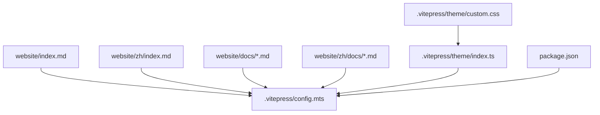
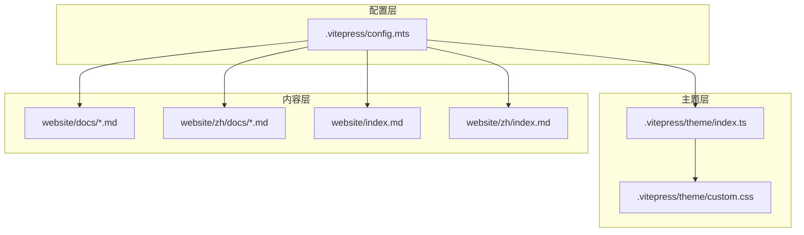
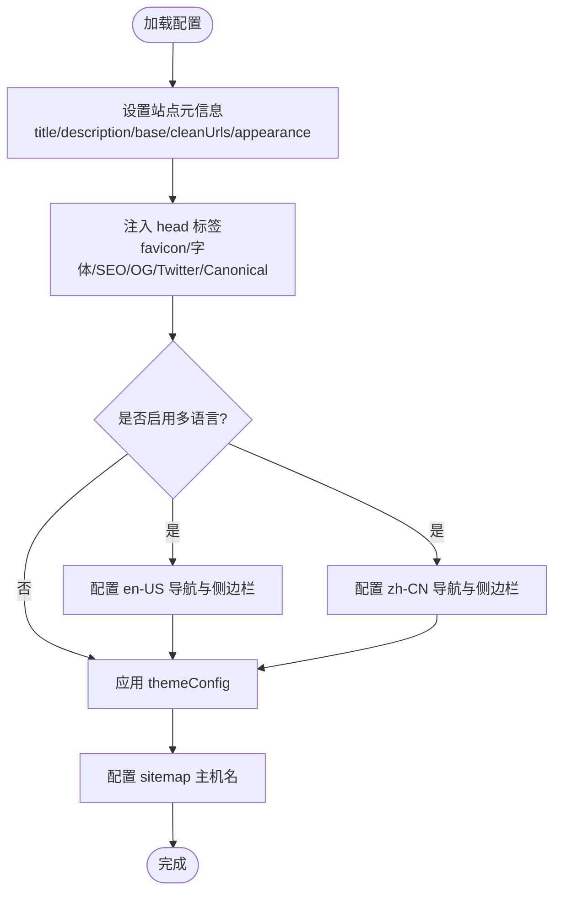
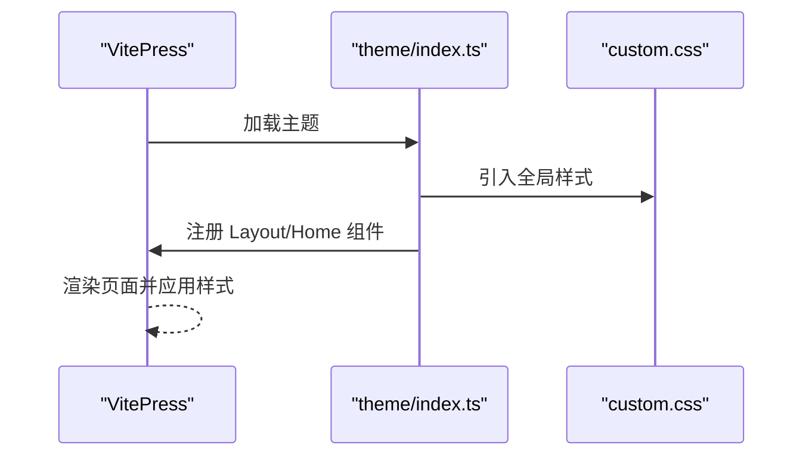
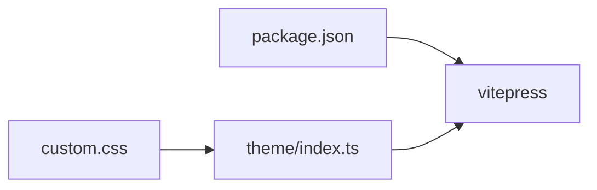

# VitePress 文档网站

<cite>
**本文引用的文件**
- [website/package.json](file://website/package.json)
- [website/.vitepress/config.mts](file://website/.vitepress/config.mts)
- [website/index.md](file://website/index.md)
- [website/zh/index.md](file://website/zh/index.md)
- [website/docs/what.md](file://website/docs/what.md)
- [website/docs/architecture.md](file://website/docs/architecture.md)
- [website/docs/quick-start.md](file://website/docs/quick-start.md)
- [website/zh/docs/what.md](file://website/zh/docs/what.md)
- [website/.vitepress/theme/index.ts](file://website/.vitepress/theme/index.ts)
- [website/.vitepress/theme/custom.css](file://website/.vitepress/theme/custom.css)
</cite>

## 目录
1. [简介](#简介)
2. [项目结构](#项目结构)
3. [核心组件](#核心组件)
4. [架构总览](#架构总览)
5. [详细组件分析](#详细组件分析)
6. [依赖关系分析](#依赖关系分析)
7. [性能与构建特性](#性能与构建特性)
8. [故障排查指南](#故障排查指南)
9. [结论](#结论)
10. [附录](#附录)

## 简介
本仓库包含一个基于 VitePress 的 OryxOS 文档站点，提供英文与中文双语内容，覆盖“是什么/为什么/快速开始/架构/ReAct Loop/Provider/Memory/Tool/API/CLI/Profile/路线图”等主题。站点采用深色主题、固定导航与侧边栏分组，并通过多语言配置实现路由与文案切换。

## 项目结构
站点位于 website 目录下，使用 VitePress 作为静态站点生成器，通过 .vitepress 目录进行配置与主题定制，docs 与 zh/docs 分别存放英文与中文文档，根级 index.md 与 zh/index.md 为各语言首页入口。

图表来源
- [website/.vitepress/config.mts:1-140](file://website/.vitepress/config.mts#L1-L140)
- [website/.vitepress/theme/index.ts:1-13](file://website/.vitepress/theme/index.ts#L1-L13)
- [website/.vitepress/theme/custom.css:1-278](file://website/.vitepress/theme/custom.css#L1-L278)
- [website/package.json:1-13](file://website/package.json#L1-L13)

章节来源
- [website/package.json:1-13](file://website/package.json#L1-L13)
- [website/.vitepress/config.mts:1-140](file://website/.vitepress/config.mts#L1-L140)

## 核心组件
- 站点配置：定义标题、描述、基础路径、SEO 元信息、多语言导航与侧边栏、主题配置与站点地图。
- 主题扩展：继承默认主题，注册自定义布局与首页组件，注入全局样式。
- 文档内容：按功能域组织 Markdown，中英对照，便于读者从入门到深入理解 OryxOS。
- 脚本命令：开发、构建与预览三件套，便于本地迭代与发布。

章节来源
- [website/.vitepress/config.mts:1-140](file://website/.vitepress/config.mts#L1-L140)
- [website/.vitepress/theme/index.ts:1-13](file://website/.vitepress/theme/index.ts#L1-L13)
- [website/.vitepress/theme/custom.css:1-278](file://website/.vitepress/theme/custom.css#L1-L278)
- [website/package.json:1-13](file://website/package.json#L1-L13)

## 架构总览
VitePress 站点由“配置层 + 主题层 + 内容层”构成。配置层负责站点元数据、多语言路由与导航；主题层负责 UI 行为与样式；内容层以 Markdown 形式承载技术文档。构建时生成静态资源并输出至部署目录。

图表来源
- [website/.vitepress/config.mts:1-140](file://website/.vitepress/config.mts#L1-L140)
- [website/.vitepress/theme/index.ts:1-13](file://website/.vitepress/theme/index.ts#L1-L13)
- [website/.vitepress/theme/custom.css:1-278](file://website/.vitepress/theme/custom.css#L1-L278)
- [website/index.md:1-8](file://website/index.md#L1-L8)
- [website/zh/index.md:1-8](file://website/zh/index.md#L1-L8)

## 详细组件分析

### 站点配置（config.mts）
- 站点元信息：标题、模板、描述、基础路径、URL 清理策略、外观模式。
- SEO 与社交分享：head 中注入图标、字体预连接、作者、关键词、OG/Twitter 卡片与规范链接。
- 多语言：root 与 zh 两套 locales，各自维护导航与侧边栏分组，统一映射到 /docs 与 /zh/docs。
- 主题配置：站点 Logo、社交链接、站点地图主机名。

图表来源
- [website/.vitepress/config.mts:1-140](file://website/.vitepress/config.mts#L1-L140)

章节来源
- [website/.vitepress/config.mts:1-140](file://website/.vitepress/config.mts#L1-L140)

### 主题扩展（index.ts + custom.css）
- 主题扩展：继承默认主题，注册 Layout 与 Home 组件，挂载全局组件。
- 样式定制：深色背景、品牌色、导航/侧边栏高亮、代码块与表格样式、隐藏默认 Hero/Footer 等。

图表来源
- [website/.vitepress/theme/index.ts:1-13](file://website/.vitepress/theme/index.ts#L1-L13)
- [website/.vitepress/theme/custom.css:1-278](file://website/.vitepress/theme/custom.css#L1-L278)

章节来源
- [website/.vitepress/theme/index.ts:1-13](file://website/.vitepress/theme/index.ts#L1-L13)
- [website/.vitepress/theme/custom.css:1-278](file://website/.vitepress/theme/custom.css#L1-L278)

### 首页与多语言入口
- 英文首页：使用 home 布局与自定义 Home 组件。
- 中文首页：同构布局，文案本地化。
- 路由：通过 locales 配置将 / 与 /zh/ 指向对应首页。

章节来源
- [website/index.md:1-8](file://website/index.md#L1-L8)
- [website/zh/index.md:1-8](file://website/zh/index.md#L1-L8)
- [website/.vitepress/config.mts:30-125](file://website/.vitepress/config.mts#L30-L125)

### 文档内容与导航
- 英文文档：what/why/quick-start/architecture/react-loop/provider/memory/tool/api/cli/profile/roadmap。
- 中文文档：what/quick-start/architecture/react-loop/provider/memory/tool/api/cli/profile/roadmap（部分页面待补充）。
- 导航与侧边栏：在 config.mts 中集中维护，保证中英文一致的结构与层级。

章节来源
- [website/.vitepress/config.mts:30-125](file://website/.vitepress/config.mts#L30-L125)
- [website/docs/what.md:1-68](file://website/docs/what.md#L1-L68)
- [website/docs/architecture.md:1-68](file://website/docs/architecture.md#L1-L68)
- [website/docs/quick-start.md:1-133](file://website/docs/quick-start.md#L1-L133)
- [website/zh/docs/what.md:1-68](file://website/zh/docs/what.md#L1-L68)

## 依赖关系分析
- 运行时依赖：VitePress 作为唯一依赖，提供构建与开发能力。
- 脚本命令：dev/build/preview 三个命令，分别用于本地开发、生产构建与预览。
- 主题与样式：通过 theme/index.ts 引入自定义样式与组件，形成对默认主题的增强。

图表来源
- [website/package.json:1-13](file://website/package.json#L1-L13)
- [website/.vitepress/theme/index.ts:1-13](file://website/.vitepress/theme/index.ts#L1-L13)
- [website/.vitepress/theme/custom.css:1-278](file://website/.vitepress/theme/custom.css#L1-L278)

章节来源
- [website/package.json:1-13](file://website/package.json#L1-L13)

## 性能与构建特性
- 构建产物：通过 docs:build 生成静态站点，适合 CDN 托管或 Nginx/Apache 直接部署。
- 多语言路由：通过 base 与 locales 控制 URL 前缀与语言切换，利于 SEO 与缓存策略。
- 主题优化：禁用暗色切换、固定深色背景，减少运行时状态切换开销；预连接 Google Fonts 提升字体加载速度。
- 站点地图：配置 hostname，便于搜索引擎抓取。

[本节为通用指导，不直接分析具体文件]

## 故障排查指南
- 无法启动开发服务器
  - 检查 Node 版本与依赖安装是否完整。
  - 确认 package.json 中的 scripts 是否正确执行。
- 页面空白或样式异常
  - 检查 theme/index.ts 是否正确引入 custom.css。
  - 确认 CSS 变量与选择器未冲突。
- 多语言路由不生效
  - 核对 locales 配置中的 root 与 zh 的 link 与 lang。
  - 确保 docs 与 zh/docs 下的文件命名与链接一致。
- SEO 与社交分享无效
  - 检查 head 中 meta 标签与 canonical 链接是否正确。
  - 确认部署域名与 sitemap hostname 一致。

章节来源
- [website/package.json:1-13](file://website/package.json#L1-L13)
- [website/.vitepress/theme/index.ts:1-13](file://website/.vitepress/theme/index.ts#L1-L13)
- [website/.vitepress/theme/custom.css:1-278](file://website/.vitepress/theme/custom.css#L1-L278)
- [website/.vitepress/config.mts:1-140](file://website/.vitepress/config.mts#L1-L140)

## 结论
该 VitePress 文档站点结构清晰、主题风格统一、多语言支持完善，能够高效支撑 OryxOS 的技术传播与用户上手。后续可考虑补充更多中文页面、增加搜索与全文检索、接入评论系统与版本化文档分支，以提升阅读体验与维护效率。

[本节为总结性内容，不直接分析具体文件]

## 附录
- 常用命令
  - 开发：npm run docs:dev
  - 构建：npm run docs:build
  - 预览：npm run docs:preview
- 关键路径
  - 站点配置：website/.vitepress/config.mts
  - 主题入口：website/.vitepress/theme/index.ts
  - 全局样式：website/.vitepress/theme/custom.css
  - 英文文档：website/docs/*.md
  - 中文文档：website/zh/docs/*.md

章节来源
- [website/package.json:1-13](file://website/package.json#L1-L13)
- [website/.vitepress/config.mts:1-140](file://website/.vitepress/config.mts#L1-L140)
- [website/.vitepress/theme/index.ts:1-13](file://website/.vitepress/theme/index.ts#L1-L13)
- [website/.vitepress/theme/custom.css:1-278](file://website/.vitepress/theme/custom.css#L1-L278)