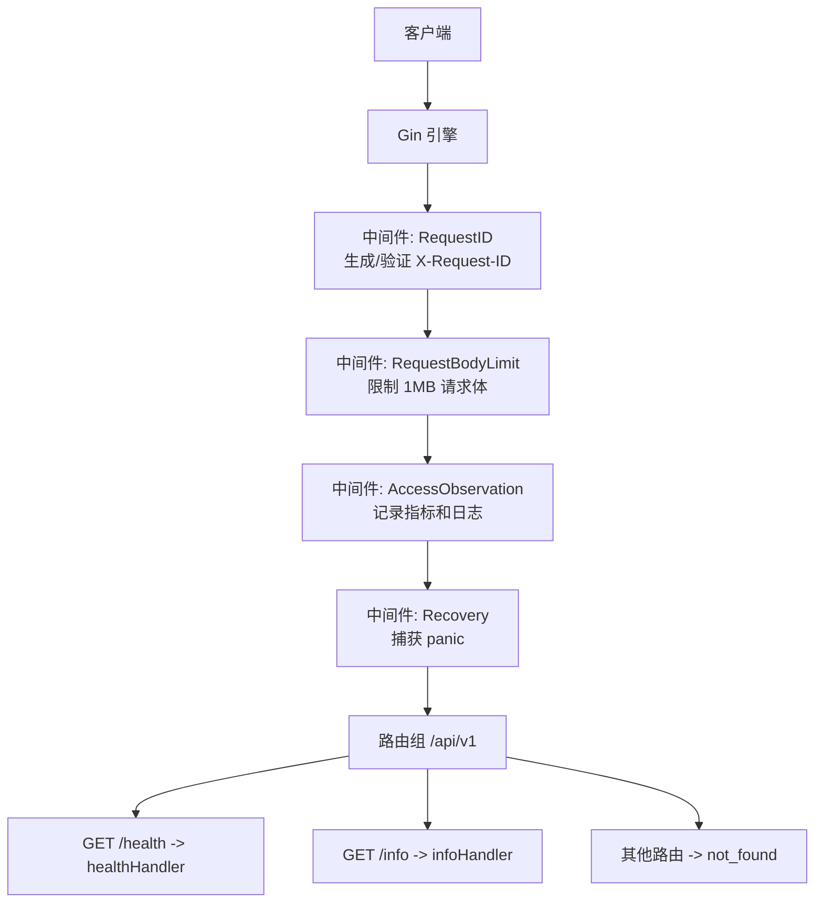
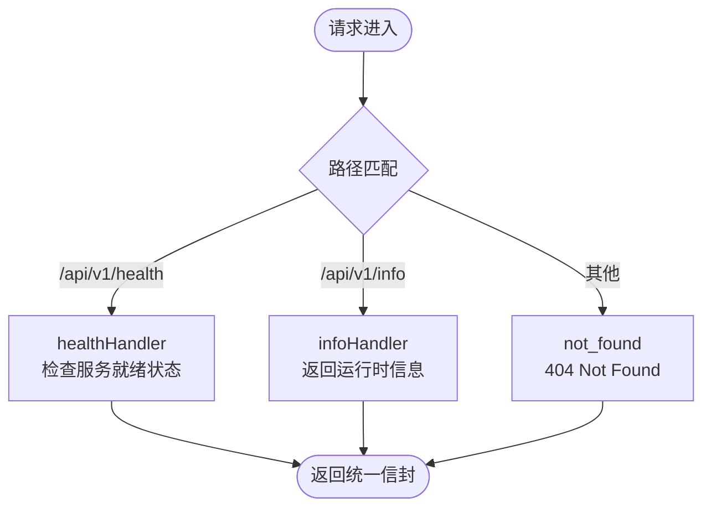
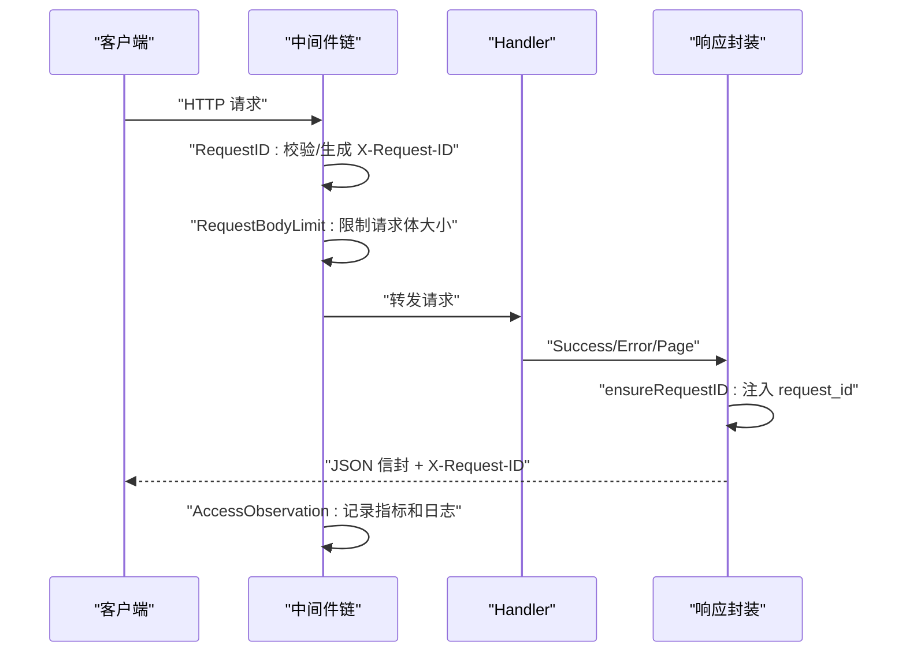
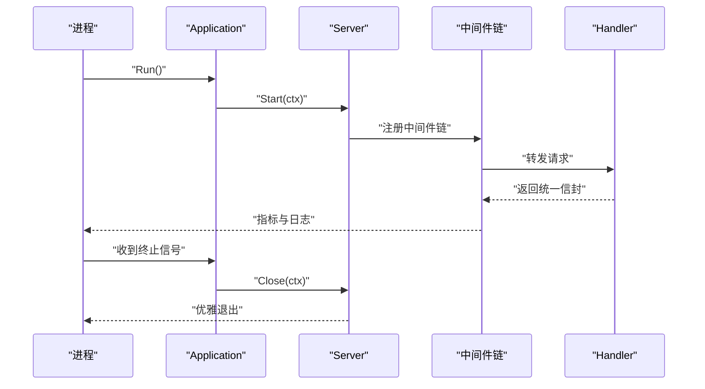

# Web Service API

<cite>
**本文引用的文件**
- [server.go](file://internal/web/server.go)
- [handlers.go](file://internal/web/handlers.go)
- [component.go](file://internal/web/component.go)
- [result.go](file://internal/web/api/result.go)
- [pagination.go](file://internal/web/api/pagination.go)
- [request_id.go](file://internal/web/middleware/request_id.go)
- [access.go](file://internal/web/middleware/access.go)
- [body_limit.go](file://internal/web/middleware/body_limit.go)
- [recovery.go](file://internal/web/middleware/recovery.go)
- [application.go](file://internal/app/application.go)
- [foundation.go](file://internal/app/foundation.go)
- [ApiConvention.md](file://docs/ApiConvention.md)
- [api.md](file://website/docs/api.md)
- [api.md](file://website/zh/docs/api.md)
</cite>

## 更新摘要
**变更内容**
- 增强了 Web 服务器基础设施，采用生产就绪的 Gin 框架实现
- 添加了全面的中间件栈：请求 ID 生成、请求体大小限制、访问观测与日志、统一恢复机制
- 详细覆盖了健康检查 (`/api/v1/health`) 和信息端点 (`/api/v1/info`) 的实现细节
- 更新了架构图表以反映实际的中间件处理流程和响应封装机制

## 目录
- Handler 结构
- 核心阶段 10 个端点
- API 约定
- 业务系统集成场景

## Handler 结构
OryxOS 的 Web Service 基于 Gin 框架构建，采用"中间件 + 路由组 + 轻量 Handler"的分层组织方式：

### 中间件层
当前实现提供了四个核心中间件，按执行顺序处理请求：

1. **RequestID 中间件**：负责请求 ID 的生成和验证，确保每个请求都有稳定的追踪标识
2. **RequestBodyLimit 中间件**：限制请求体大小为 1MB，防止内存攻击
3. **AccessObservation 中间件**：记录请求方法、路由、状态码、耗时等指标，并输出结构化日志
4. **Recovery 中间件**：捕获未处理的 panic，转换为统一的错误响应

### 路由层
- 版本前缀：`/api/v1`
- 当前已实现的系统级端点：
  - `GET /api/v1/health`：健康检查端点
  - `GET /api/v1/info`：运行信息端点
- 未匹配的路由返回 `not_found` 错误
- 不支持的方法返回 `method_not_allowed` 错误

### Handler 设计原则
- 仅负责协议解析、参数校验、调用上层服务
- 不直接访问数据库或外部 Provider
- 使用统一的响应信封格式返回结果

**图表来源**
- [server.go:34-49](file://internal/web/server.go#L34-L49)
- [handlers.go:21-39](file://internal/web/handlers.go#L21-L39)

**章节来源**
- [server.go:18-50](file://internal/web/server.go#L18-L50)
- [handlers.go:11-39](file://internal/web/handlers.go#L11-L39)

## 核心阶段 10 个端点
核心阶段严格限定 10 个 REST 端点，按职责划分为 Session、Agent、Profile、Memory、Tool、System 六类 Handler。当前代码仓库已实现 System 类的两个端点，其余端点在 VitePress 文档中明确定义，作为后续扩展的契约边界。

### 会话管理（Session Management）
- **POST /api/v1/sessions**：创建会话
  - 请求体包含 profile、channel、user_id
  - 返回 session_id、status、created_at
  - 状态码：201 Created

- **POST /api/v1/sessions/{id}/messages**：发送消息
  - 触发 ReAct Loop，同步等待 Agent 响应
  - 返回 role、content、tool_calls、iterations
  - 状态码：200 OK

- **GET /api/v1/sessions/{id}**：查询历史
  - 返回会话详情和消息历史
  - 状态码：200 OK

- **DELETE /api/v1/sessions/{id}**：逻辑归档
  - 标记会话为 archived 状态
  - 状态码：200 OK

### Agent 调用（Agent Invocation）
- **POST /api/v1/agents/{name}/invoke**：无状态调用
  - 执行单次 ReAct Loop，不创建持久会话
  - 适合批处理、Webhook 回调等场景
  - 状态码：200 OK

### Profile 管理（Profile Management）
- **GET /api/v1/profiles**：列出可用 Profile
  - 返回 .oryxos/profiles/ 下所有 Profile 配置
  - 包含 name、description、provider、model、tools
  - 状态码：200 OK

### 记忆（Memory）
- **GET /api/v1/memory**：查询长期记忆
  - 返回 MEMORY.md 文件内容
  - 支持 profile 和 keyword 过滤参数
  - 状态码：200 OK

### 工具（Tools）
- **GET /api/v1/tools**：列出可用 Tool
  - 返回 ToolRegistry 中注册的 Tool
  - 包含内置工具和 MCP 服务器暴露的工具
  - 状态码：200 OK

### 系统（System）

#### 健康检查端点
- **GET /api/v1/health**：健康检查
  - 轻量级存活探针，检查服务就绪状态
  - 当服务未就绪时返回 503 Service Unavailable
  - 成功时返回 200 OK 和就绪状态
  - 状态码：200 OK / 503 Service Unavailable

#### 运行信息端点
- **GET /api/v1/info**：运行信息
  - 返回版本、工作模式、就绪状态
  - 包含 active_sessions、tools_registered 等运行时指标
  - 用于监控和诊断目的
  - 状态码：200 OK

**图表来源**
- [server.go:47-49](file://internal/web/server.go#L47-L49)
- [handlers.go:21-39](file://internal/web/handlers.go#L21-L39)

**章节来源**
- [api.md:13-266](file://website/docs/api.md#L13-L266)
- [api.md:20-280](file://website/zh/docs/api.md#L20-L280)
- [server.go:47-49](file://internal/web/server.go#L47-L49)
- [handlers.go:21-39](file://internal/web/handlers.go#L21-L39)

## API 约定
OryxOS 对外暴露统一的 JSON 信封、稳定的错误码、一致的请求追踪和分页规范。所有公共字段使用 snake_case，时间戳使用 RFC3339 UTC。

### 统一响应信封
- **code**：稳定小写下划线的应用级错误码
- **message**：人类可读的消息文本
- **data**：成功响应携带数据；错误响应省略
- **details**：可选的结构化细节，仅限安全白名单字段与规则
- **request_id**：贯穿请求链路的可追踪标识

### 请求追踪
- 通过 X-Request-ID 头传递；若无效则自动生成
- 响应头、响应体 request_id、访问日志中的关联值必须一致
- 有效格式：a-zA-Z0-9._-，长度不超过128字符
- 自动生成的请求 ID 格式：`req_` + 16进制随机数

### 分页
- 查询参数 page、page_size；默认 page=1、page_size=20
- 范围约束：page 1..10000，page_size 1..100
- PageResult.Items 永不返回 null，空页序列化为 []
- total_pages 由非负 total 与 page_size 计算得出

### 错误处理
- HTTP 状态码表达传输语义，code 表达应用分类
- 支持的错误码：invalid_request、invalid_argument、not_found、method_not_allowed、conflict、payload_too_large、rate_limited、internal、not_implemented、not_ready
- 非法描述符、页面值或 details 降级为 internal server error
- 禁止泄露原始请求体、头部、Provider/数据库错误、路径、堆栈、凭证等敏感信息

**图表来源**
- [request_id.go:13-24](file://internal/web/middleware/request_id.go#L13-L24)
- [result.go:149-157](file://internal/web/api/result.go#L149-L157)
- [access.go:13-33](file://internal/web/middleware/access.go#L13-L33)

**章节来源**
- [ApiConvention.md:1-39](file://docs/ApiConvention.md#L1-L39)
- [result.go:15-188](file://internal/web/api/result.go#L15-L188)
- [pagination.go:6-88](file://internal/web/api/pagination.go#L6-L88)
- [request_id.go:13-51](file://internal/web/middleware/request_id.go#L13-L51)

## 业务系统集成场景
Web Service 在 OryxOS 中承担"进程边界"的 HTTP 入口职责，与应用生命周期、可观测性、配置加载紧密协作。

### 启动与生命周期
- Foundation 组装 Server 与 Application，注入配置、观察者、日志器与监听工厂
- Application 按注册顺序启动组件，设置就绪标志，等待终止信号后反向关闭组件
- Server 支持优雅关闭，并在错误通道上报非正常终止错误
- 监听工厂支持测试替换，便于单元测试

### 可观测性与审计
- AccessObservation 记录方法、路由、状态码、耗时，并通过 Observer 上报 HTTP 指标
- RequestID 中间件确保每个请求具备稳定追踪 ID，便于跨层排查
- Recovery 中间件捕获未处理的 panic，转换为安全的错误响应
- 所有请求都带有 X-Request-ID 头，用于链路追踪

### 安全与防护
- 请求体大小限制为 1MB，防止内存耗尽攻击
- 严格的请求 ID 格式验证，防止注入攻击
- 统一的错误响应格式，避免信息泄露
- 详细的访问日志记录，便于安全审计

### 集成建议
- 将 HTTPS、限流、鉴权放在反向代理或网关层终止；核心阶段默认内网可信部署
- 通过 X-Request-ID 串联上游网关、OryxOS 与下游依赖日志
- 对列表接口使用分页参数，避免大结果集导致内存压力
- 对超时、拒绝、未找到等错误使用标准 code 与 HTTP 状态码组合，客户端据此分支
- 使用健康检查端点进行服务可用性监控

**图表来源**
- [foundation.go:25-55](file://internal/app/foundation.go#L25-L55)
- [application.go:68-99](file://internal/app/application.go#L68-L99)
- [component.go:31-75](file://internal/web/component.go#L31-L75)
- [access.go:13-33](file://internal/web/middleware/access.go#L13-L33)

**章节来源**
- [foundation.go:15-64](file://internal/app/foundation.go#L15-L64)
- [application.go:19-183](file://internal/app/application.go#L19-L183)
- [component.go:12-117](file://internal/web/component.go#L12-L117)
- [access.go:1-34](file://internal/web/middleware/access.go#L1-L34)
- [body_limit.go:9-21](file://internal/web/middleware/body_limit.go#L9-L21)
- [recovery.go:12-30](file://internal/web/middleware/recovery.go#L12-L30)