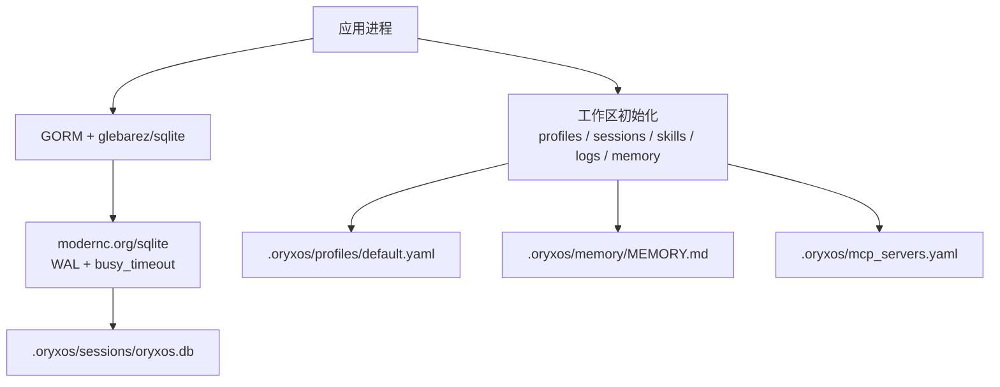
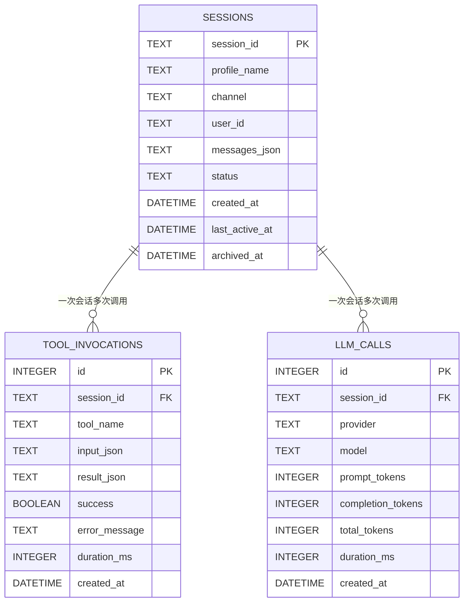
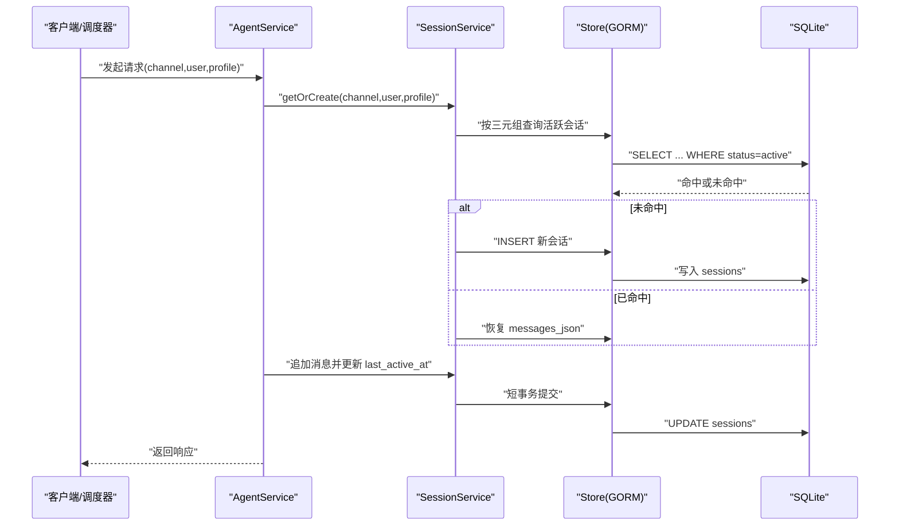
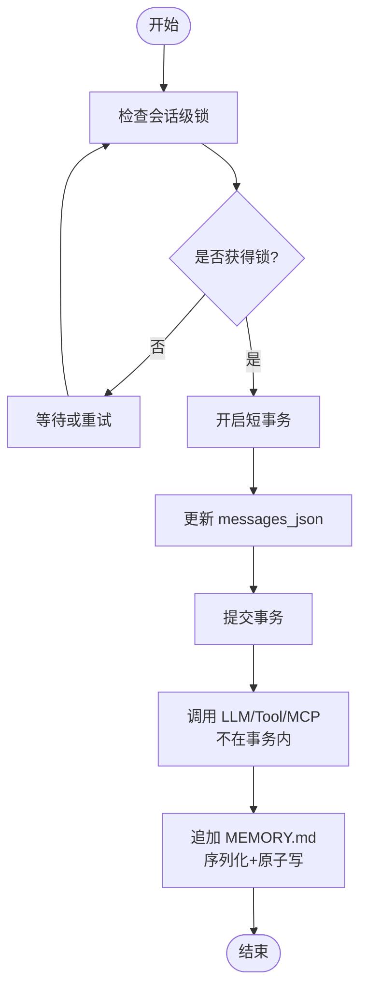

# 数据持久化

<cite>
**本文引用的文件**
- [TechnicalSolution.md](file://docs/TechnicalSolution.md)
- [constitution.md](file://.specify/memory/constitution.md)
- [workspace.go](file://cmd/oryxos/workspace.go)
- [workspace_test.go](file://cmd/oryxos/workspace_test.go)
- [doc.go（session）](file://internal/session/doc.go)
- [doc.go（store）](file://internal/store/doc.go)
- [doc.go（memory）](file://internal/memory/doc.go)
</cite>

## SQLite 选型与单二进制
- OryxOS 在核心阶段使用 GORM，并通过 `github.com/glebarez/sqlite` 接入纯 Go 的 `modernc.org/sqlite` 驱动，确保可构建为无 CGO 的单二进制。发布前必须验证 `CGO_ENABLED=0 go build ./cmd/oryxos` 能成功。
- 数据库路径固定在工作区下的 `.oryxos/sessions/oryxos.db`，由工作区初始化流程统一落地；迁移仅在启动时执行，且只包含三张核心表，失败则服务不进入 ready。
- 运行参数要求启用 WAL 并配置合理的 `busy_timeout`，以降低并发读写冲突；所有 LLM、MCP、Tool 调用必须在数据库事务之外执行，避免长事务阻塞。
- 安全与权限：SQLite 文件与日志目录按运行用户最小权限设置；工作区目录与文件采用严格权限控制，禁止通过符号链接绕过限制。

**图表来源**
- [TechnicalSolution.md:694-715](file://docs/TechnicalSolution.md#L694-L715)
- [workspace.go:12-21](file://cmd/oryxos/workspace.go#L12-L21)

**章节来源**
- [TechnicalSolution.md:694-715](file://docs/TechnicalSolution.md#L694-L715)
- [constitution.md:152-154](file://.specify/memory/constitution.md#L152-L154)
- [workspace.go:72-108](file://cmd/oryxos/workspace.go#L72-L108)

## 核心阶段三张表
核心阶段仅保留三张业务表，分别承担会话上下文、工具调用记录与模型调用记录。任何扩展能力不得新增核心表。

- sessions：保存会话元信息与完整消息历史。主键为 `session_id`，状态字段区分活跃与归档；复合索引 `(channel, user_id, profile_name, status)` 用于快速查找活跃会话。
- tool_invocations：记录每次 Tool 调用的输入、输出、耗时与结果，便于审计与问题定位。
- llm_calls：记录每次模型调用的提供商、模型、Token 用量与耗时，支撑成本与性能分析。

**图表来源**
- [TechnicalSolution.md:717-763](file://docs/TechnicalSolution.md#L717-L763)
- [constitution.md:199-208](file://.specify/memory/constitution.md#L199-L208)

**章节来源**
- [TechnicalSolution.md:717-763](file://docs/TechnicalSolution.md#L717-L763)
- [constitution.md:199-208](file://.specify/memory/constitution.md#L199-L208)

## 会话上下文管理
- 会话标识由三元组决定：`channel + user_id + profile.name`。CLI/Web 有状态交互使用该三元组；无状态 HTTP invoke 使用 `channel="http_invoke"` 与每次唯一的 `request_id` 作为 `user_id`；Scheduler 使用 `channel="scheduler"` 与 `schedule.id` 作为 `user_id`。
- 会话历史以 JSON 形式整体存入 `sessions.messages_json`，核心阶段不做逐条拆表；超过模型上下文上限时截断早期消息，保证可恢复与可追踪。
- Session 创建与恢复遵循幂等原则：同一三元组多次获取返回同一会话；不同 channel/user/profile 组合产生隔离的会话。
- 会话删除采用软归档，将状态置为 `archived` 并记录归档时间，不物理删除，便于审计与回溯。
- 包边界上，`internal/session` 负责会话解析与持久化协调，具体实现由后续特性规范补齐；当前以占位包存在，约束行为与接口契约。

**图表来源**
- [TechnicalSolution.md:313-344](file://docs/TechnicalSolution.md#L313-L344)
- [TechnicalSolution.md:877-886](file://docs/TechnicalSolution.md#L877-L886)

**章节来源**
- [TechnicalSolution.md:313-344](file://docs/TechnicalSolution.md#L313-L344)
- [TechnicalSolution.md:877-886](file://docs/TechnicalSolution.md#L877-L886)
- [doc.go（session）:1-5](file://internal/session/doc.go#L1-L5)

## 并发一致性
- 可变状态更新必须线程安全：每个 Session 的消息更新串行化，并以短事务提交；LLM、MCP、Tool 调用必须在数据库事务外执行，避免长事务导致锁竞争。
- 长期记忆文件 `.oryxos/memory/MEMORY.md` 的追加操作必须序列化且原子，防止并发覆盖；读取时最多注入 4000 字，超出简单截断。
- 工作区初始化对目录与文件进行严格校验，拒绝符号链接与类型不符的目标，确保存储介质不被绕过或篡改。
- 迁移失败必须阻止服务进入 ready；持久化失败必须显式返回，不得静默吞错。
- 测试用例验证工作区初始化幂等性与非破坏性，确保重复初始化不会覆盖用户内容，也不会意外创建运行时工件。

**图表来源**
- [constitution.md:121-125](file://.specify/memory/constitution.md#L121-L125)
- [TechnicalSolution.md:313-332](file://docs/TechnicalSolution.md#L313-L332)
- [workspace.go:130-185](file://cmd/oryxos/workspace.go#L130-L185)

**章节来源**
- [constitution.md:121-125](file://.specify/memory/constitution.md#L121-L125)
- [TechnicalSolution.md:313-332](file://docs/TechnicalSolution.md#L313-L332)
- [workspace.go:130-185](file://cmd/oryxos/workspace.go#L130-L185)
- [workspace_test.go:12-42](file://cmd/oryxos/workspace_test.go#L12-L42)