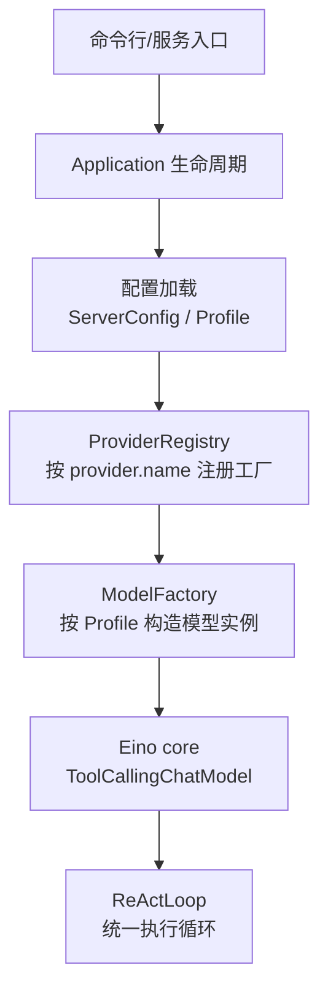
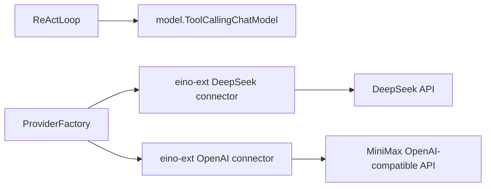
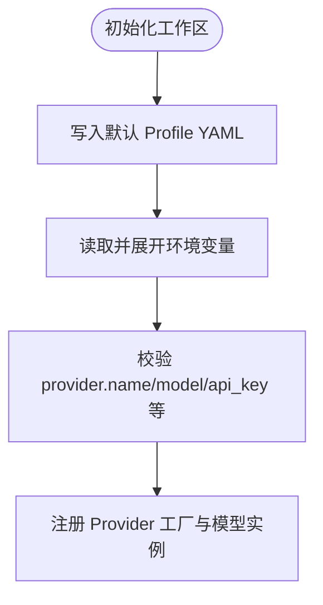
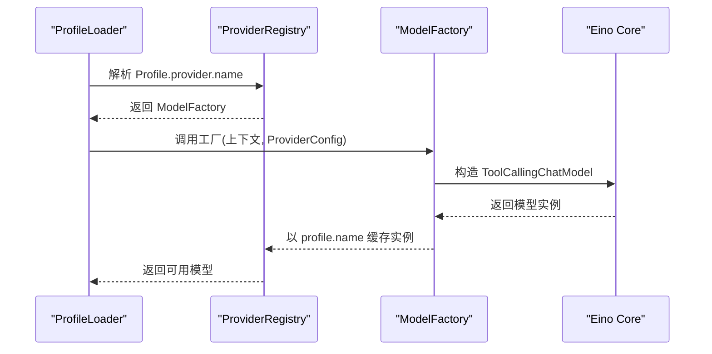
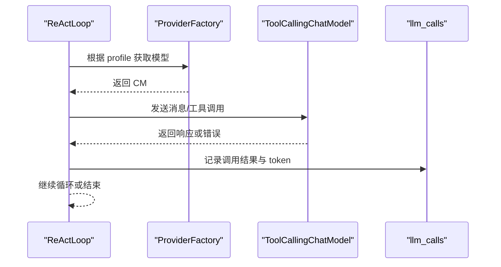
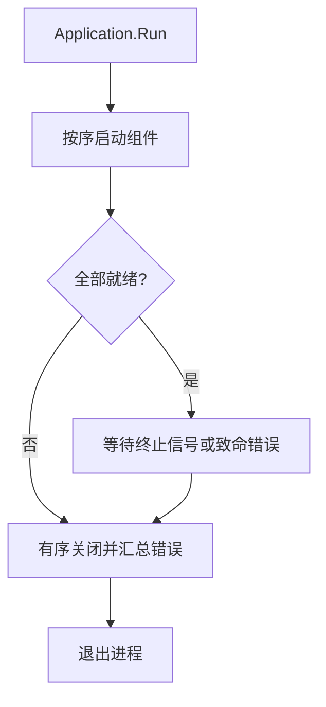
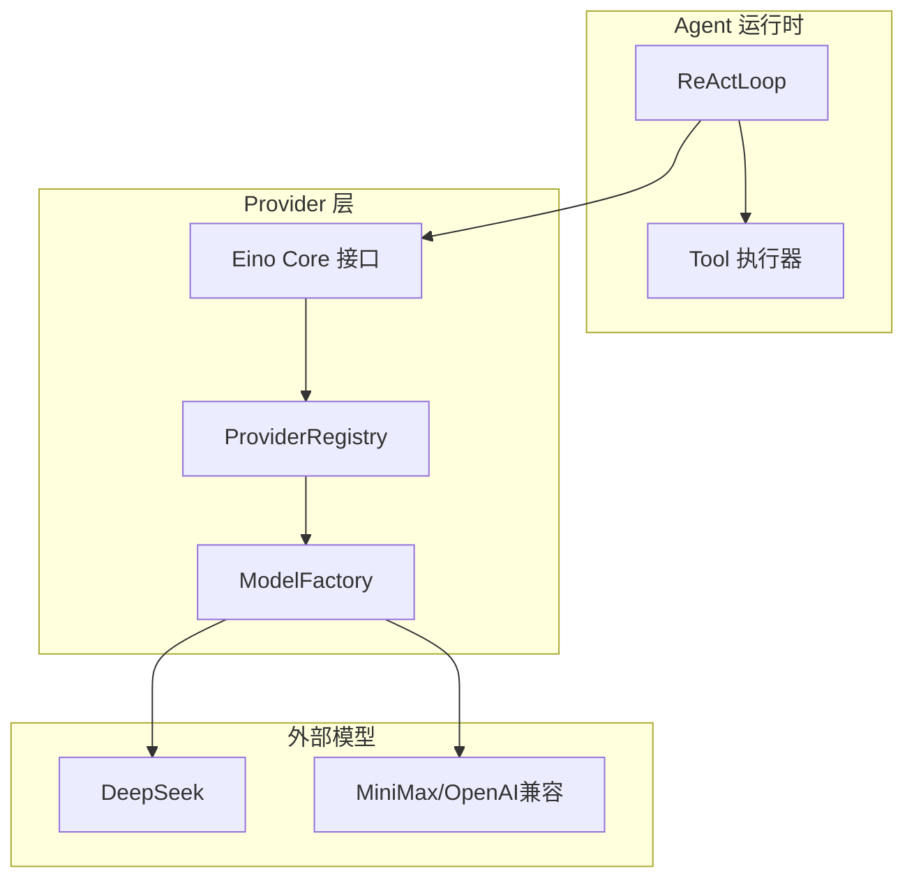
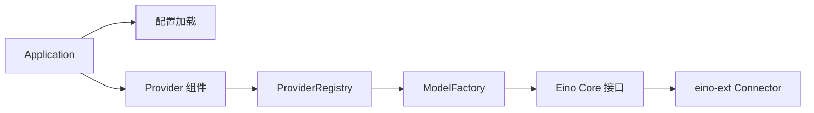

# Agent Provider 原理解析、实现与代码讲解

<cite>
**本文引用的文件**
- [internal/provider/doc.go](file://internal/provider/doc.go)
- [docs/TechnicalSolution.md](file://docs/TechnicalSolution.md)
- [website/docs/provider.md](file://website/docs/provider.md)
- [cmd/oryxos/workspace.go](file://cmd/oryxos/workspace.go)
- [internal/config/config.go](file://internal/config/config.go)
- [internal/app/application.go](file://internal/app/application.go)
</cite>

## 目录
1. [引言](#引言)
2. [项目结构](#项目结构)
3. [核心组件](#核心组件)
4. [架构总览](#架构总览)
5. [详细组件分析](#详细组件分析)
6. [依赖关系分析](#依赖关系分析)
7. [性能考虑](#性能考虑)
8. [故障排查指南](#故障排查指南)
9. [结论](#结论)
10. [附录](#附录)

## 引言
本文件聚焦 OryxOS 的 Agent Provider 机制：它如何把“配置中的 provider.name”映射到具体的模型实例，并通过统一的 Eino core 接口进入 ReAct 循环。当前仓库中 internal/provider 是编译期占位包，实际 Provider 工厂与适配逻辑在技术方案文档中定义；运行时通过 Profile 加载、ProviderRegistry 注册、ReActLoop 调用，形成从配置到调用的完整链路。

## 项目结构
- 入口与生命周期：Application 负责组件启动、终止和错误汇聚，Provider 相关组件以 Component 形式接入。
- 配置加载：ServerConfig 等进程级配置由 config 包管理；Profile 与 Provider 配置由工作区初始化与加载流程提供。
- Provider 抽象：provider 包声明为占位，真实实现遵循技术方案文档中的 ProviderFactory、ProviderRegistry、ModelFactory 约定。
- 工作区：CLI 命令创建默认 Profile，其中包含 provider.name、model、api_key、base_url、temperature 等字段。

图表来源
- [internal/app/application.go:35-102](file://internal/app/application.go#L35-L102)
- [docs/TechnicalSolution.md:144-217](file://docs/TechnicalSolution.md#L144-L217)
- [cmd/oryxos/workspace.go:23-62](file://cmd/oryxos/workspace.go#L23-L62)

章节来源
- [internal/app/application.go:35-102](file://internal/app/application.go#L35-L102)
- [internal/config/config.go:6-39](file://internal/config/config.go#L6-L39)
- [cmd/oryxos/workspace.go:23-62](file://cmd/oryxos/workspace.go#L23-L62)
- [docs/TechnicalSolution.md:144-217](file://docs/TechnicalSolution.md#L144-L217)

## 核心组件
- Provider 占位包：声明 Provider 工厂与适配器所在包，具体行为延后实现。
- Provider 配置：name、model、api_key、base_url、temperature，作为 Profile 的一部分在启动阶段校验并展开环境变量。
- ProviderRegistry：维护“provider.name -> ModelFactory”的工厂映射，以及“profile.name -> ToolCallingChatModel”的实例缓存。
- ModelFactory：接收上下文与 ProviderConfig，返回 Eino core 的 ToolCallingChatModel 实例。
- Application：将 Provider 相关组件纳入统一生命周期管理，确保启动顺序与优雅关闭。

章节来源
- [internal/provider/doc.go:1-5](file://internal/provider/doc.go#L1-L5)
- [docs/TechnicalSolution.md:170-217](file://docs/TechnicalSolution.md#L170-L217)
- [internal/app/application.go:35-102](file://internal/app/application.go#L35-L102)

## 架构总览
Provider 层位于“集成层”，向上暴露稳定的 Eino core 接口，向下封装各厂商 connector 差异。ReActLoop 不感知具体厂商，只依赖 ToolCallingChatModel。

图表来源
- [docs/TechnicalSolution.md:144-169](file://docs/TechnicalSolution.md#L144-L169)

章节来源
- [docs/TechnicalSolution.md:144-169](file://docs/TechnicalSolution.md#L144-L169)

## 详细组件分析

### Provider 配置与默认 Profile
- 默认 Profile 由 CLI 初始化生成，包含 provider.name=deepseek、model、api_key（支持环境变量注入）、base_url、temperature 等。
- 配置文件加载时进行严格反序列化与字段校验，缺失或非法会在启动阶段失败，避免首次对话才报错。

图表来源
- [cmd/oryxos/workspace.go:23-62](file://cmd/oryxos/workspace.go#L23-L62)
- [docs/TechnicalSolution.md:182-217](file://docs/TechnicalSolution.md#L182-L217)

章节来源
- [cmd/oryxos/workspace.go:23-62](file://cmd/oryxos/workspace.go#L23-L62)
- [docs/TechnicalSolution.md:182-217](file://docs/TechnicalSolution.md#L182-L217)

### ProviderRegistry 与 ModelFactory
- ProviderRegistry 维护两类映射：
  - factories：key 为 provider.name，value 为 ModelFactory。
  - models：key 为 profile.name，value 为 ToolCallingChatModel 实例。
- 加载流程：ProfileLoader 校验唯一性 -> 查找对应工厂 -> 传入完整 ProviderConfig -> 创建模型实例 -> 以 profile.name 缓存。
- 设计要点：不同 Profile 可复用同一 provider.name，但拥有独立模型实例，互不覆盖。

图表来源
- [docs/TechnicalSolution.md:191-217](file://docs/TechnicalSolution.md#L191-L217)

章节来源
- [docs/TechnicalSolution.md:191-217](file://docs/TechnicalSolution.md#L191-L217)

### ReActLoop 与 Provider 的交互
- ReActLoop 仅依赖 Eino core 的 ToolCallingChatModel 接口，不直接持有 eino-ext 类型。
- 每次 LLM 调用无论成功失败都记录结构化日志与 llm_calls，包含 provider、model、token、耗时等。
- 错误分类：配置错误、认证错误、限流、超时、上游服务错误、响应格式错误；核心阶段不做自动 fallback。

图表来源
- [docs/TechnicalSolution.md:219-243](file://docs/TechnicalSolution.md#L219-L243)

章节来源
- [docs/TechnicalSolution.md:219-243](file://docs/TechnicalSolution.md#L219-L243)

### 应用生命周期中的 Provider 组件
- Application 统一管理组件启动与关闭，Provider 相关组件若实现 TerminalSource 可在运行期间上报致命错误。
- 启动失败会触发有序关闭；关闭阶段收集所有错误并记录。

图表来源
- [internal/app/application.go:71-102](file://internal/app/application.go#L71-L102)
- [internal/app/application.go:153-182](file://internal/app/application.go#L153-L182)

章节来源
- [internal/app/application.go:71-102](file://internal/app/application.go#L71-L102)
- [internal/app/application.go:153-182](file://internal/app/application.go#L153-L182)

### 概念性总览
下图展示 Provider 在整体系统中的角色：它是连接业务 Agent 与外部大模型的适配层，屏蔽厂商差异，向上提供稳定接口。

[此图为概念图，不直接映射具体源码文件]

## 依赖关系分析
- 上层模块（ReActLoop、AgentService）仅依赖 Eino core 的稳定接口。
- Provider 工厂依赖 eino-ext connector 的具体实现，隔离在工厂内部。
- 配置依赖工作区默认 Profile 与 ConfigLoader 的环境变量展开能力。
- 应用生命周期依赖 Application 对组件的统一管理。

图表来源
- [internal/app/application.go:35-102](file://internal/app/application.go#L35-L102)
- [docs/TechnicalSolution.md:144-217](file://docs/TechnicalSolution.md#L144-L217)

章节来源
- [internal/app/application.go:35-102](file://internal/app/application.go#L35-L102)
- [docs/TechnicalSolution.md:144-217](file://docs/TechnicalSolution.md#L144-L217)

## 性能考虑
- 模型实例按 profile.name 缓存，避免重复构造；不同 Profile 可共享同一 provider.name 但拥有独立实例。
- 每次调用记录 token 与耗时，便于后续优化与成本核算。
- 核心阶段不提供流式响应；SSE/Stream 作为兼容性回归项，不影响同步主路径。
- 配置重载通过重启生效，避免在线热替换带来的复杂性与一致性风险。

章节来源
- [docs/TechnicalSolution.md:191-217](file://docs/TechnicalSolution.md#L191-L217)
- [docs/TechnicalSolution.md:219-243](file://docs/TechnicalSolution.md#L219-L243)

## 故障排查指南
- 启动阶段失败：检查 provider.name、model、api_key 是否完整且合法；确认环境变量已正确展开。
- 首次对话失败：优先查看 llm_calls 记录与结构化日志，定位认证、限流、超时或上游错误。
- 多 Profile 冲突：确认每个 Profile 的 provider.name 指向正确的工厂，且 model/base_url/temperature 符合预期。
- 应用异常退出：关注 Application 的致命错误通道与关闭阶段错误汇总，定位具体组件。

章节来源
- [docs/TechnicalSolution.md:182-217](file://docs/TechnicalSolution.md#L182-L217)
- [docs/TechnicalSolution.md:219-243](file://docs/TechnicalSolution.md#L219-L243)
- [internal/app/application.go:120-182](file://internal/app/application.go#L120-L182)

## 结论
OryxOS 的 Agent Provider 以“工厂 + 注册表 + 统一接口”为核心模式：通过 ProviderRegistry 将配置中的 provider.name 映射到具体工厂，再由工厂基于 Profile 的 ProviderConfig 构建 Eino core 的 ToolCallingChatModel。ReActLoop 仅依赖稳定接口，屏蔽厂商差异，保证扩展性与可维护性。当前仓库中 provider 包为占位，完整实现与约束详见技术方案文档。

## 附录
- 支持的 Provider 名称与说明可参考网站文档；核心阶段以 deepseek 与 MiniMax 为主，其他厂商可按相同模式扩展。
- 默认 Profile 由 CLI 初始化生成，用户只需编辑 api_key 与 model 即可快速上手。

章节来源
- [website/docs/provider.md:1-106](file://website/docs/provider.md#L1-L106)
- [cmd/oryxos/workspace.go:23-62](file://cmd/oryxos/workspace.go#L23-L62)