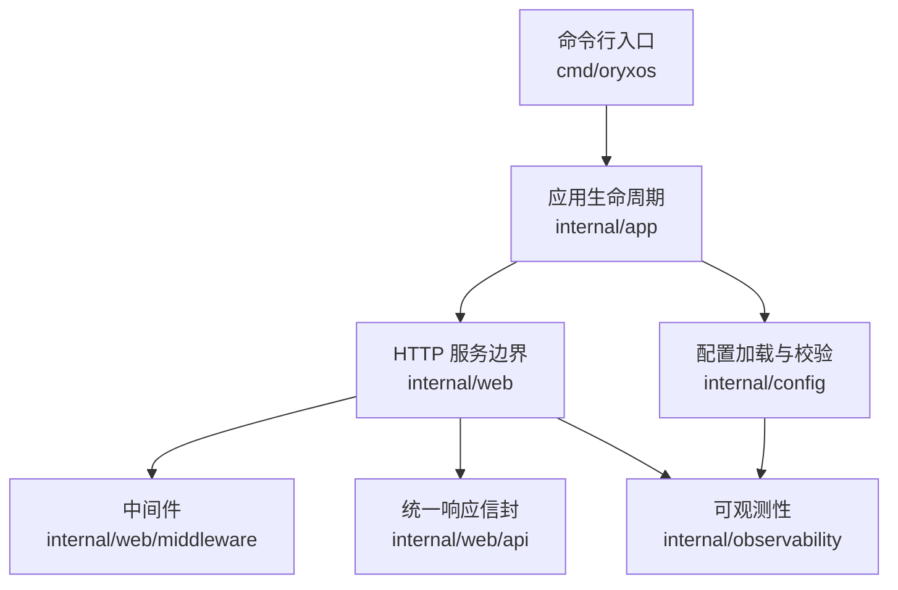
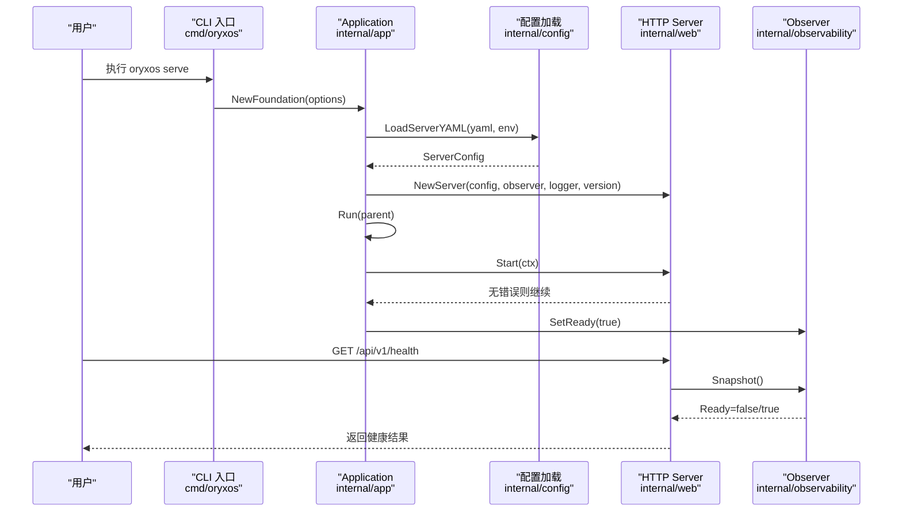
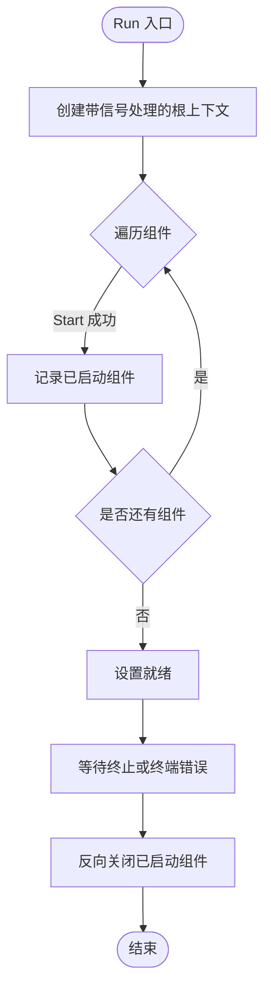
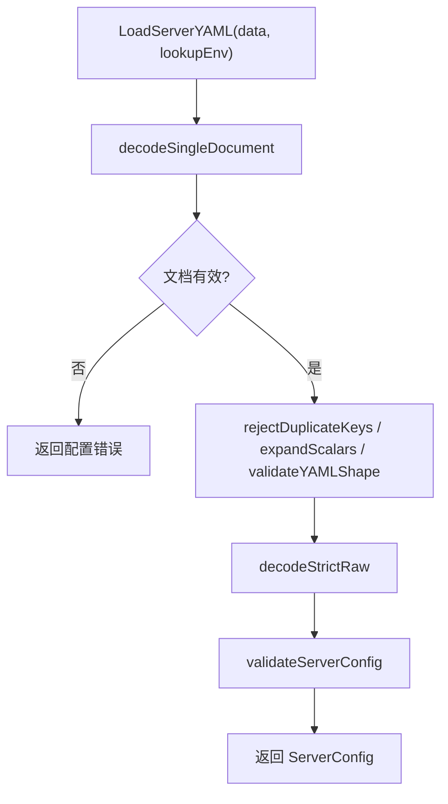
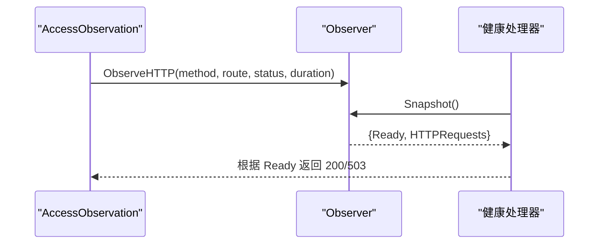
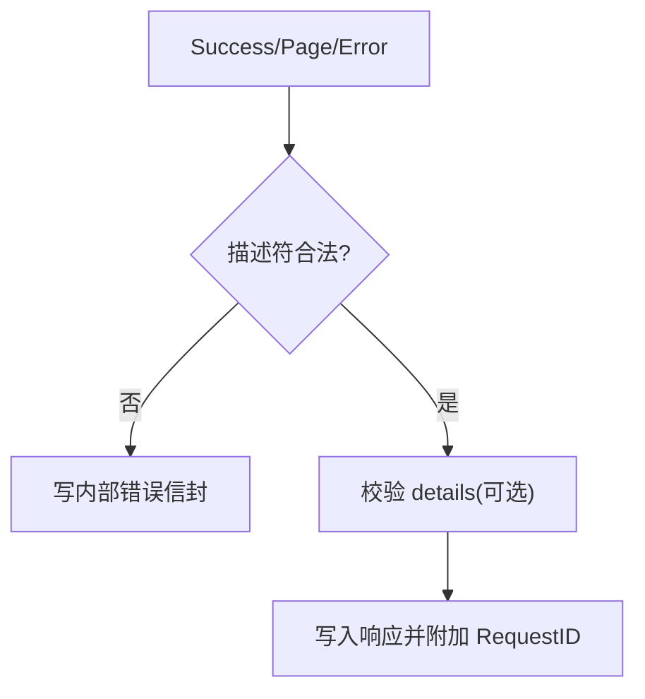
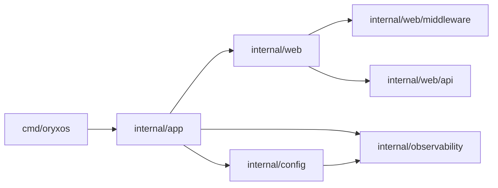

# Go模块架构

<cite>
**本文引用的文件**
- [go.mod](file://go.mod)
- [main.go](file://cmd/oryxos/main.go)
- [root.go](file://cmd/oryxos/root.go)
- [application.go](file://internal/app/application.go)
- [foundation.go](file://internal/app/foundation.go)
- [config.go](file://internal/config/config.go)
- [load.go](file://internal/config/load.go)
- [server.go](file://internal/web/server.go)
- [component.go](file://internal/web/component.go)
- [handlers.go](file://internal/web/handlers.go)
- [access.go](file://internal/web/middleware/access.go)
- [result.go](file://internal/web/api/result.go)
- [observer.go](file://internal/observability/observer.go)
- [logger.go](file://internal/observability/logger.go)
</cite>

## 目录
1. [简介](#简介)
2. [项目结构](#项目结构)
3. [核心组件](#核心组件)
4. [架构总览](#架构总览)
5. [详细组件分析](#详细组件分析)
6. [依赖分析](#依赖分析)
7. [性能考虑](#性能考虑)
8. [故障排查指南](#故障排查指南)
9. [结论](#结论)
10. [附录](#附录)

## 简介
本项目是一个面向企业场景的 Agent OS 运行时内核，采用 Go 实现，提供进程级应用生命周期管理、配置加载与校验、HTTP 服务边界、可观测性与结构化日志等基础能力。入口通过 Cobra 构建 CLI，内部以 Application 协调各 Component（如 HTTP Server）的启动与关闭；Web 层基于 Gin 提供统一路由、中间件与标准化响应信封；配置层对 YAML 进行严格解析、默认值填充与强类型校验；可观测性层提供就绪状态与请求聚合统计。

## 项目结构
- cmd/oryxos：CLI 入口与命令树组织，负责装配并运行 Foundation。
- internal/app：应用生命周期编排，定义 Component 接口与 Application 启动/关闭流程。
- internal/config：服务器配置模型、YAML 解析、字段校验与默认值处理。
- internal/web：HTTP 服务边界，包含 Gin 路由器、中间件、处理器与统一结果封装。
- internal/observability：进程内观察者（就绪状态、HTTP 请求聚合）与结构化日志器。



**图表来源**
- [main.go:8-12](file://cmd/oryxos/main.go#L8-L12)
- [root.go:22-45](file://cmd/oryxos/root.go#L22-L45)
- [application.go:19-101](file://internal/app/application.go#L19-L101)
- [foundation.go:25-55](file://internal/app/foundation.go#L25-L55)
- [server.go:18-70](file://internal/web/server.go#L18-L70)
- [load.go:42-65](file://internal/config/load.go#L42-L65)
- [observer.go:10-47](file://internal/observability/observer.go#L10-L47)

**章节来源**
- [main.go:8-12](file://cmd/oryxos/main.go#L8-L12)
- [root.go:22-45](file://cmd/oryxos/root.go#L22-L45)
- [application.go:19-101](file://internal/app/application.go#L19-L101)
- [foundation.go:25-55](file://internal/app/foundation.go#L25-L55)
- [server.go:18-70](file://internal/web/server.go#L18-L70)
- [load.go:42-65](file://internal/config/load.go#L42-L65)
- [observer.go:10-47](file://internal/observability/observer.go#L10-L47)

## 核心组件
- 应用生命周期 Application：按注册顺序启动组件，监听终止信号或终端错误，反向安全关闭已启动组件，支持优雅停机超时。
- HTTP 服务 Server：基于 Gin 的路由与中间件装配，暴露健康与信息端点，提供 ListenerFactory 以便测试替换。
- 配置加载 LoadServerYAML：单文档 YAML 解析、重复键拒绝、形状校验、严格解码、默认值与正时长校验。
- 可观测性 Observer：记录就绪状态与按方法/路由/状态码聚合的请求计数与耗时，供健康检查与诊断使用。
- 统一响应 Result：成功/分页/错误三种信封，强制校验 code/message/details，注入 RequestID 并输出标准 JSON。

**章节来源**
- [application.go:19-101](file://internal/app/application.go#L19-L101)
- [component.go:31-110](file://internal/web/component.go#L31-L110)
- [load.go:42-65](file://internal/config/load.go#L42-L65)
- [observer.go:10-47](file://internal/observability/observer.go#L10-L47)
- [result.go:15-157](file://internal/web/api/result.go#L15-L157)

## 架构总览
下图展示从 CLI 到应用生命周期、配置、HTTP 服务与可观测性的调用关系。



**图表来源**
- [root.go:22-45](file://cmd/oryxos/root.go#L22-L45)
- [foundation.go:25-55](file://internal/app/foundation.go#L25-L55)
- [load.go:42-65](file://internal/config/load.go#L42-L65)
- [server.go:18-70](file://internal/web/server.go#L18-L70)
- [application.go:71-101](file://internal/app/application.go#L71-L101)
- [handlers.go:21-39](file://internal/web/handlers.go#L21-L39)
- [observer.go:44-86](file://internal/observability/observer.go#L44-L86)

## 详细组件分析

### 应用生命周期 Application
- 职责：维护组件集合、按序启动、等待终止信号或终端错误、反向关闭已启动组件。
- 关键设计：
  - Component 接口要求 Start 仅阻塞至就绪，Close 必须尊重上下文取消。
  - TerminalSource 允许组件上报非正常终止错误，Application 统一收集并触发停机。
  - shutdownOnce 保证关闭幂等，合并所有关闭错误并记录日志。
  - waitForTermination 使用 reflect.Select 同时监听根上下文与各组件错误通道。



**图表来源**
- [application.go:71-101](file://internal/app/application.go#L71-L101)
- [application.go:120-181](file://internal/app/application.go#L120-L181)

**章节来源**
- [application.go:19-101](file://internal/app/application.go#L19-L101)
- [application.go:120-181](file://internal/app/application.go#L120-L181)

### HTTP 服务 Server
- 职责：组装 Gin 路由器、注册全局中间件、挂载基础路由、绑定监听并启动服务。
- 关键设计：
  - 中间件链包括请求 ID、请求体大小限制、访问观察与恢复。
  - NoRoute/NoMethod 统一返回未匹配与方法不允许的错误信封。
  - Start 使用互斥状态机避免重复启动与竞态关闭；Close 优雅停机并等待 Serve 协程退出。
  - Errors 通道用于向 Application 报告非正常终止错误。

```mermaid
classDiagram
class Server {
+router *gin.Engine
+httpServer *http.Server
+observer Observer
+listenerFactory ListenerFactory
+errors chan error
+done chan struct{}
+state startState
+Start(ctx) error
+Close(ctx) error
+Errors() <-chan error
+Handler() http.Handler
+Routes() gin.RoutesInfo
}
class startState {
+mu sync.Mutex
+started bool
+starting bool
+closed bool
+closeOnce sync.Once
+closeErr error
+doneOnce sync.Once
}
Server --> startState : "拥有"
```

**图表来源**
- [server.go:18-70](file://internal/web/server.go#L18-L70)
- [component.go:20-117](file://internal/web/component.go#L20-L117)

**章节来源**
- [server.go:18-70](file://internal/web/server.go#L18-L70)
- [component.go:31-110](file://internal/web/component.go#L31-L110)

### 配置加载与校验
- 职责：将 YAML 转换为强类型的 ServerConfig，完成去重、形状校验、严格解码、默认值与范围校验。
- 关键流程：
  - 单文档校验与重复键拒绝。
  - 顶层与嵌套字段类型校验（字符串、映射）。
  - 严格解码未知字段报错并定位路径。
  - 解析正时长与端口范围，提供默认值。



**图表来源**
- [load.go:42-65](file://internal/config/load.go#L42-L65)
- [load.go:67-185](file://internal/config/load.go#L67-L185)
- [load.go:297-338](file://internal/config/load.go#L297-L338)

**章节来源**
- [config.go:6-39](file://internal/config/config.go#L6-L39)
- [load.go:42-65](file://internal/config/load.go#L42-L65)
- [load.go:297-338](file://internal/config/load.go#L297-L338)

### 可观测性 Observer 与日志
- Observer：线程安全的进程内观察者，记录就绪状态与按维度聚合的 HTTP 请求指标；Snapshot 提供稳定视图。
- 日志：JSON 与控制台两种格式，均经过敏感字段脱敏处理器包装。
- 集成点：
  - AccessObservation 中间件在请求完成后记录方法与路由、状态码与耗时。
  - 健康检查读取 Ready 状态决定返回 200 或 503。



**图表来源**
- [access.go:12-34](file://internal/web/middleware/access.go#L12-L34)
- [observer.go:44-86](file://internal/observability/observer.go#L44-L86)
- [handlers.go:21-39](file://internal/web/handlers.go#L21-L39)
- [logger.go:9-19](file://internal/observability/logger.go#L9-L19)

**章节来源**
- [observer.go:10-86](file://internal/observability/observer.go#L10-L86)
- [access.go:12-34](file://internal/web/middleware/access.go#L12-L34)
- [handlers.go:21-39](file://internal/web/handlers.go#L21-L39)
- [logger.go:9-19](file://internal/observability/logger.go#L9-L19)

### 统一响应信封 Result
- 成功/分页/错误三种信封，强制校验 code/message 组合与 details 白名单规则。
- 自动注入 RequestID，优先复用链路中的关联 ID，否则生成紧急 ID。
- 异常时降级为统一的内部错误信封，避免泄露实现细节。



**图表来源**
- [result.go:15-157](file://internal/web/api/result.go#L15-L157)

**章节来源**
- [result.go:15-157](file://internal/web/api/result.go#L15-L157)

## 依赖分析
- 直接依赖：Gin（HTTP）、Cobra（CLI）、YAML 解析库。
- 间接依赖：OpenTelemetry、Google GenAI SDK、OpenAI/Anthropic SDK 等，当前作为第三方扩展存在，核心运行时不直接耦合其业务逻辑。
- 模块边界：
  - cmd/oryxos 仅负责 CLI 装配与运行。
  - internal/app 不感知具体业务，只编排 Component。
  - internal/web 仅暴露 HTTP 边界与中间件。
  - internal/config 独立于网络与业务。
  - internal/observability 提供通用可观测能力。



**图表来源**
- [go.mod:5-10](file://go.mod#L5-L10)
- [root.go:22-45](file://cmd/oryxos/root.go#L22-L45)
- [foundation.go:25-55](file://internal/app/foundation.go#L25-L55)
- [server.go:18-70](file://internal/web/server.go#L18-L70)
- [load.go:42-65](file://internal/config/load.go#L42-L65)
- [observer.go:10-47](file://internal/observability/observer.go#L10-L47)

**章节来源**
- [go.mod:5-10](file://go.mod#L5-L10)
- [root.go:22-45](file://cmd/oryxos/root.go#L22-L45)
- [foundation.go:25-55](file://internal/app/foundation.go#L25-L55)
- [server.go:18-70](file://internal/web/server.go#L18-L70)
- [load.go:42-65](file://internal/config/load.go#L42-L65)
- [observer.go:10-47](file://internal/observability/observer.go#L10-L47)

## 性能考虑
- 配置解析采用严格模式与最小化对象分配，错误路径快速失败。
- HTTP 层启用释放模式与请求体大小限制，减少恶意负载风险。
- Observer 使用细粒度锁与固定维度聚合，避免高并发下热点竞争。
- 日志通过 Handler 链式包装，避免在业务路径中做额外格式化。
- 优雅停机通过 context 超时控制关闭时间，防止资源泄漏。

[本节为通用指导，不直接分析具体文件]

## 故障排查指南
- 配置错误
  - 现象：启动时报“unknown field”或“must be a scalar string”等。
  - 定位：查看 YAML 路径与行号，确认字段拼写与类型。
  - 参考：[load.go:187-201](file://internal/config/load.go#L187-L201)、[load.go:297-338](file://internal/config/load.go#L297-L338)
- 端口冲突或权限不足
  - 现象：Bind 失败。
  - 定位：检查 listen_address 与系统端口占用。
  - 参考：[component.go:49-55](file://internal/web/component.go#L49-L55)
- 服务未就绪
  - 现象：/health 返回 503。
  - 定位：确认 Application 已完成全部组件启动并设置 Ready。
  - 参考：[handlers.go:21-28](file://internal/web/handlers.go#L21-L28)、[application.go:96-99](file://internal/app/application.go#L96-L99)
- 请求未匹配或方法不允许
  - 现象：404 或 405。
  - 定位：检查路由注册与请求路径/方法。
  - 参考：[server.go:40-45](file://internal/web/server.go#L40-L45)
- 响应信封非法
  - 现象：被降级为内部错误。
  - 定位：核对 code/message 组合与 details 白名单。
  - 参考：[result.go:65-111](file://internal/web/api/result.go#L65-L111)

**章节来源**
- [load.go:187-201](file://internal/config/load.go#L187-L201)
- [load.go:297-338](file://internal/config/load.go#L297-L338)
- [component.go:49-55](file://internal/web/component.go#L49-L55)
- [handlers.go:21-28](file://internal/web/handlers.go#L21-L28)
- [application.go:96-99](file://internal/app/application.go#L96-L99)
- [server.go:40-45](file://internal/web/server.go#L40-L45)
- [result.go:65-111](file://internal/web/api/result.go#L65-L111)

## 结论
该模块以清晰的分层与明确的边界实现了企业级 Agent OS 的基础运行时：CLI 驱动、应用生命周期管理、严格的配置加载、健壮的 HTTP 服务与可观测性。通过 Component 抽象与 Observer 解耦，便于后续扩展更多业务组件与观测指标。建议在后续迭代中保持现有边界，逐步引入 Provider、Tool、Session 等模块，并确保每个新组件遵循 Start/Close 契约与错误上报机制。

[本节为总结性内容，不直接分析具体文件]

## 附录
- 环境变量与配置项
  - listen_address：监听地址，默认 127.0.0.1:8080。
  - log_format：日志格式，console/json。
  - http.read_header_timeout/read_timeout/write_timeout/idle_timeout：HTTP 超时，需为正时长。
  - shutdown_timeout：优雅停机超时，需为正时长。
  - 参考：[config.go:6-39](file://internal/config/config.go#L6-L39)、[load.go:16-24](file://internal/config/load.go#L16-L24)、[load.go:297-338](file://internal/config/load.go#L297-L338)
- 健康与信息端点
  - GET /api/v1/health：返回就绪状态。
  - GET /api/v1/info：返回版本与模式信息。
  - 参考：[server.go:47-49](file://internal/web/server.go#L47-L49)、[handlers.go:21-39](file://internal/web/handlers.go#L21-L39)
- 统一响应规范
  - Success/Page/Error 三件套，强制校验与 RequestID 注入。
  - 参考：[result.go:15-157](file://internal/web/api/result.go#L15-L157)

**章节来源**
- [config.go:6-39](file://internal/config/config.go#L6-L39)
- [load.go:16-24](file://internal/config/load.go#L16-L24)
- [load.go:297-338](file://internal/config/load.go#L297-L338)
- [server.go:47-49](file://internal/web/server.go#L47-L49)
- [handlers.go:21-39](file://internal/web/handlers.go#L21-L39)
- [result.go:15-157](file://internal/web/api/result.go#L15-L157)