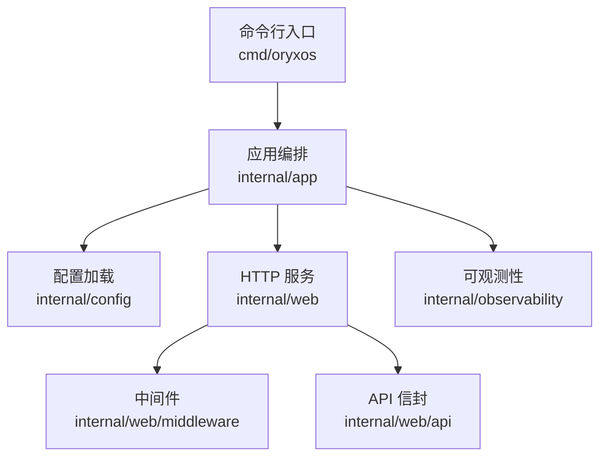
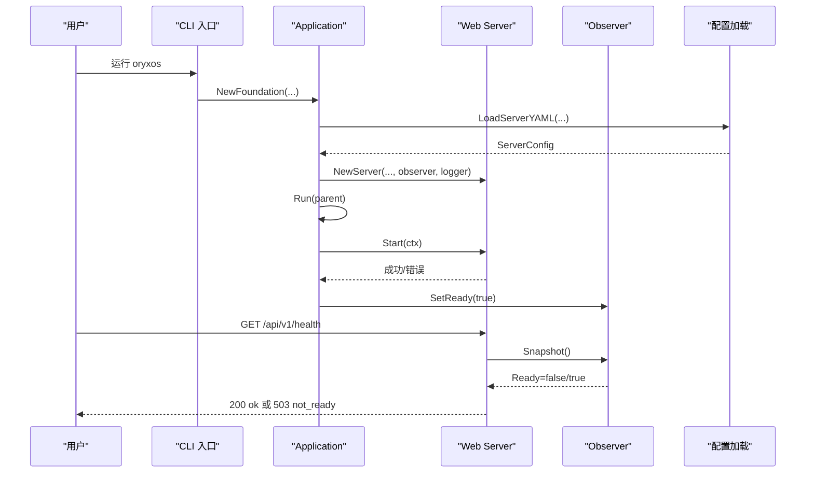
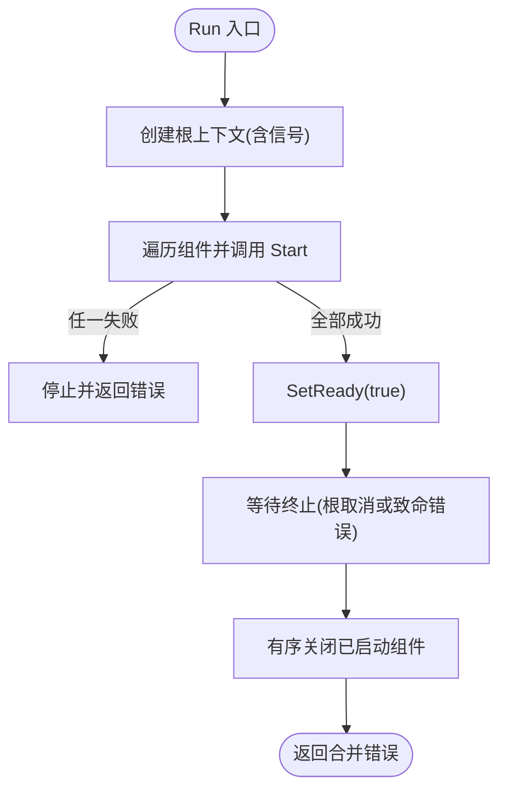
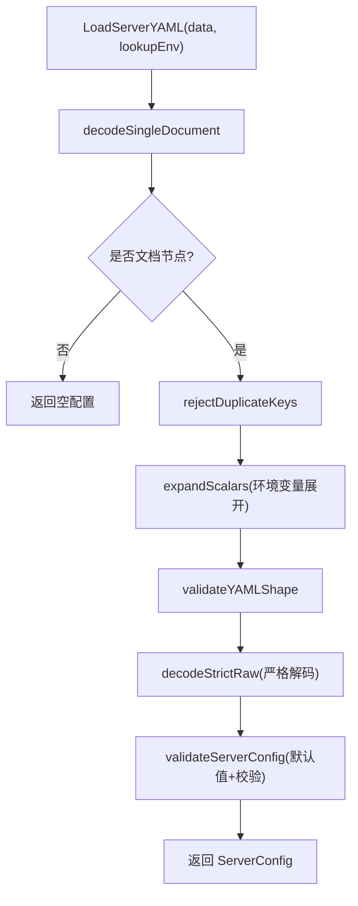
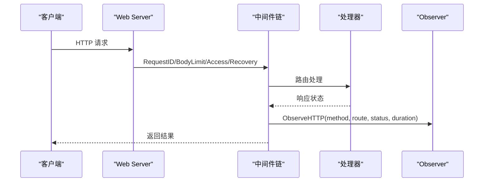
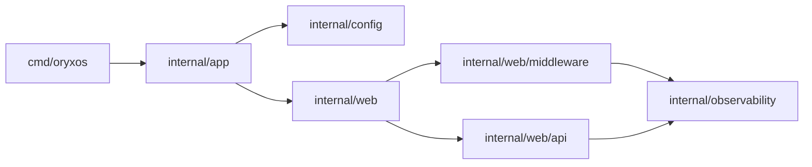

# 内部包结构

<cite>
**本文引用的文件**
- [cmd/oryxos/main.go](file://cmd/oryxos/main.go)
- [cmd/oryxos/root.go](file://cmd/oryxos/root.go)
- [cmd/oryxos/workspace.go](file://cmd/oryxos/workspace.go)
- [internal/app/application.go](file://internal/app/application.go)
- [internal/app/foundation.go](file://internal/app/foundation.go)
- [internal/config/config.go](file://internal/config/config.go)
- [internal/config/load.go](file://internal/config/load.go)
- [internal/config/expand.go](file://internal/config/expand.go)
- [internal/observability/logger.go](file://internal/observability/logger.go)
- [internal/observability/observer.go](file://internal/observability/observer.go)
- [internal/web/server.go](file://internal/web/server.go)
- [internal/web/component.go](file://internal/web/component.go)
- [internal/web/handlers.go](file://internal/web/handlers.go)
- [internal/web/api/result.go](file://internal/web/api/result.go)
- [internal/web/middleware/access.go](file://internal/web/middleware/access.go)
</cite>

## 目录
1. [简介](#简介)
2. [项目结构](#项目结构)
3. [核心组件](#核心组件)
4. [架构总览](#架构总览)
5. [详细组件分析](#详细组件分析)
6. [依赖关系分析](#依赖关系分析)
7. [性能考量](#性能考量)
8. [故障排查指南](#故障排查指南)
9. [结论](#结论)
10. [附录](#附录)

## 简介
本仓库是 OryxOS 的 Go 实现，面向企业场景提供 Agent OS 运行时内核。当前阶段聚焦于“基础能力”：进程级配置加载、HTTP 服务、可观测性、应用生命周期编排与 CLI 入口。内部包以 internal 为边界，将基础设施（配置、可观测性、Web）与上层业务解耦，并通过 Application 统一编排启动与关闭流程。

## 项目结构
- cmd/oryxos：CLI 入口与命令树，负责装配 Foundation 并执行。
- internal/app：应用生命周期编排（Application），以及 Foundation 装配器（NewFoundation）。
- internal/config：进程级 YAML 配置加载、校验、默认值与环境变量展开。
- internal/observability：结构化日志与进程内观测（就绪状态、HTTP 请求聚合）。
- internal/web：基于 Gin 的基础 HTTP 服务、中间件、API 响应信封与健康检查。
- 其他 internal/* 目录（如 provider、tool、store、scheduler 等）在当前版本多为占位或扩展点，用于后续能力接入。

**图示来源**
- [cmd/oryxos/main.go:8-13](file://cmd/oryxos/main.go#L8-L13)
- [cmd/oryxos/root.go:22-46](file://cmd/oryxos/root.go#L22-L46)
- [internal/app/foundation.go:25-56](file://internal/app/foundation.go#L25-L56)
- [internal/config/load.go:42-65](file://internal/config/load.go#L42-L65)
- [internal/web/server.go:29-71](file://internal/web/server.go#L29-L71)
- [internal/web/middleware/access.go:12-34](file://internal/web/middleware/access.go#L12-L34)
- [internal/web/api/result.go:15-22](file://internal/web/api/result.go#L15-L22)
- [internal/observability/observer.go:10-15](file://internal/observability/observer.go#L10-L15)

**章节来源**
- [cmd/oryxos/main.go:8-13](file://cmd/oryxos/main.go#L8-L13)
- [cmd/oryxos/root.go:22-46](file://cmd/oryxos/root.go#L22-L46)
- [internal/app/foundation.go:25-56](file://internal/app/foundation.go#L25-L56)
- [internal/config/load.go:42-65](file://internal/config/load.go#L42-L65)
- [internal/web/server.go:29-71](file://internal/web/server.go#L29-L71)

## 核心组件
- 应用编排 Application：定义 Component 接口，按注册顺序启动，监听终止信号与组件错误通道，反向安全关闭，支持超时控制与就绪标记。
- Foundation 装配器：加载 YAML 配置、创建日志与观测器、构建 Web Server，并返回 Application。
- 配置系统：严格解析 YAML，拒绝未知字段，支持环境变量展开，校验地址与时限，提供默认值。
- Web 服务：Gin 路由、统一中间件链、健康与信息端点、请求体限制、未匹配路由处理。
- 可观测性：JSON/控制台日志（敏感信息脱敏）、进程内 HTTP 指标聚合、就绪状态快照。
- CLI：Cobra 命令树，包含 serve、init、status 等命令；工作区初始化与状态检查。

**章节来源**
- [internal/app/application.go:19-48](file://internal/app/application.go#L19-L48)
- [internal/app/foundation.go:15-56](file://internal/app/foundation.go#L15-L56)
- [internal/config/config.go:6-24](file://internal/config/config.go#L6-L24)
- [internal/config/load.go:42-65](file://internal/config/load.go#L42-L65)
- [internal/web/server.go:18-71](file://internal/web/server.go#L18-L71)
- [internal/observability/logger.go:9-19](file://internal/observability/logger.go#L9-L19)
- [internal/observability/observer.go:10-15](file://internal/observability/observer.go#L10-L15)
- [cmd/oryxos/root.go:22-46](file://cmd/oryxos/root.go#L22-L46)

## 架构总览
OryxOS 的基础架构围绕“进程边界”组织：CLI 作为入口，装配 Foundation，由 Application 管理组件生命周期；Web 层通过中间件记录访问并上报观测；配置在启动前完成加载与校验。

**图示来源**
- [cmd/oryxos/root.go:22-46](file://cmd/oryxos/root.go#L22-L46)
- [internal/app/foundation.go:25-56](file://internal/app/foundation.go#L25-L56)
- [internal/config/load.go:42-65](file://internal/config/load.go#L42-L65)
- [internal/web/server.go:29-71](file://internal/web/server.go#L29-L71)
- [internal/app/application.go:71-102](file://internal/app/application.go#L71-L102)
- [internal/web/handlers.go:21-39](file://internal/web/handlers.go#L21-L39)
- [internal/observability/observer.go:44-87](file://internal/observability/observer.go#L44-L87)

## 详细组件分析

### 应用编排 Application
- 职责：统一管理组件生命周期，按注册顺序启动，收集 TerminalSource 的错误通道，触发有序关闭，设置就绪状态。
- 关键行为：
  - 启动失败时立即停止并记录错误。
  - 等待根上下文取消或首个致命错误。
  - 关闭阶段使用带超时的 context，反向调用 Close，合并错误。
- 并发与健壮性：使用 sync.Once 保证关闭仅执行一次；对 nil 组件进行防御性检查。

**图示来源**
- [internal/app/application.go:71-102](file://internal/app/application.go#L71-L102)
- [internal/app/application.go:120-151](file://internal/app/application.go#L120-L151)
- [internal/app/application.go:153-182](file://internal/app/application.go#L153-L182)

**章节来源**
- [internal/app/application.go:19-48](file://internal/app/application.go#L19-L48)
- [internal/app/application.go:71-102](file://internal/app/application.go#L71-L102)
- [internal/app/application.go:120-182](file://internal/app/application.go#L120-L182)

### Foundation 装配器
- 职责：读取 YAML 配置、构造日志与观测器、创建 Web Server，组装 Application。
- 关键点：
  - 支持注入 LookupEnv、ListenerFactory、SignalContextFactory 以便测试。
  - 根据 LogFormat 选择 JSON 或控制台日志。
  - 将 Server.ShutdownTimeout 传递给 Application 作为关闭超时。

**章节来源**
- [internal/app/foundation.go:15-56](file://internal/app/foundation.go#L15-L56)
- [internal/app/foundation.go:58-63](file://internal/app/foundation.go#L58-L63)

### 配置系统
- 数据结构：ServerConfig 描述监听地址、日志格式与 HTTP 超时；LogFormat 限定 console/json。
- 加载流程：单文档校验 -> 去重键 -> 环境变量展开 -> 形状校验 -> 严格解码 -> 默认值填充 -> 参数校验。
- 环境变量展开：支持 ${VAR} 语法，要求合法变量名且必须存在。
- 校验策略：端口范围、非空 host:port、正数时长、禁止未知字段。

**图示来源**
- [internal/config/load.go:42-65](file://internal/config/load.go#L42-L65)
- [internal/config/load.go:67-80](file://internal/config/load.go#L67-L80)
- [internal/config/load.go:82-111](file://internal/config/load.go#L82-L111)
- [internal/config/load.go:113-146](file://internal/config/load.go#L113-L146)
- [internal/config/load.go:158-185](file://internal/config/load.go#L158-L185)
- [internal/config/load.go:297-338](file://internal/config/load.go#L297-L338)
- [internal/config/expand.go:11-44](file://internal/config/expand.go#L11-L44)
- [internal/config/expand.go:46-75](file://internal/config/expand.go#L46-L75)

**章节来源**
- [internal/config/config.go:6-24](file://internal/config/config.go#L6-L24)
- [internal/config/load.go:42-65](file://internal/config/load.go#L42-L65)
- [internal/config/load.go:297-338](file://internal/config/load.go#L297-L338)
- [internal/config/expand.go:11-75](file://internal/config/expand.go#L11-L75)

### Web 服务与中间件
- 路由与中间件：
  - 全局中间件：RequestID、请求体大小限制、访问观测、Recovery。
  - 未匹配路由与方法返回统一错误信封。
  - /api/v1/health 与 /api/v1/info 暴露基础信息。
- 生命周期：
  - Start：绑定监听、启动 Serve goroutine、错误写入 channel。
  - Close：优雅关闭，必要时强制关闭，等待 goroutine 结束。
  - Errors：供 Application 监控致命错误。
- 可观测性集成：AccessObservation 记录方法、路由、状态码、耗时，并输出结构化日志。

**图示来源**
- [internal/web/server.go:29-71](file://internal/web/server.go#L29-L71)
- [internal/web/component.go:31-89](file://internal/web/component.go#L31-L89)
- [internal/web/middleware/access.go:12-34](file://internal/web/middleware/access.go#L12-L34)
- [internal/web/handlers.go:21-39](file://internal/web/handlers.go#L21-L39)

**章节来源**
- [internal/web/server.go:18-82](file://internal/web/server.go#L18-L82)
- [internal/web/component.go:31-117](file://internal/web/component.go#L31-L117)
- [internal/web/middleware/access.go:12-34](file://internal/web/middleware/access.go#L12-L34)
- [internal/web/handlers.go:21-39](file://internal/web/handlers.go#L21-L39)

### API 响应信封
- Result[T]：统一 code/message/data/details/request_id 结构。
- Success/Page/Error：严格校验状态码、code、message 组合，非法输入回退到 500 internal。
- 细节校验：details 最多两个字段 field/rule，rule 白名单限制。
- 追踪：确保 X-Request-ID 存在，优先复用关联 ID，否则生成紧急 ID。

**章节来源**
- [internal/web/api/result.go:15-22](file://internal/web/api/result.go#L15-L22)
- [internal/web/api/result.go:65-111](file://internal/web/api/result.go#L65-L111)
- [internal/web/api/result.go:124-147](file://internal/web/api/result.go#L124-L147)
- [internal/web/api/result.go:149-188](file://internal/web/api/result.go#L149-L188)

### CLI 与工作区
- 命令树：cobra 构建 root，挂载 init/status/chat/serve/profile 等命令，预留 gateway/provider/tool/session 分组。
- 工作区：
  - InitializeWorkspace：创建 .oryxos 及子目录与模板文件，幂等跳过已有目标。
  - WorkspaceStatus：校验目录结构与权限，返回 initialized/not_initialized。
  - 安全：拒绝符号链接，严格权限控制，原子发布临时文件后链接。

**章节来源**
- [cmd/oryxos/root.go:22-46](file://cmd/oryxos/root.go#L22-L46)
- [cmd/oryxos/workspace.go:72-137](file://cmd/oryxos/workspace.go#L72-L137)
- [cmd/oryxos/workspace.go:169-246](file://cmd/oryxos/workspace.go#L169-L246)
- [cmd/oryxos/workspace.go:289-305](file://cmd/oryxos/workspace.go#L289-L305)

## 依赖关系分析
- 外部依赖边界：
  - Gin 仅被 internal/web 使用。
  - Cobra 仅被 cmd/oryxos 使用。
  - YAML 解析仅在 internal/config。
  - 调度、Provider、Tool、Store 等扩展点在对应 internal 包中隔离。
- 内部依赖方向：
  - app 依赖 config、web、observability。
  - web 依赖 observability、config（通过构造函数传入）。
  - middleware 依赖 observability。
  - api 依赖 observability（关联 ID）。
- 无循环依赖：各包职责清晰，依赖单向。

**图示来源**
- [cmd/oryxos/root.go:22-46](file://cmd/oryxos/root.go#L22-L46)
- [internal/app/foundation.go:25-56](file://internal/app/foundation.go#L25-L56)
- [internal/web/server.go:29-71](file://internal/web/server.go#L29-L71)
- [internal/web/middleware/access.go:12-34](file://internal/web/middleware/access.go#L12-L34)
- [internal/web/api/result.go:149-188](file://internal/web/api/result.go#L149-L188)

**章节来源**
- [cmd/oryxos/architecture_test.go:41-80](file://cmd/oryxos/architecture_test.go#L41-L80)

## 性能考量
- 配置加载：严格解码与路径回溯定位错误，避免运行时歧义；环境变量展开一次性完成。
- HTTP 服务：
  - 请求体限制防止过大负载。
  - 中间件最小化开销，仅记录必要指标。
  - Observer 使用细粒度锁与固定维度聚合，避免高内存占用。
- 生命周期：
  - 关闭阶段带超时，避免阻塞退出。
  - 错误通道容量为 1，避免阻塞主流程。
- 日志：JSON 或控制台输出，敏感字段脱敏，减少泄露风险与额外处理成本。

[本节为通用指导，不直接分析具体文件]

## 故障排查指南
- 配置错误：
  - 现象：启动时报错，提示未知字段、类型错误或缺失环境变量。
  - 定位：查看配置加载错误中的路径与消息；确认 ${VAR} 是否存在且命名合法。
  - 参考：[internal/config/load.go:42-65](file://internal/config/load.go#L42-L65)、[internal/config/expand.go:46-75](file://internal/config/expand.go#L46-L75)
- 端口冲突或无法监听：
  - 现象：Start 报错 bind listener。
  - 处理：检查 listen_address 与端口占用；确认防火墙与安全组。
  - 参考：[internal/web/component.go:49-55](file://internal/web/component.go#L49-L55)
- 健康检查返回 503：
  - 现象：/api/v1/health 返回 not_ready。
  - 原因：Application 尚未 SetReady(true)。
  - 参考：[internal/web/handlers.go:21-29](file://internal/web/handlers.go#L21-L29)、[internal/app/application.go:96-99](file://internal/app/application.go#L96-L99)
- 关闭超时：
  - 现象：进程退出缓慢或报关闭错误。
  - 处理：调整 shutdown_timeout；检查组件 Close 是否及时释放资源。
  - 参考：[internal/app/application.go:153-182](file://internal/app/application.go#L153-L182)
- 工作区初始化失败：
  - 现象：权限不足、符号链接阻止创建、临时文件清理失败。
  - 处理：检查 .oryxos 目录权限、文件系统权限与磁盘空间。
  - 参考：[cmd/oryxos/workspace.go:169-246](file://cmd/oryxos/workspace.go#L169-L246)

**章节来源**
- [internal/config/load.go:42-65](file://internal/config/load.go#L42-L65)
- [internal/config/expand.go:46-75](file://internal/config/expand.go#L46-L75)
- [internal/web/component.go:49-55](file://internal/web/component.go#L49-L55)
- [internal/web/handlers.go:21-29](file://internal/web/handlers.go#L21-L29)
- [internal/app/application.go:96-99](file://internal/app/application.go#L96-L99)
- [internal/app/application.go:153-182](file://internal/app/application.go#L153-L182)
- [cmd/oryxos/workspace.go:169-246](file://cmd/oryxos/workspace.go#L169-L246)

## 结论
OryxOS 的内部包结构以清晰的边界与单一职责为原则：CLI 负责装配与命令分发，app 编排生命周期，config 保障配置正确性与可移植性，web 提供稳定可靠的 HTTP 基础能力，observability 贯穿日志与观测。该设计便于后续扩展 Provider、Tool、Scheduler 等模块，同时保持基础层的稳定性与可测试性。

[本节为总结性内容，不直接分析具体文件]

## 附录
- 关键入口与装配点：
  - CLI 入口：[cmd/oryxos/main.go:8-13](file://cmd/oryxos/main.go#L8-L13)
  - 命令树：[cmd/oryxos/root.go:22-46](file://cmd/oryxos/root.go#L22-L46)
  - Foundation 装配：[internal/app/foundation.go:25-56](file://internal/app/foundation.go#L25-L56)
  - 配置加载：[internal/config/load.go:42-65](file://internal/config/load.go#L42-L65)
  - Web 服务：[internal/web/server.go:29-71](file://internal/web/server.go#L29-L71)
  - 可观测性：[internal/observability/observer.go:44-87](file://internal/observability/observer.go#L44-L87)

[本节为索引性内容，不直接分析具体文件]