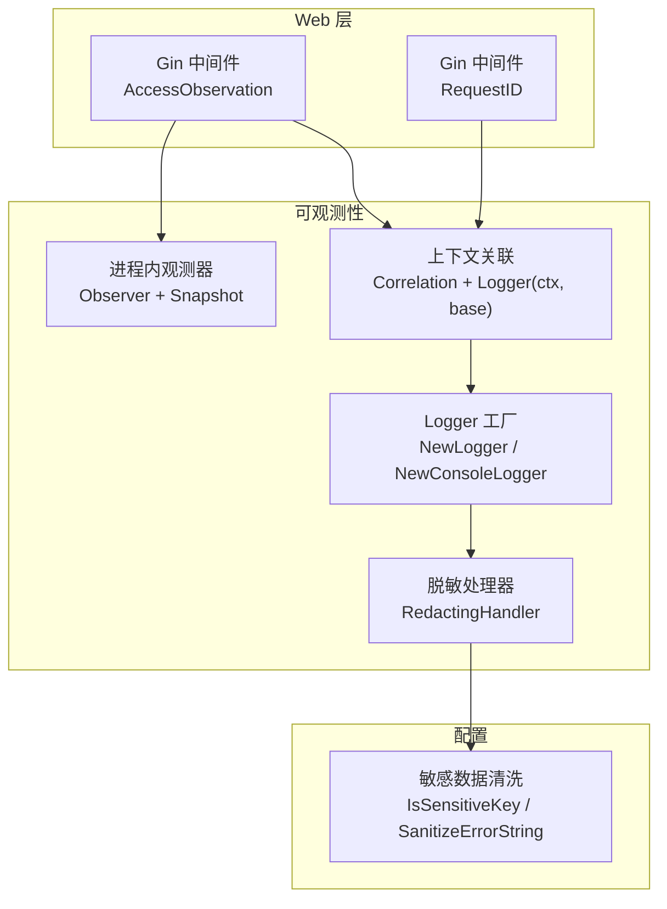
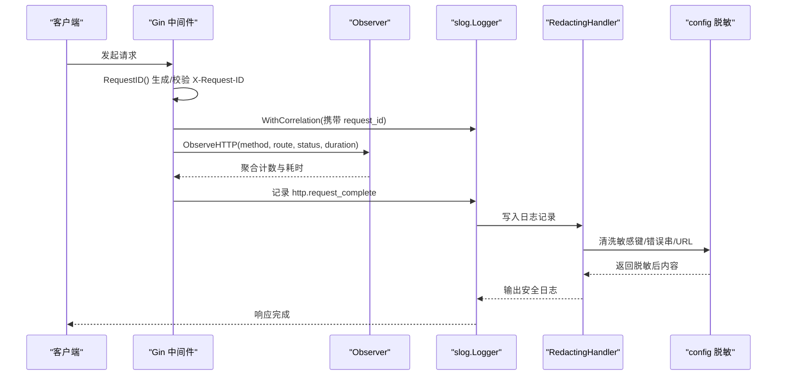
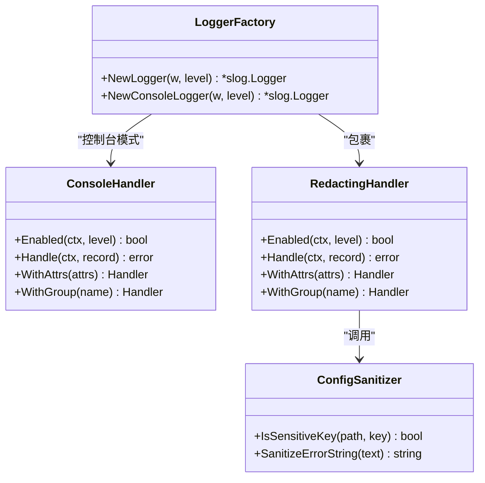
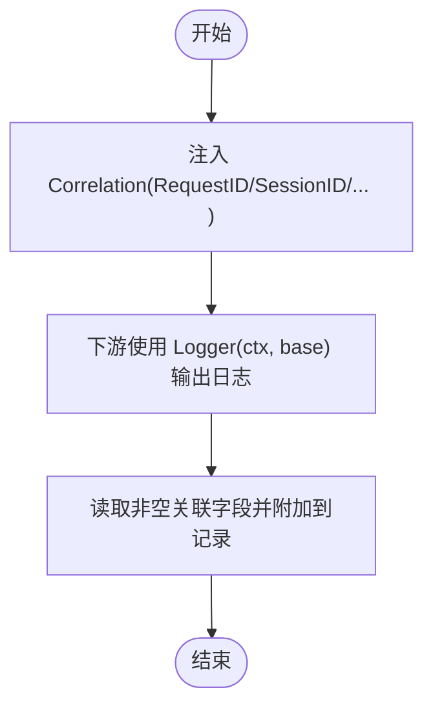
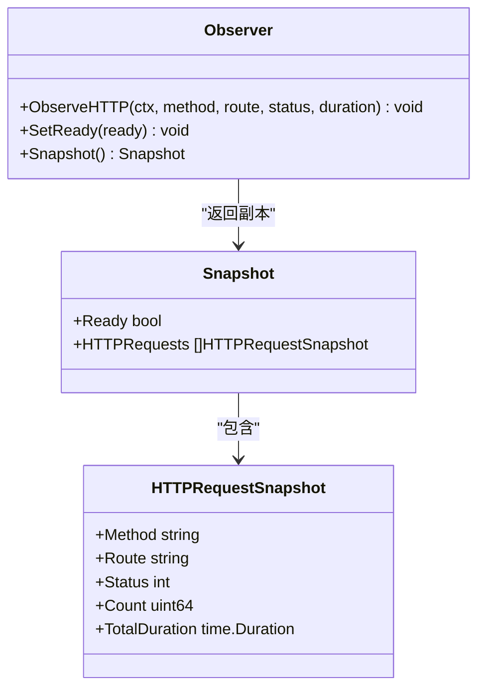
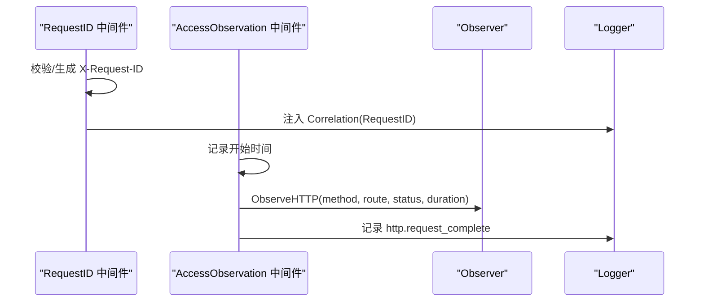
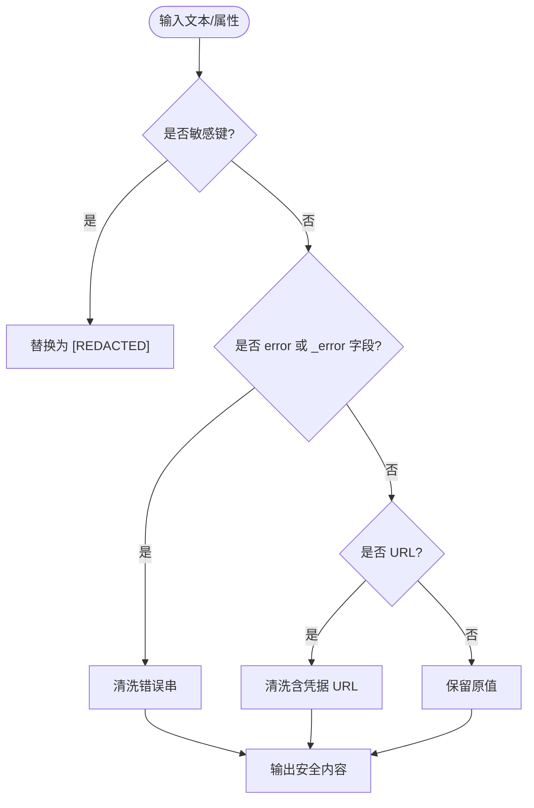
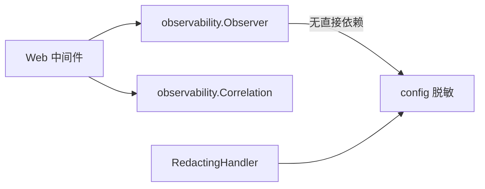

# 可观测性框架

<cite>
**本文引用的文件**
- [logger.go](file://internal/observability/logger.go)
- [console_handler.go](file://internal/observability/console_handler.go)
- [redacting_handler.go](file://internal/observability/redacting_handler.go)
- [observer.go](file://internal/observability/observer.go)
- [correlation.go](file://internal/observability/correlation.go)
- [access.go](file://internal/web/middleware/access.go)
- [request_id.go](file://internal/web/middleware/request_id.go)
- [redact.go](file://internal/config/redact.go)
- [observability.md](file://.agents/skills/oryxos-init/references/observability.md)
- [observability_test.go](file://internal/observability/observability_test.go)
</cite>

## 目录
1. [简介](#简介)
2. [项目结构](#项目结构)
3. [核心组件](#核心组件)
4. [架构总览](#架构总览)
5. [详细组件分析](#详细组件分析)
6. [依赖关系分析](#依赖关系分析)
7. [性能考虑](#性能考虑)
8. [故障排查指南](#故障排查指南)
9. [结论](#结论)
10. [附录](#附录)

## 简介
本文件聚焦 OryxOS 的可观测性框架，说明其结构化日志、上下文关联、进程内观测与敏感数据脱敏的设计与实现。该框架仅使用 Go 标准库 log/slog，不暴露 HTTP 指标端点或全局单例，面向后续扩展（如 Prometheus）提供稳定的内部接口。

## 项目结构
可观测性能力集中在 internal/observability 包，并通过 Web 中间件在请求边界接入；敏感数据处理由 internal/config 提供。整体组织如下：
- 日志输出：JSON 与彩色控制台两种模式，均包裹脱敏处理器。
- 上下文关联：通过 context 传递 request/session/profile/channel/schedule 等标识。
- 进程内观测：聚合 HTTP 请求维度统计与就绪状态快照。
- 安全脱敏：基于键名路径与错误字符串规则进行统一清洗。

图表来源
- [access.go:12-33](file://internal/web/middleware/access.go#L12-L33)
- [request_id.go:12-24](file://internal/web/middleware/request_id.go#L12-L24)
- [logger.go:9-19](file://internal/observability/logger.go#L9-L19)
- [redacting_handler.go:12-37](file://internal/observability/redacting_handler.go#L12-L37)
- [correlation.go:19-52](file://internal/observability/correlation.go#L19-L52)
- [observer.go:10-47](file://internal/observability/observer.go#L10-L47)
- [redact.go:18-47](file://internal/config/redact.go#L18-L47)

章节来源
- [observability.md:14-67](file://.agents/skills/oryxos-init/references/observability.md#L14-L67)
- [access.go:12-33](file://internal/web/middleware/access.go#L12-L33)
- [request_id.go:12-24](file://internal/web/middleware/request_id.go#L12-L24)
- [logger.go:9-19](file://internal/observability/logger.go#L9-L19)
- [redacting_handler.go:12-37](file://internal/observability/redacting_handler.go#L12-L37)
- [correlation.go:19-52](file://internal/observability/correlation.go#L19-L52)
- [observer.go:10-47](file://internal/observability/observer.go#L10-L47)
- [redact.go:18-47](file://internal/config/redact.go#L18-L47)

## 核心组件
- 日志工厂：提供 JSON 与控制台两种输出，均包裹脱敏处理器，保证生产与开发行为一致。
- 脱敏处理器：递归处理属性与分组，识别敏感键、错误串与含凭据的 URL，统一替换为脱敏标记。
- 上下文关联：以不可变 Correlation 值在 context 中传播跨阶段标识，并自动注入到日志。
- 进程内观测器：线程安全地聚合 HTTP 请求计数与耗时，并提供就绪状态快照。
- Web 中间件：在请求边界记录最终状态、路由模板与耗时，并写入访问日志。

章节来源
- [logger.go:9-19](file://internal/observability/logger.go#L9-L19)
- [redacting_handler.go:12-37](file://internal/observability/redacting_handler.go#L12-L37)
- [correlation.go:19-52](file://internal/observability/correlation.go#L19-L52)
- [observer.go:10-47](file://internal/observability/observer.go#L10-L47)
- [access.go:12-33](file://internal/web/middleware/access.go#L12-L33)

## 架构总览
下图展示一次 HTTP 请求从进入 Gin 到完成的全链路可观测性流程：请求 ID 注入、上下文关联、观测器聚合、访问日志输出，以及日志在脱敏处理器中的安全清洗。

图表来源
- [request_id.go:12-24](file://internal/web/middleware/request_id.go#L12-L24)
- [access.go:12-33](file://internal/web/middleware/access.go#L12-L33)
- [observer.go:49-66](file://internal/observability/observer.go#L49-L66)
- [logger.go:9-19](file://internal/observability/logger.go#L9-L19)
- [redacting_handler.go:28-37](file://internal/observability/redacting_handler.go#L28-L37)
- [redact.go:41-47](file://internal/config/redact.go#L41-L47)

## 详细组件分析

### 日志工厂与处理器
- JSON 与控制台两种输出均由工厂创建，并在外层包裹脱敏处理器，确保所有属性与消息都经过统一清洗。
- 控制台处理器按行输出时间、级别、消息与 key=value 属性，级别带颜色，便于本地调试。
- 脱敏处理器递归处理 slog.Group，对敏感键、error 字段与含凭据 URL 进行清洗，未知安全的内容会被替换为脱敏标记。

图表来源
- [logger.go:9-19](file://internal/observability/logger.go#L9-L19)
- [console_handler.go:27-78](file://internal/observability/console_handler.go#L27-L78)
- [redacting_handler.go:12-57](file://internal/observability/redacting_handler.go#L12-L57)
- [redact.go:18-47](file://internal/config/redact.go#L18-L47)

章节来源
- [logger.go:9-19](file://internal/observability/logger.go#L9-L19)
- [console_handler.go:27-78](file://internal/observability/console_handler.go#L27-L78)
- [redacting_handler.go:12-57](file://internal/observability/redacting_handler.go#L12-L57)
- [redact.go:18-47](file://internal/config/redact.go#L18-L47)

### 上下文关联
- 使用不可变的 Correlation 结构体承载 request_id、session_id、profile_name、channel、schedule_id。
- 通过 WithCorrelation 将关联信息注入 context，Logger(ctx, base) 会读取并附加到日志属性中。
- 各阶段（CLI、HTTP、调度、工具调用）均可派生子上下文，避免共享可变状态。

图表来源
- [correlation.go:19-52](file://internal/observability/correlation.go#L19-L52)

章节来源
- [correlation.go:19-52](file://internal/observability/correlation.go#L19-L52)

### 进程内观测器
- 线程安全的内存聚合器，按 (method, matched-route-template, status) 维度累计请求次数与总耗时。
- 提供 SetReady 与 Snapshot 用于健康检查与测试断言。
- 不暴露任何外部导出面，仅作为内部接口供适配器消费。

图表来源
- [observer.go:10-47](file://internal/observability/observer.go#L10-L47)
- [observer.go:49-86](file://internal/observability/observer.go#L49-L86)

章节来源
- [observer.go:10-86](file://internal/observability/observer.go#L10-L86)

### Web 中间件集成
- RequestID：校验或生成 X-Request-ID，并将其注入 Correlation，贯穿整个请求生命周期。
- AccessObservation：在 c.Next() 前后测量耗时，记录最终状态与路由模板，调用 Observer 聚合，并输出访问日志。

图表来源
- [request_id.go:12-24](file://internal/web/middleware/request_id.go#L12-L24)
- [access.go:12-33](file://internal/web/middleware/access.go#L12-L33)

章节来源
- [request_id.go:12-24](file://internal/web/middleware/request_id.go#L12-L24)
- [access.go:12-33](file://internal/web/middleware/access.go#L12-L33)

### 敏感数据脱敏策略
- 敏感键判定：支持 api_key、authorization、mcp_auth、mcp_token、password、secret、token、webhook_url 及其常见变体。
- 错误串清洗：识别键值对、授权头、含凭据 URL 等模式，无法证明安全即替换为脱敏标记。
- URL 清洗：解析 URL，检测用户信息、查询串、敏感路径片段与疑似凭据片段。

图表来源
- [redacting_handler.go:59-90](file://internal/observability/redacting_handler.go#L59-L90)
- [redact.go:18-47](file://internal/config/redact.go#L18-L47)
- [redact.go:49-78](file://internal/config/redact.go#L49-L78)

章节来源
- [redacting_handler.go:59-90](file://internal/observability/redacting_handler.go#L59-L90)
- [redact.go:18-78](file://internal/config/redact.go#L18-L78)

## 依赖关系分析
- observability 包依赖 config 包的脱敏能力，但不反向依赖，避免循环依赖。
- Web 中间件依赖 observability 的 Observer 与 Correlation，保持 HTTP 边界清晰。
- 测试覆盖 JSON/控制台输出、关联字段、脱敏、并发与无 Prometheus 表面等契约。

图表来源
- [access.go:12-33](file://internal/web/middleware/access.go#L12-L33)
- [request_id.go:12-24](file://internal/web/middleware/request_id.go#L12-L24)
- [redacting_handler.go:12-37](file://internal/observability/redacting_handler.go#L12-L37)
- [redact.go:18-47](file://internal/config/redact.go#L18-L47)

章节来源
- [access.go:12-33](file://internal/web/middleware/access.go#L12-L33)
- [request_id.go:12-24](file://internal/web/middleware/request_id.go#L12-L24)
- [redacting_handler.go:12-37](file://internal/observability/redacting_handler.go#L12-L37)
- [redact.go:18-47](file://internal/config/redact.go#L18-L47)

## 性能考虑
- 观测器使用读写锁保护聚合结构，适合高并发场景下的轻量级统计。
- 快照为只读拷贝，排序稳定，便于测试与内部消费。
- 脱敏处理器在 Handle 中构造新记录并递归清洗，避免修改原始记录；对于大量属性或深层分组可能带来额外开销，建议控制日志粒度与层级。
- 控制台处理器使用互斥写锁，避免多 goroutine 同时写入导致交错。

[本节为通用指导，不直接分析具体文件]

## 故障排查指南
- 日志未包含关联字段：确认已通过 RequestID 中间件注入 request_id，并使用 Logger(ctx, base) 输出。
- 敏感信息泄露：检查是否在错误串或 URL 中携带了凭据；确保所有日志经由 NewLogger/NewConsoleLogger 创建。
- 观测数据异常：确认中间件在 c.Next() 前后记录耗时，且传入的是路由模板而非原始路径。
- 并发问题：若出现竞态，检查是否直接操作共享 logger 或 observer 的非线程安全对象。

章节来源
- [observability_test.go:21-58](file://internal/observability/observability_test.go#L21-L58)
- [observability_test.go:60-114](file://internal/observability/observability_test.go#L60-L114)
- [observability_test.go:116-186](file://internal/observability/observability_test.go#L116-L186)
- [observability_test.go:344-366](file://internal/observability/observability_test.go#L344-L366)

## 结论
OryxOS 的可观测性框架以最小依赖实现了结构化日志、上下文关联、进程内观测与安全脱敏。它严格遵循“无外部指标导出面”的原则，为后续扩展提供稳定接口。通过 Web 中间件在请求边界采集关键指标，并以统一的脱敏策略保障日志安全。

## 附录
- 契约与约束：详见参考文档中对目的与边界、结构化日志、脱敏处理器、上下文关联、内部观测、HTTP 观测边界、敏感数据规则与必需表驱动测试的约定。
- 测试要点：涵盖 JSON/控制台输出、关联字段、脱敏、并发、无 Prometheus 表面等。

章节来源
- [observability.md:14-240](file://.agents/skills/oryxos-init/references/observability.md#L14-L240)
- [observability_test.go:21-553](file://internal/observability/observability_test.go#L21-L553)