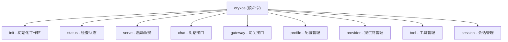
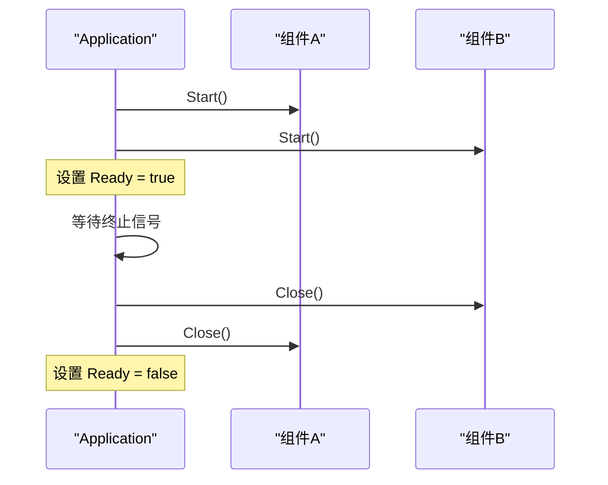
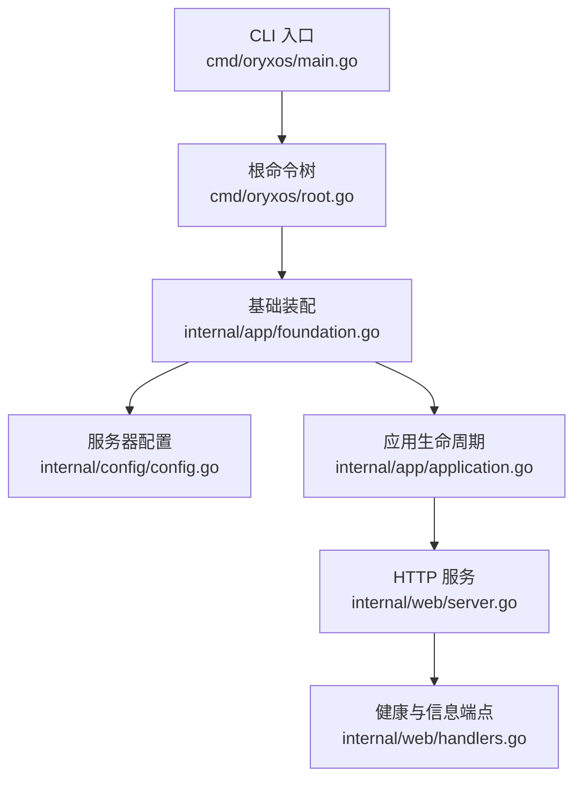
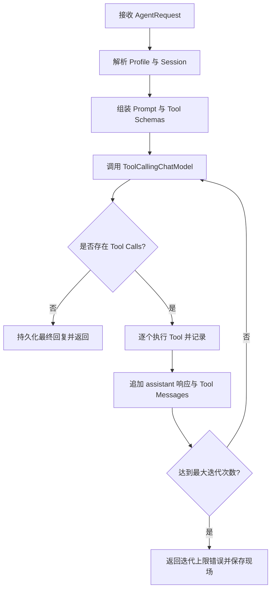
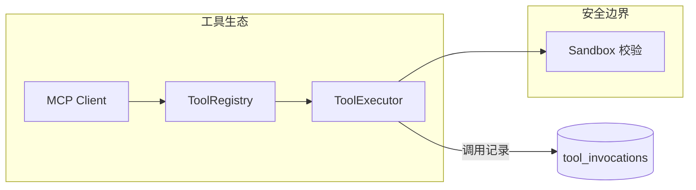
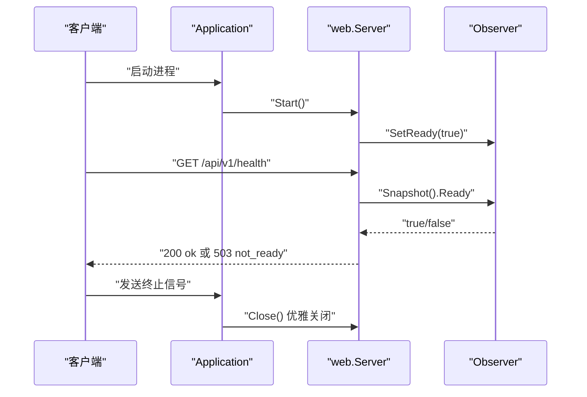

# 核心模块详解

<cite>
**本文引用的文件**
- [main.go](file://cmd/oryxos/main.go)
- [root.go](file://cmd/oryxos/root.go)
- [commands.go](file://cmd/oryxos/commands.go)
- [workspace.go](file://cmd/oryxos/workspace.go)
- [application.go](file://internal/app/application.go)
- [foundation.go](file://internal/app/foundation.go)
- [config.go](file://internal/config/config.go)
- [server.go](file://internal/web/server.go)
- [handlers.go](file://internal/web/handlers.go)
- [go.mod](file://go.mod)
- [TechnicalSolution.md](file://docs/TechnicalSolution.md)
- [第17节：ReAct 原理解析、实现与代码讲解.md](file://docs/class/第17节：ReAct 原理解析、实现与代码讲解.md)
- [doc.go（tool）](file://internal/tool/doc.go)
- [doc.go（sandbox）](file://internal/sandbox/doc.go)
- [doc.go（memory）](file://internal/memory/doc.go)
- [doc.go（session）](file://internal/session/doc.go)
</cite>

## 更新摘要
**变更内容**
- 新增 CLI 框架实现章节，涵盖根命令结构、工作区管理和命令注册机制
- 增强组件化架构模式覆盖，详细说明 Application 生命周期管理
- 更新 Web Service 章节以反映新的组件化设计
- 新增工作区初始化和管理功能说明

## 目录
- CLI 框架与工作区管理
- 组件化架构与应用生命周期
- Provider 与 Eino 集成
- ReAct Runtime
- Memory 与 Session 上下文
- Tool、MCP 与 Sandbox
- Web Service

## CLI 框架与工作区管理

### 根命令结构
OryxOS 使用 Cobra 框架构建完整的命令行界面，采用分层命令设计：



**图表来源**
- [root.go:23-46](file://cmd/oryxos/root.go#L23-L46)
- [commands.go:11-85](file://cmd/oryxos/commands.go#L11-L85)

### 工作区管理系统
工作区是 OryxOS 的核心概念，提供项目级配置和状态管理：

#### 工作区结构
- **profiles/**: Agent 配置文件存储
- **sessions/**: 对话会话数据
- **skills/**: 技能定义文件
- **logs/**: 运行日志
- **memory/**: 长期记忆存储

#### 初始化流程
`InitializeWorkspace` 函数负责创建工作区目录结构和默认配置文件：

1. 创建 `.oryxos` 工作区根目录
2. 初始化必需的子目录（权限 0750）
3. 生成默认配置文件（权限 0600）
4. 输出创建结果（created/skipped）

#### 安全特性
- 拒绝符号链接防止路径逃逸
- 严格的文件权限控制
- 原子性文件写入操作
- 错误时的自动清理机制

**章节来源**
- [workspace.go:72-117](file://cmd/oryxos/workspace.go#L72-L117)
- [workspace.go:169-246](file://cmd/oryxos/workspace.go#L169-L246)
- [commands.go:11-47](file://cmd/oryxos/commands.go#L11-L47)

## 组件化架构与应用生命周期

### 组件接口设计
OryxOS 采用统一的组件抽象，所有可插拔模块都实现 `Component` 接口：

```go
type Component interface {
    Start(context.Context) error
    Close(context.Context) error
}
```

### 应用生命周期管理
`Application` 组件负责协调所有子组件的生命周期：

#### 启动阶段
1. 按注册顺序依次调用各组件的 `Start()` 方法
2. 记录成功启动的组件列表
3. 设置就绪状态到观察者

#### 运行阶段
1. 监听终止信号（SIGINT/SIGTERM）
2. 监控组件错误通道
3. 等待正常关闭或错误触发

#### 关闭阶段
1. 逆序调用已启动组件的 `Close()` 方法
2. 合并所有关闭错误
3. 清理资源并退出



**图表来源**
- [application.go:71-102](file://internal/app/application.go#L71-L102)
- [application.go:153-182](file://internal/app/application.go#L153-L182)

### 基础装配器
`Foundation` 作为应用的装配中心，负责：

1. 加载服务器配置
2. 创建日志记录器和观察者
3. 实例化 Web 服务器
4. 组装 Application 实例

**章节来源**
- [application.go:19-183](file://internal/app/application.go#L19-L183)
- [foundation.go:25-56](file://internal/app/foundation.go#L25-L56)

## Provider 与 Eino 集成
- 设计目标
  - OryxOS 将 Eino core 的 ToolCallingChatModel 作为运行时边界，Provider 工厂按厂商映射，模型实例按 Profile.name 保存，避免多 Profile 共享覆盖。
  - 核心阶段提供两个 Provider，通过配置加载、校验并在启动时完成实例化；缺少变量、模型或名称非法在启动阶段失败，不拖到首次对话才报错。
- 装配流程
  - CLI 入口通过 Cobra 构建命令树，并注入 FoundationOptions。
  - Foundation 读取 YAML 配置与环境变量展开，构造日志与可观测性 Observer，再创建 web.Server 并注册为 Application 组件。
  - Application 统一编排组件生命周期：顺序 Start、等待终止信号、逆序 Close。
- 关键约束
  - Provider 工厂以 provider.name 注册，模型实例以 profile.name 保存。
  - 配置重载通过重启生效，无需在线热替换。
- 依赖关系
  - 使用 Gin 作为 HTTP 框架，Cobra 作为 CLI 框架，log/slog 作为日志，gopkg.in/yaml.v3 解析配置。



**图表来源**
- [main.go:8-12](file://cmd/oryxos/main.go#L8-L12)
- [root.go:23-46](file://cmd/oryxos/root.go#L23-L46)
- [foundation.go:25-56](file://internal/app/foundation.go#L25-L56)
- [config.go:6-39](file://internal/config/config.go#L6-L39)
- [application.go:71-102](file://internal/app/application.go#L71-L102)
- [server.go:18-70](file://internal/web/server.go#L18-L70)
- [handlers.go:21-39](file://internal/web/handlers.go#L21-L39)

**章节来源**
- [main.go:8-12](file://cmd/oryxos/main.go#L8-L12)
- [root.go:23-46](file://cmd/oryxos/root.go#L23-L46)
- [foundation.go:25-56](file://internal/app/foundation.go#L25-L56)
- [config.go:6-39](file://internal/config/config.go#L6-L39)
- [application.go:71-102](file://internal/app/application.go#L71-L102)
- [server.go:18-70](file://internal/web/server.go#L18-L70)
- [handlers.go:21-39](file://internal/web/handlers.go#L21-L39)
- [TechnicalSolution.md:182-217](file://docs/TechnicalSolution.md#L182-L217)
- [go.mod:1-10](file://go.mod#L1-L10)

## ReAct Runtime
- 职责拆分
  - AgentService：统一入口，解析 Profile/Session，调用 Runtime，提交最终结果。
  - ReActLoop：LLM 与 Tool 的循环控制、迭代上限、取消和错误传播。
  - PromptBuilder：按固定顺序组装身份、Skill、Bootstrap、Memory、历史与当前消息。
  - ToolRegistry：为每个 Profile 解析可用 Tool，暴露 Tool schema。
  - ToolExecutor：参数/白名单校验、执行、有限重试、记录调用。
  - SessionService：会话解析、追加消息、截断上下文、归档。
- 核心循环
  - 接收请求后组装 Prompt 与 Tool schemas，调用 ToolCallingChatModel。
  - 若存在 Tool Calls，逐个执行并记录，再将 assistant 完整响应与 Tool messages 追加进 Session。
  - 达到最大轮数强制停止，返回错误并保存现场。
- 安全与稳定性
  - 设置最大迭代次数防止死循环。
  - 每轮必须保存 assistant 完整消息，避免工具调用 ID 丢失或上下文不一致。
  - 异常路径需清理上下文，避免线程复用串号。



**图表来源**
- [TechnicalSolution.md:246-275](file://docs/TechnicalSolution.md#L246-L275)
- [第17节：ReAct 原理解析、实现与代码讲解.md:45-71](file://docs/class/第17节：ReAct 原理解析、实现与代码讲解.md#L45-L71)

**章节来源**
- [TechnicalSolution.md:246-275](file://docs/TechnicalSolution.md#L246-L275)
- [第17节：ReAct 原理解析、实现与代码讲解.md:45-71](file://docs/class/第17节：ReAct 原理解析、实现与代码讲解.md#L45-L71)

## Memory 与 Session 上下文
- 长期记忆
  - memory 包用于 Markdown 驱动的长期记忆存储，后续由 Skill 与 PromptBuilder 按需读写，参与上下文拼装。
- 会话管理
  - session 包负责会话解析、消息追加、上下文截断与归档，确保每轮对话状态可审计、可恢复。
- 与 ReAct 的关系
  - ReActLoop 每轮将 LLM 响应与工具结果追加至 Session，保证审计与下一轮上下文连续性。
  - SessionService 在达到长度限制时进行截断，避免上下文爆炸。

```mermaid
sequenceDiagram
participant Loop as "ReActLoop"
participant Session as "SessionService"
participant Memory as "MemoryStore"
Loop->>Session : "追加用户消息"
Loop->>Session : "获取历史上下文"
Session->>Memory : "读取长期记忆片段"
Memory-->>Session : "返回记忆内容"
Session-->>Loop : "返回上下文"
Loop->>Loop : "调用 LLM 并处理 Tool Calls"
Loop->>Session : "追加 assistant 响应与工具结果"
Session->>Session : "必要时截断历史"
```

**图表来源**
- [doc.go（memory）:1-6](file://internal/memory/doc.go#L1-L6)
- [doc.go（session）:1-6](file://internal/session/doc.go#L1-L6)
- [TechnicalSolution.md:246-275](file://docs/TechnicalSolution.md#L246-L275)

**章节来源**
- [doc.go（memory）:1-6](file://internal/memory/doc.go#L1-L6)
- [doc.go（session）:1-6](file://internal/session/doc.go#L1-L6)
- [TechnicalSolution.md:246-275](file://docs/TechnicalSolution.md#L246-L275)

## Tool、MCP 与 Sandbox
- Tool 体系
  - tool 包作为工具注册与执行边界，后续支持零代码（SKILL.md + MCP）、轻代码（自建 MCP server）、重代码（Go Tool 实现 Eino InvokableTool）。
  - ToolExecutor 负责参数与白名单校验、幂等键、有限重试与结构化调用记录。
- MCP 集成
  - 使用官方 MCP Go SDK，通过 mcp_servers.yaml 定义 stdio 与 remote 两种传输方式。
  - Profile 仅引用 server name，连接细节集中管理；进程关闭时统一释放客户端。
  - MCP Server 提供的 Tools 需经过名称冲突检查、Profile 可用列表与统一调用记录入口。
- 应用层 Sandbox
  - 核心阶段 Sandbox 是统一校验层，不是容器隔离。
  - 校验路径、命令与 URL，拒绝软链接逃逸，HTTP 重定向后重新校验，命令以参数数组执行，所有调用设置超时与输入输出上限。



**图表来源**
- [doc.go（tool）:1-6](file://internal/tool/doc.go#L1-L6)
- [doc.go（sandbox）:1-6](file://internal/sandbox/doc.go#L1-L6)
- [TechnicalSolution.md:386-457](file://docs/TechnicalSolution.md#L386-L457)

**章节来源**
- [doc.go（tool）:1-6](file://internal/tool/doc.go#L1-L6)
- [doc.go（sandbox）:1-6](file://internal/sandbox/doc.go#L1-L6)
- [TechnicalSolution.md:386-457](file://docs/TechnicalSolution.md#L386-L457)

## Web Service
- 服务装配
  - web.Server 基于 Gin 构建，注册全局中间件：请求 ID、请求体大小限制、访问观察、恢复中间件。
  - 默认路由 /api/v1/health 与 /api/v1/info 暴露服务就绪状态与版本信息。
- 生命周期
  - Server 实现 Component 接口，Start 绑定监听器并启动 HTTP 服务，Close 优雅关闭。
  - Application 统一管理组件启动与关闭顺序，捕获终端错误并记录。
- 可观测性与容错
  - 通过 observability.Observer 暴露 Ready 状态，健康检查据此返回 200 或 503。
  - NoRoute/NoMethod 统一返回标准化错误结构。



**图表来源**
- [application.go:71-102](file://internal/app/application.go#L71-L102)
- [server.go:18-70](file://internal/web/server.go#L18-L70)
- [handlers.go:21-39](file://internal/web/handlers.go#L21-L39)

**章节来源**
- [application.go:71-102](file://internal/app/application.go#L71-L102)
- [server.go:18-70](file://internal/web/server.go#L18-L70)
- [handlers.go:21-39](file://internal/web/handlers.go#L21-L39)