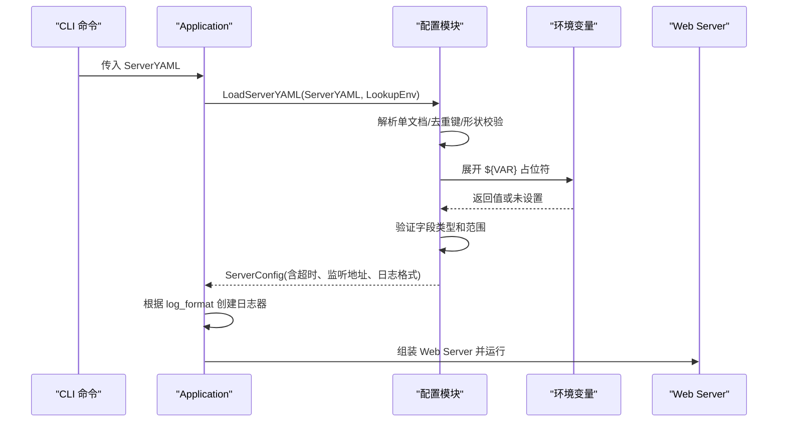
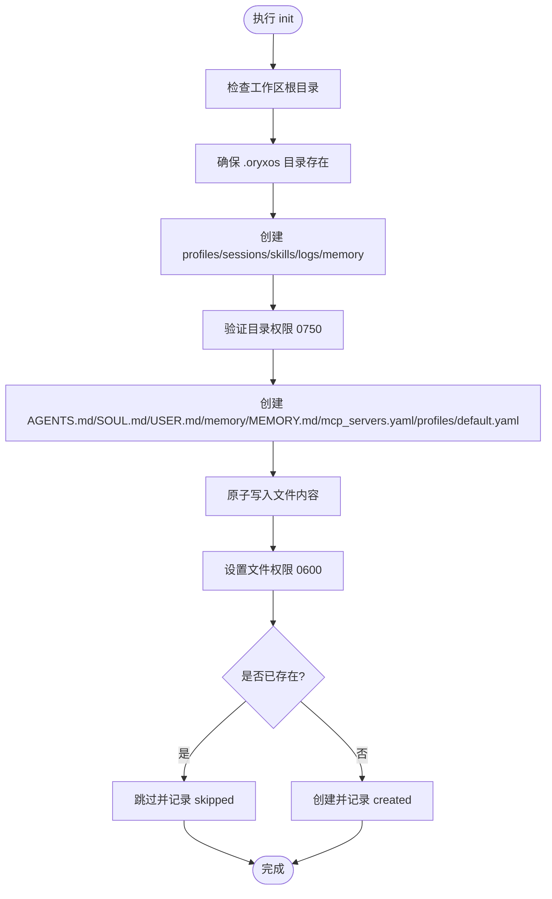
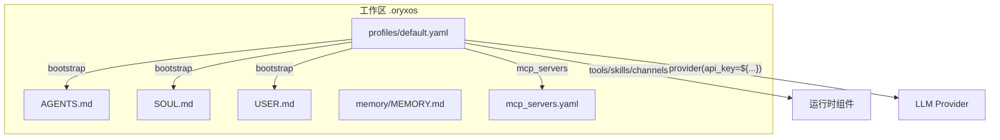
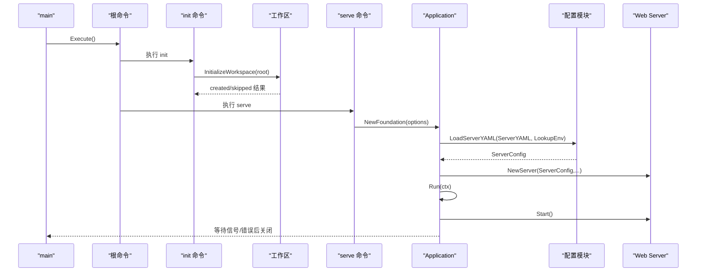

# 配置与初始化

<cite>
**本文引用的文件**
- [internal/config/config.go](file://internal/config/config.go)
- [internal/config/load.go](file://internal/config/load.go)
- [internal/config/expand.go](file://internal/config/expand.go)
- [internal/config/redact.go](file://internal/config/redact.go)
- [cmd/oryxos/workspace.go](file://cmd/oryxos/workspace.go)
- [cmd/oryxos/commands.go](file://cmd/oryxos/commands.go)
- [cmd/oryxos/root.go](file://cmd/oryxos/root.go)
- [cmd/oryxos/main.go](file://cmd/oryxos/main.go)
- [internal/app/foundation.go](file://internal/app/foundation.go)
- [internal/app/application.go](file://internal/app/application.go)
- [internal/web/server.go](file://internal/web/server.go)
- [internal/observability/console_handler.go](file://internal/observability/console_handler.go)
- [website/docs/cli.md](file://website/docs/cli.md)
- [website/docs/profile.md](file://website/docs/profile.md)
- [website/zh/docs/cli.md](file://website/zh/docs/cli.md)
- [website/zh/docs/profile.md](file://website/zh/docs/profile.md)
</cite>

## 更新摘要
**所做更改**
- 增强了工作区初始化过程的安全性，包括符号链接防护、严格的权限控制和原子文件操作
- 添加了完整的 .oryxos 目录结构说明，包括强制子目录和文件的详细权限要求
- 更新了默认配置文件生成机制，包含完整的 Profile YAML 模板
- 增强了工作区状态管理系统，提供精确的初始化和未初始化状态检测
- 完善了安全最佳实践，包括敏感信息保护和输入验证
- 更新了初始化流程架构图和执行步骤，反映最新的实现细节

## 目录
- 配置加载规则
- 工作区结构与安全管理
- Profile YAML 配置参考
- CLI 命令参考
- 初始化流程
- 安全与最佳实践

## 配置加载规则

### 核心特性
OryxOS 的配置系统提供企业级的配置管理能力，支持严格的验证、环境变量展开和详细的安全控制。

- **进程级 HTTP 服务器配置**通过 YAML 提供，由配置模块负责解析、校验并产出强类型结构。
- **CLI 的 serve 命令**将外部传入的 ServerYAML 字节切片交给配置模块处理；若未显式提供，则使用默认值。
- **环境变量占位符**以 `${VAR}` 形式出现在标量字符串中，会在解码前被展开，缺失变量会报错。

### 支持的顶层字段与子字段

#### 顶层配置字段
| 字段 | 类型 | 默认值 | 说明 |
|------|------|--------|------|
| `listen_address` | string | `127.0.0.1:8080` | 服务器监听地址，格式为 host:port |
| `log_format` | string | `console` | 日志格式，仅支持 `console` 或 `json` |
| `shutdown_timeout` | duration | `30s` | 优雅关闭超时时间 |
| `http` | object | - | HTTP 服务器详细配置 |

#### HTTP 子字段配置
| 字段 | 类型 | 默认值 | 说明 |
|------|------|--------|------|
| `read_header_timeout` | duration | `5s` | 读取请求头超时 |
| `read_timeout` | duration | `30s` | 读取请求体超时 |
| `write_timeout` | duration | `5m` | 写入响应超时 |
| `idle_timeout` | duration | `60s` | 空闲连接保持超时 |

### 严格验证规则
- **单文档限制**：只允许单个 YAML 文档；多余文档会被拒绝
- **重复键检测**：禁止重复键；未知字段会报告具体路径
- **类型验证**：类型错误会尝试回溯到 YAML 行号，并输出字段路径，便于定位问题
- **空值拒绝**：空值（null）不被接受，标量必须为字符串
- **端口范围验证**：listen_address 必须为 host:port 且端口在 1..65535
- **超时验证**：所有超时字段均为 Go duration 字符串且必须大于零

### 环境变量展开机制
- **占位符格式**：`${ENV_VAR_NAME}` 形式的占位符
- **变量名规范**：需符合 ASCII 字母/数字/下划线规范
- **缺失处理**：未设置的环境变量会返回明确错误信息，避免静默失败
- **嵌套支持**：支持在任意字符串值中使用环境变量占位符



**图表来源**
- [internal/app/foundation.go:25-55](file://internal/app/foundation.go#L25-L55)
- [internal/config/load.go:42-65](file://internal/config/load.go#L42-L65)
- [internal/config/expand.go:11-44](file://internal/config/expand.go#L11-L44)

**章节来源**
- [internal/config/config.go:6-39](file://internal/config/config.go#L6-L39)
- [internal/config/load.go:16-373](file://internal/config/load.go#L16-L373)
- [internal/config/expand.go:11-99](file://internal/config/expand.go#L11-L99)
- [internal/app/foundation.go:15-64](file://internal/app/foundation.go#L15-L64)

## 工作区结构与安全管理

### 工作区根目录
- 位于当前工作目录下的 `.oryxos` 隐藏目录
- 初始化命令会确保该目录存在，并以安全权限创建所需子目录和文件

### 强制子目录及其安全要求
| 目录 | 用途 | 权限 | 安全特性 |
|------|------|------|----------|
| `profiles/` | 存放 Profile 定义文件 | 0750 | 符号链接防护、权限验证 |
| `sessions/` | 会话数据 | 0750 | 符号链接防护、权限验证 |
| `skills/` | 技能定义 | 0750 | 符号链接防护、权限验证 |
| `logs/` | 日志输出 | 0750 | 符号链接防护、权限验证 |
| `memory/` | 记忆存储 | 0750 | 符号链接防护、权限验证 |

### 强制文件及其安全要求
| 文件 | 用途 | 权限 | 安全特性 |
|------|------|------|----------|
| `AGENTS.md` | 项目指令 | 0600 | 原子写入、符号链接防护 |
| `SOUL.md` | Agent 人格 | 0600 | 原子写入、符号链接防护 |
| `USER.md` | 用户偏好 | 0600 | 原子写入、符号链接防护 |
| `memory/MEMORY.md` | 初始记忆文件 | 0600 | 原子写入、符号链接防护 |
| `mcp_servers.yaml` | MCP 服务器列表 | 0600 | 原子写入、符号链接防护 |
| `profiles/default.yaml` | 默认 Profile 模板 | 0600 | 原子写入、符号链接防护 |

### 增强的安全机制

#### 符号链接防护
- **工作区根目录检查**：拒绝符号链接指向的工作区目标，防止绕过安全检查
- **文件符号链接检测**：拒绝符号链接指向的文件，确保文件完整性
- **目录符号链接检测**：拒绝符号链接指向的目录，防止意外访问外部资源

#### 原子文件操作
- **临时文件创建**：使用 `CreateTemp` 创建临时文件，避免部分写入
- **原子链接发布**：通过硬链接将临时文件原子地发布为目标文件
- **错误清理**：任何失败都会自动清理临时文件，确保工作区一致性

#### 权限强制执行
- **目录权限验证**：确保目录权限为 0750，拒绝不正确的权限设置
- **文件权限设置**：所有工作区文件设置为 0600，仅所有者可读写
- **权限回滚**：权限设置失败时自动清理已创建的目录

### 初始化行为
- **安全创建**：仅创建不存在的目标；已存在的目标不会被覆盖
- **幂等性保证**：多次执行 init 不会产生副作用，已存在目标跳过创建
- **审计输出**：输出每个目标的创建结果（created/skipped），便于审计
- **状态一致性**：确保工作区始终处于一致的状态

### 状态检查
- **initialized**：当 `.oryxos` 及其全部强制目录与文件均存在且权限正确时
- **not_initialized**：否则处于未初始化状态



**图表来源**
- [cmd/oryxos/workspace.go:72-108](file://cmd/oryxos/workspace.go#L72-L108)
- [cmd/oryxos/workspace.go:130-185](file://cmd/oryxos/workspace.go#L130-L185)
- [cmd/oryxos/workspace.go:200-246](file://cmd/oryxos/workspace.go#L200-L246)

**章节来源**
- [cmd/oryxos/workspace.go:12-62](file://cmd/oryxos/workspace.go#L12-L62)
- [cmd/oryxos/workspace.go:72-128](file://cmd/oryxos/workspace.go#L72-L128)
- [cmd/oryxos/workspace.go:130-203](file://cmd/oryxos/workspace.go#L130-L203)
- [cmd/oryxos/workspace.go:200-246](file://cmd/oryxos/workspace.go#L200-L246)

## Profile YAML 配置参考

### 默认 Profile 位置与用途
- 位于 `.oryxos/profiles/default.yaml`，作为新工作区的基线配置
- 定义了 Agent 身份、Provider、可用 Tools、Skills、MCP 服务器、通知渠道、定时任务、Channel 以及 ReAct 循环相关设置

### 关键字段说明
| 字段 | 类型 | 说明 |
|------|------|------|
| `name` | string | Profile 标识名称 |
| `description` | string | Profile 描述信息 |
| `identity.agent_name` | string | Agent 名称 |
| `identity.prompt` | string | 系统提示词 |
| `provider.name` | string | LLM Provider 名称 |
| `provider.model` | string | 模型名称 |
| `provider.api_key` | string | API 密钥，支持环境变量占位符 |
| `provider.base_url` | string | 基础 URL |
| `provider.temperature` | number | 温度参数 |
| `tools` | array | 启用的内置工具列表 |
| `skills` | array | 关联的技能名称列表 |
| `mcp_servers` | array | MCP 服务器列表 |
| `notify_channels` | array | 通知渠道列表 |
| `schedules` | array | 定时任务列表 |
| `channels` | array | 通信通道列表 |
| `bootstrap` | array | 启动时注入的基础文档 |
| `settings.max_iterations` | integer | ReAct 循环最大迭代次数 |
| `settings.max_history_turns` | integer | 历史轮数限制 |

### 环境变量与扩展
- **敏感字段支持**：Provider 的 `api_key` 等敏感字段可通过 `${ENV_VAR}` 引用环境变量
- **配置加载阶段展开**：在配置加载阶段进行环境变量展开
- **缺失变量处理**：若变量未设置，将在配置加载时报错，避免运行时泄露或缺失

### 管理命令
- `profile list/create/show/delete` 命令已注册，但当前实现为占位，后续将基于 `.oryxos/profiles` 下的 YAML 文件进行管理



**图表来源**
- [cmd/oryxos/workspace.go:14-62](file://cmd/oryxos/workspace.go#L14-L62)

**章节来源**
- [cmd/oryxos/workspace.go:14-62](file://cmd/oryxos/workspace.go#L14-L62)
- [cmd/oryxos/commands.go:55-64](file://cmd/oryxos/commands.go#L55-L64)

## CLI 命令参考

### 全局选项
| 选项 | 默认值 | 说明 |
|------|--------|------|
| `--workspace <path>` | `./.oryxos` | 覆盖工作区路径 |
| `--log-level <level>` | `info` | 日志级别：debug、info、warn、error |

### 初始化和状态

#### oryxos init
初始化 `.oryxos/` 工作区。在当前目录创建目录结构、默认配置文件和 SQLite 数据库。已存在工作区时会跳过已有文件，不会覆盖。

```bash
oryxos init
```

#### oryxos status
查看当前工作区配置和运行状态，包括已加载的 Profile 数量、Provider 连通性、注册的 Tool 列表和活跃会话数。

```bash
oryxos status
```

### 对话

#### oryxos chat
启动交互式多轮对话。每轮对话经过完整的 ReAct Loop，Agent 可调用工具后再回复。使用 `/exit` 或 Ctrl+C 退出。

```bash
oryxos chat [--profile <name>]
```

| 选项 | 默认值 | 说明 |
|------|--------|------|
| `--profile <name>` | `default` | 指定使用的 Profile |

### 服务

#### oryxos serve
启动 HTTP API 服务，对外暴露 REST 端点。

```bash
oryxos serve [--port <port>]
```

| 选项 | 默认值 | 说明 |
|------|--------|------|
| `--port <port>` | `8080` | 监听端口 |

#### oryxos gateway
以守护进程模式启动，同时接入多个 Channel（CLI、API 等），适合生产部署场景。

```bash
oryxos gateway
```

### Profile 管理

#### oryxos profile list
列出 `.oryxos/profiles/` 下所有 Profile 及其基本信息。

```bash
oryxos profile list
```

#### oryxos profile create
创建新 Profile，在 `.oryxos/profiles/` 下生成带默认字段的 YAML 文件。

```bash
oryxos profile create <name>
```

#### oryxos profile show
打印指定 Profile 的完整配置内容。

```bash
oryxos profile show <name>
```

#### oryxos profile delete
删除指定 Profile 文件。

```bash
oryxos profile delete <name>
```

### 查询

#### oryxos provider list
列出已配置的所有 Provider 及其连通状态。

```bash
oryxos provider list
```

#### oryxos tool list
列出 ToolRegistry 中当前注册的所有可用 Tool，包括内置 Tool 和通过 MCP 接入的 Tool。

```bash
oryxos tool list
```

#### oryxos session list
列出当前活跃的会话，包括 Session ID、关联 Profile、用户 ID 和最后活跃时间。

```bash
oryxos session list
```

**章节来源**
- [website/docs/cli.md:1-237](file://website/docs/cli.md#L1-L237)
- [website/zh/docs/cli.md:1-179](file://website/zh/docs/cli.md#L1-L179)
- [cmd/oryxos/commands.go:11-86](file://cmd/oryxos/commands.go#L11-L86)

## 初始化流程

### 命令行入口
- **main 函数**构造根命令并执行；根命令注册 init、status、serve、profile 等子命令
- **init 命令**调用 InitializeWorkspace，创建 `.oryxos` 及必要内容
- **status 命令**输出工作区初始化状态
- **serve 命令**构建 Foundation 并运行 Application

### 工作区初始化
- 确保 `.oryxos` 根目录存在
- 创建 profiles、sessions、skills、logs、memory 目录
- 创建 AGENTS.md、SOUL.md、USER.md、memory/MEMORY.md、mcp_servers.yaml、profiles/default.yaml
- 对已存在目标跳过创建，并输出结果

### 应用启动
- **NewFoundation** 接收 FoundationOptions，内部加载 ServerYAML 并生成 ServerConfig
- 根据 log_format 选择日志器，创建 Web Server
- 将 Server 作为 Component 加入 Application，统一生命周期管理
- **Application.Run** 顺序启动各组件，等待终止信号或致命错误，然后逆序关闭



**图表来源**
- [cmd/oryxos/main.go:8-13](file://cmd/oryxos/main.go#L8-L13)
- [cmd/oryxos/root.go:22-46](file://cmd/oryxos/root.go#L22-L46)
- [cmd/oryxos/commands.go:11-47](file://cmd/oryxos/commands.go#L11-L47)
- [internal/app/foundation.go:25-55](file://internal/app/foundation.go#L25-L55)
- [internal/app/application.go:68-99](file://internal/app/application.go#L68-L99)

**章节来源**
- [cmd/oryxos/main.go:8-13](file://cmd/oryxos/main.go#L8-L13)
- [cmd/oryxos/root.go:22-46](file://cmd/oryxos/root.go#L22-L46)
- [cmd/oryxos/commands.go:11-47](file://cmd/oryxos/commands.go#L11-L47)
- [internal/app/foundation.go:25-64](file://internal/app/foundation.go#L25-L64)
- [internal/app/application.go:68-183](file://internal/app/application.go#L68-L183)

## 安全与最佳实践

### 敏感信息保护
- **自动脱敏**：错误消息中的敏感信息会自动隐藏，包括 API 密钥、令牌、URL 中的凭据等
- **敏感字段识别**：系统自动识别常见的敏感字段名，如 api_key、password、token、secret 等
- **URL 安全**：URL 中的凭据和查询参数会被检测和脱敏

### 工作区安全建议
- **符号链接防护**：系统拒绝符号链接，防止绕过安全检查
- **最小权限原则**：工作区文件使用严格的文件权限（0600），目录使用（0750）
- **原子操作**：使用临时文件和原子链接确保文件创建的原子性
- **输入验证**：所有配置都经过严格验证，防止恶意输入

### 配置安全建议
- **环境变量使用**：敏感配置应通过环境变量提供，避免硬编码在配置文件中
- **最小权限原则**：工作区文件使用严格的文件权限（0600），目录使用（0750）
- **符号链接防护**：系统拒绝符号链接，防止绕过安全检查
- **输入验证**：所有配置都经过严格验证，防止恶意输入

### 性能优化建议
- **超时配置**：合理设置 HTTP 超时时间，避免资源泄漏
- **日志格式选择**：生产环境建议使用 JSON 格式以便日志收集和分析
- **内存管理**：合理配置会话数量和历史记录大小

**章节来源**
- [internal/config/redact.go:1-108](file://internal/config/redact.go#L1-108)
- [internal/config/load.go:297-373](file://internal/config/load.go#L297-L373)
- [cmd/oryxos/workspace.go:169-246](file://cmd/oryxos/workspace.go#L169-L246)