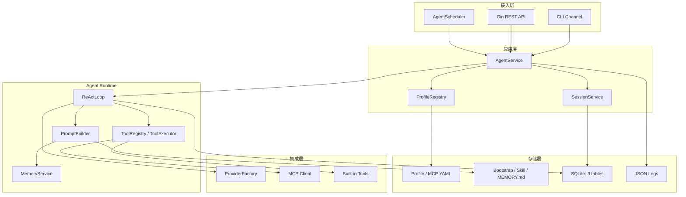
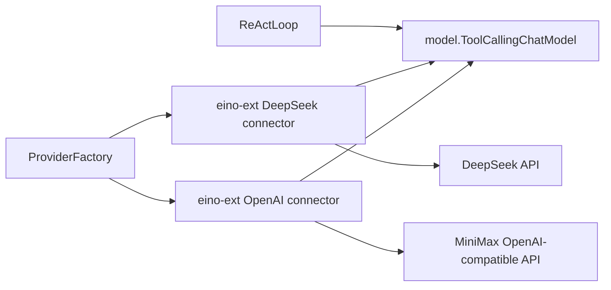
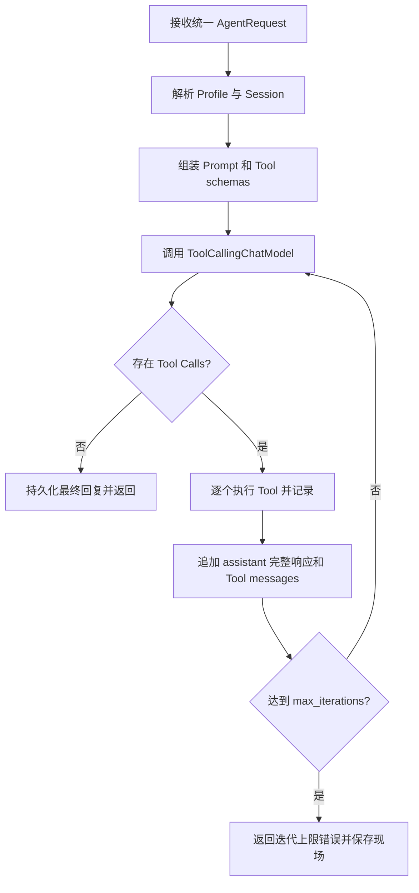
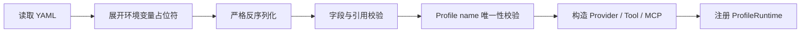
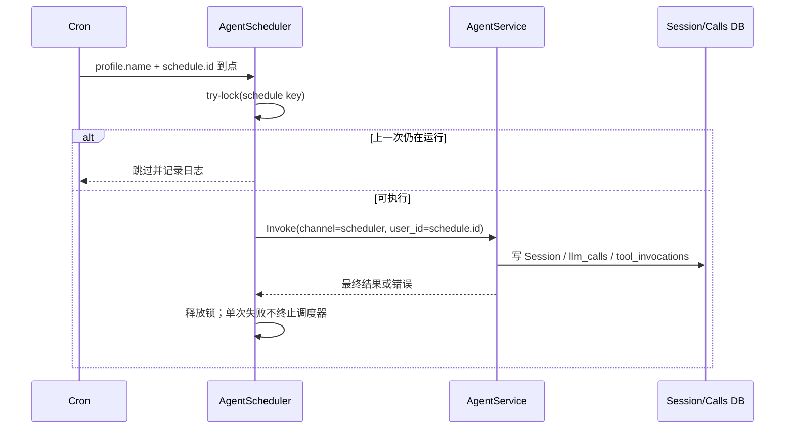

# OryxOS 技术方案

> 本文档定义 OryxOS 的技术方案，回答 **How**。功能范围、阶段边界和验收口径以《OryxOS 需求文档》为唯一事实来源；若本文档与需求文档冲突，以需求文档为准。

---

## 1. 方案目标与约束

### 1.1 核心阶段目标

核心阶段用 Go 1.26 在 4 周、合计 12 小时内跑通最短闭环：

1. `oryxos init` 初始化工作区，用户编辑 `profiles/default.yaml` 配置 API key 和模型。
2. Profile 绑定 Provider、Skill、Tool、Bootstrap、Channel 和定时规则，形成可运行 Agent。
3. CLI、HTTP API、AgentScheduler 统一进入 `AgentService`。
4. `AgentService` 驱动自研 ReAct 循环，通过 Eino 调用 DeepSeek 或 MiniMax，并执行内置/MCP Tool。
5. Session 和调用记录存入 SQLite，长期记忆存入 `memory/MEMORY.md`。
6. 交付每日天气、每日科技日报两个定时推送 Demo。

核心阶段不是完整企业治理平台。多租户、SSO、RBAC、完整审计、Provider fallback、多 IM Channel、任务管理 API、向量记忆等均属于扩展阶段。

### 1.2 关键技术决策

| 决策项 | 核心阶段选择 | 理由 |
|---|---|---|
| Agent 执行 | 自研轻量 ReAct 循环 | 保持循环、持久化、Tool 审计和错误处理可控 |
| 模型抽象 | Eino core `model.ToolCallingChatModel` | 运行时只依赖稳定的统一接口 |
| Provider 实现 | Eino-ext connector | 不重复实现厂商协议；connector 细节隔离在工厂内 |
| 首批模型 | DeepSeek + MiniMax | 同时验证原生 connector 与 OpenAI 兼容 connector |
| Web | Gin | 轻量、成熟，满足 10 个核心 REST 端点 |
| CLI | Cobra | 支持 12 个命令及分组子命令 |
| 数据库 | GORM + `github.com/glebarez/sqlite` | 该 dialector 由 `modernc.org/sqlite` 驱动，不依赖 CGO |
| 长期记忆 | Markdown 文件 | 与需求的极简 `MEMORY.md` 口径一致 |
| MCP | 官方 Go SDK `github.com/modelcontextprotocol/go-sdk/mcp` | 避免自建协议层，统一 stdio/远程连接 |
| 定时调度 | `robfig/cron/v3` | 支持 cron 与时区，Profile 重启加载即可 |
| 日志 | `log/slog` JSON Handler | 标准库、结构化、便于后续接入日志平台 |

### 1.3 明确不采用的旧设计

- 不使用 `.oryxos/agents/<name>/AGENT.md`；Profile YAML 是运行时配置唯一来源，Skill 位于 `.oryxos/skills/`。
- 不在核心阶段引入 `SqliteMemoryStore`、Mem0、向量库或 Memory 分区。
- 不在核心阶段创建 `scheduled_tasks`、`task_executions` 表或任务管理 API。
- 不把 Eino-ext 暴露为业务层接口，也不直接依赖 Eino ADK Agent 封装。
- 不使用依赖 CGO 的 `mattn/go-sqlite3`，保证单二进制和交叉编译承诺。

---

## 2. 总体架构

### 2.1 逻辑分层



### 2.2 统一调用入口

CLI、Web Service 和定时任务只负责接入差异，统一请求后都调用 `AgentService.Invoke`。任何触发源都不得绕过 Profile 解析、Session、Memory、ReAct、Tool 和调用记录。

```go
type AgentRequest struct {
	ProfileName string
	Channel     string
	UserID      string
	SessionID   string // 可空；空时按 channel + user + profile 解析或创建
	Message     string
	Stateless   bool
}

type AgentResponse struct {
	SessionID string
	Content   string
}

type AgentService interface {
	Invoke(ctx context.Context, req AgentRequest) (AgentResponse, error)
}
```

### 2.3 Agent 的组成

Agent 不是代码目录，也不是单独的 Markdown 文件：

```text
Agent = Profile（怎么运行） + Skill（做什么）
```

- Profile：`.oryxos/profiles/<name>.yaml`，配置模型、工具、Skill、MCP、通知、Channel、Bootstrap 和 schedules。
- Skill：`.oryxos/skills/**/SKILL.md`，描述业务任务、适用时机和操作方式。
- `Profile.name`：唯一运行时标识，供 CLI、API、Session、Scheduler 使用。
- `identity.agent_name`：展示名称，可以重复，不得作为注册表 key。

---

## 3. Provider 与 Eino 集成

### 3.1 最终调用关系

Provider 最终调用的是 Eino core 的 `model.ToolCallingChatModel`；Eino-ext 负责创建这个接口的具体实现，不是上层业务代码直接调用的统一接口。



依赖方向必须保持为：

```text
runtime -> Eino core interface
provider factory -> Eino-ext concrete connector -> vendor API
```

上层不得保存 Eino-ext 具体类型，也不得让 Handler、Scheduler 或 Tool 直接构造模型 connector。

### 3.2 配置模型

```go
type ProviderConfig struct {
	Name        string  `yaml:"name"`
	Model       string  `yaml:"model"`
	APIKey      string  `yaml:"api_key"`
	BaseURL     string  `yaml:"base_url,omitempty"`
	Temperature float32 `yaml:"temperature,omitempty"`
}
```

核心字段与需求文档完全一致：`name`、`model`、`api_key`、可选 `base_url`、可选 `temperature`。核心阶段不增加 fallback、候选模型、路由权重等字段。

用户初次使用的配置流程是：

1. 执行 `oryxos init`。
2. 编辑 `.oryxos/profiles/default.yaml` 的 `provider.api_key` 和 `provider.model`。
3. 推荐把 `api_key` 写成 `${LLM_API_KEY}`，由 `ConfigLoader` 展开环境变量；也允许通过独立本地配置加载。
4. 缺少变量、模型或 Provider 名称非法时，在启动阶段失败并返回明确字段路径，不能拖到第一次对话才报错。

### 3.3 工厂与实例生命周期

Provider 工厂按 `provider.name` 注册，但模型实例按 `Profile.name` 保存。这样两个 Profile 即使都使用 DeepSeek，也可以拥有不同模型、API key、base URL 和 temperature，不会互相覆盖。

```go
type ModelFactory func(
	ctx context.Context,
	cfg ProviderConfig,
) (model.ToolCallingChatModel, error)

type ProviderRegistry struct {
	factories map[string]ModelFactory               // key: provider.name
	models    map[string]model.ToolCallingChatModel // key: profile.name
}
```

加载过程：

```text
ProfileLoader -> 校验 Profile.name 唯一
  -> ProviderRegistry 找到 provider.name 对应工厂
  -> 工厂读取该 Profile 的完整 ProviderConfig
  -> 创建 ToolCallingChatModel
  -> 以 Profile.name 注册模型实例
```

核心阶段配置重载通过重启生效，因此无需做在线实例热替换。

### 3.4 DeepSeek 与 MiniMax

- **DeepSeek**：使用 Eino-ext DeepSeek connector，工厂返回 `model.ToolCallingChatModel`。
- **MiniMax**：使用 Eino-ext OpenAI connector，配置 MiniMax 官方 OpenAI 兼容 base URL 和模型名；中国区、国际区地址由 Profile 的 `base_url` 明确选择，不在代码中猜测账号区域。
- 两条路径都要验证 Function Calling、多轮 Tool 消息累积、错误归一化和 token 记录。
- Web 核心接口只做同步响应；connector 的 Stream 能力作为兼容性回归项，不等于核心阶段提供 SSE。

建议导入边界：

```go
import (
	"github.com/cloudwego/eino/components/model"
	deepseekmodel "github.com/cloudwego/eino-ext/components/model/deepseek"
	openaimodel "github.com/cloudwego/eino-ext/components/model/openai"
)
```

实际开发时锁定一组通过回归测试的 Eino/Eino-ext 版本，升级前重新验证 Tool Calling 消息格式。

### 3.5 错误和调用记录

Provider 适配层统一返回可判别错误类别：配置错误、认证错误、限流、超时、上游服务错误、响应格式错误。核心阶段不自动切换 Provider；错误返回 Agent 或调用方。

每次模型调用尝试无论成功或失败都记录结构化日志并写 `llm_calls`，至少包含 Session、Provider、模型、token 和耗时。失败或 connector 无法提供准确 token 时，token 字段允许为 0；失败原因和 `usage_available=false` 写入结构化日志，不为此扩充核心表字段。

---

## 4. ReAct Runtime

### 4.1 模块职责

| 模块 | 职责 |
|---|---|
| `AgentService` | 统一入口、解析 Profile/Session、调用 Runtime、提交最终结果 |
| `ReActLoop` | LLM 与 Tool 的循环控制、迭代上限、取消和错误传播 |
| `PromptBuilder` | 按固定顺序组装身份、Skill、Bootstrap、Memory、历史和当前消息 |
| `ToolRegistry` | 为每个 Profile 解析可用 Tool，暴露 Tool schema |
| `ToolExecutor` | 参数/白名单校验、执行、有限重试、记录调用 |
| `SessionService` | 会话解析、追加消息、截断上下文、归档 |

### 4.2 核心循环



核心阶段按模型返回顺序串行执行 Tool Call，不做并行 Tool 调用。每轮必须保存 assistant 的完整消息，再追加对应 Tool 消息，避免 MiniMax/OpenAI 兼容路径丢失 tool call ID 或上下文。

### 4.3 Prompt 组装与优先级

Prompt 使用带标签的独立段落，不把所有文件拼成难以辨识的一段文本：

```text
[RUNTIME_RULES]    OryxOS 不可覆盖的运行时和安全约束
[PROJECT_RULES]    AGENTS.md，项目级行为说明
[AGENT_IDENTITY]   Profile.identity.prompt + SOUL.md
[SKILLS]           Profile 引用的 SKILL.md
[USER_PREFERENCES] USER.md
[LONG_TERM_MEMORY] MEMORY.md（最多 4000 字）
[HISTORY]          当前 Session 近期对话
[USER_MESSAGE]     本次输入
```

冲突处理优先级：

```text
运行时安全约束 > AGENTS.md > Profile identity / Skill > SOUL.md > USER.md > MEMORY.md
```

- `MEMORY.md` 是事实和偏好上下文，不能覆盖指令。
- Profile 的 `bootstrap` 为空或省略时默认加载 `AGENTS.md`、`SOUL.md`、`USER.md`；显式配置时只加载列出的文件。
- 文件不存在时，默认模板允许为空；Profile 显式引用但找不到的 Skill 或 Bootstrap 必须报错。
- Bootstrap、Skill、Memory 的内容必须包在清晰边界中，防止内容混淆。

### 4.4 上下文和结束条件

- `max_iterations` 默认 10，可由 Profile 覆盖，必须大于 0。
- `max_history_turns` 默认 20；先保留最近 N 轮，再按模型上下文上限继续截断早期消息。
- 核心阶段不做 LLM 总结压缩。
- `context.Context` 贯穿 HTTP/CLI/Scheduler、LLM 和 Tool，支持调用取消与超时。
- 无 Tool Call、调用方取消、不可恢复错误或达到迭代上限时结束循环。

---

## 5. Memory 与 Session 上下文

### 5.1 核心 Memory 边界

核心阶段长期记忆只有一个文件：`.oryxos/memory/MEMORY.md`。不引入 backend 配置、scope、热/冷分区、归档文件、数据库 Memory 表或第三方 Memory 服务。

```go
type MarkdownMemoryStore interface {
	Load(ctx context.Context) (string, error)
	Append(ctx context.Context, content string) error
	Recall(ctx context.Context, query string) ([]string, error)
}
```

- `Load`：启动/请求组装时读取文件；注入 Prompt 前最多保留 4000 字，超出时简单截断。
- `Append`：`save_memory(content)` 以追加方式写入，串行化并使用文件锁或进程内互斥避免并发覆盖。
- `Recall`：`recall_memory(query)` 做大小写不敏感的关键词匹配，返回命中段落及有限上下文。
- 初始化时创建空文件，写入采用限制权限的原子追加策略；失败必须返回 Tool 错误。

自动事实抽取、语义检索、情景记忆、Memory Wiki、矛盾检测和压缩都放扩展阶段。

### 5.2 会话上下文

会话历史存入 SQLite 的 `sessions.messages_json`。会话标识规则：

```text
stateful CLI/Web: channel + user_id + profile.name
stateless invoke: channel="http_invoke" + user_id=request_id + profile.name
scheduler:        channel="scheduler" + user_id=schedule.id + profile.name
```

实现可对上述三元组做规范化后计算稳定哈希作为 `session_id`。无状态 invoke 为每次请求生成唯一 `request_id`，所以每次调用拥有独立 Session 并可在完成后归档；同一 `schedule.id` 历次触发复用 Session，不同 schedule 相互隔离。

### 5.3 并发一致性

- Session 追加消息按 `session_id` 串行化，防止两个请求覆盖同一 `messages_json`。
- 单次 Agent 调用完成后在事务中更新消息历史和 `last_active_at`。
- `DELETE /sessions/{id}` 是逻辑归档，不物理删除数据。
- Scheduler 对单个 schedule 使用非阻塞运行锁；上次未完成时跳过并记录日志。

---

## 6. Tool、MCP 与 Sandbox

### 6.1 Eino Tool 接口边界

Eino 的 `tool.BaseTool` 只提供 Tool 元数据；可执行 Tool 需要实现嵌入 `BaseTool` 的 `tool.InvokableTool`，其核心执行方法是 `InvokableRun`。因此需求中的“实现 BaseTool”在代码层落地为“以 BaseTool 为元数据基线，实现 InvokableTool 执行接口”。

```go
type OryxTool struct {
	Tool       tool.InvokableTool
	Retryable  bool
	Idempotent bool
	Timeout    time.Duration
}
```

`ToolRegistry` 注册 `OryxTool`，向模型暴露 Eino Tool schema；`ToolExecutor` 统一完成校验、执行、错误归一化和调用记录。不得只保存 `tool.BaseTool` 后在运行时做类型猜测。

### 6.2 九个内置 Tool

| Tool | 关键约束 |
|---|---|
| `read_file` | 路径解析后必须位于允许目录 |
| `write_file` | 路径白名单、大小限制，默认非幂等 |
| `list_dir` | 路径白名单、条目数限制 |
| `shell` | 命令白名单、超时、输出大小限制 |
| `http_get` | scheme/域名白名单、超时、响应大小限制 |
| `http_post` | 同上，默认非幂等 |
| `save_memory` | 追加 `MEMORY.md`，默认非幂等 |
| `recall_memory` | 关键词检索 `MEMORY.md` |
| `notify` | 按 Profile 通知渠道发送 Webhook，默认非幂等 |

### 6.3 notify 选择规则

`notify(content, channel?)` 的行为必须确定：

- Profile 没有 `notify_channels`：返回配置错误，不尝试发送。
- 只有一个渠道：`channel` 可省略，自动选唯一渠道。
- 多个渠道：必须提供 `channel`，按唯一的 `notify_channels[].name` 精确匹配。
- 找不到或重复名称：返回配置错误。
- 核心阶段不广播；Webhook URL 仍需通过 HTTP 域名白名单。
- 发送成功或失败都写入 `tool_invocations`，敏感 URL 和认证信息必须脱敏。

### 6.4 Plugin Tool 三种路径

| 路径 | 载体 | 核心实现 |
|---|---|---|
| 零代码 | SKILL.md + 复用 MCP server + Profile 引用 | `SkillLoader` + `McpConfigLoader` + MCP Client |
| 轻代码 | 业务方自建 MCP server | 任意语言实现，OryxOS 作为 MCP client |
| 重代码 | Go Tool 编译进二进制 | 实现 Eino `tool.InvokableTool` 并注册 |

工作区不设置悬空的 `tools/` 配置目录。Go Tool 的注册由代码完成；MCP 连接由 `mcp_servers.yaml` 定义；业务语义由 SKILL.md 定义。

### 6.5 MCP 配置与生命周期

使用官方 MCP Go SDK：`github.com/modelcontextprotocol/go-sdk/mcp`。

```yaml
servers:
  - name: local-files
    transport: stdio
    command: local-files-mcp
    args: ["--root", "./data"]
    env:
      TOKEN: ${LOCAL_FILES_TOKEN}

  - name: company-api
    transport: remote
    url: https://mcp.example.com/mcp
    auth:
      bearer_token: ${COMPANY_MCP_TOKEN}
```

- stdio：要求 `name`、`transport`、`command`，支持可选 `args`、`env`。
- remote：要求 `name`、`transport`、`url`，认证值通过环境变量注入。
- Profile 的 `mcp_servers` 只引用 `name`，连接细节不得复制到 Profile。
- 启动时按 Profile 引用建立或复用 MCP client；进程关闭时统一释放。
- MCP Server 提供的 Tools 必须经过名称冲突、Profile 可用 Tool 列表和同一套调用记录入口；完整 Tool Policy 属于扩展阶段。

### 6.6 重试策略

Tool 只有同时满足以下条件才自动重试：

1. 错误明确标记为可重试；
2. Tool 本身幂等，或本次请求携带可靠幂等键。

满足条件时采用指数退避，最多三次。`write_file`、`shell`、`http_post`、`notify`、`save_memory` 等有副作用调用默认不重试。每次实际尝试写结构化日志，最终结果写一条 `tool_invocations`；核心数据库表不为重试新增字段或独立表。

### 6.7 应用层 Sandbox

核心阶段 Sandbox 是统一校验层，不是容器隔离：

```go
type Sandbox interface {
	ValidatePath(path string, write bool) error
	ValidateCommand(command string, args []string) error
	ValidateURL(target *url.URL) error
}
```

安全要点：先规范化路径再做白名单判断；拒绝软链接逃逸；HTTP 重定向后的每个目标都重新校验；命令以参数数组执行，不拼接 shell 字符串；所有调用设置超时和输入/输出上限。Docker、K8s Pod、WASM 隔离属于扩展阶段。

---

## 7. Web Service

### 7.1 Handler 结构

Gin 层按职责拆为 `SessionHandler`、`AgentHandler`、`ProfileHandler`、`MemoryHandler`、`ToolHandler`、`SystemHandler`。Handler 只做协议解析、校验、调用 Service 和响应映射，不直接访问 GORM、Provider 或 Tool。

### 7.2 核心阶段 10 个端点

| 方法与路径 | Handler | 说明 |
|---|---|---|
| `POST /api/v1/sessions` | Session | 创建会话 |
| `POST /api/v1/sessions/{id}/messages` | Session | 发消息，进入 AgentService |
| `GET /api/v1/sessions/{id}` | Session | 查询历史 |
| `DELETE /api/v1/sessions/{id}` | Session | 逻辑归档 |
| `POST /api/v1/agents/{name}/invoke` | Agent | 以 Profile name 无状态调用 |
| `GET /api/v1/profiles` | Profile | 列 Profile |
| `GET /api/v1/memory` | Memory | 查询长期记忆 |
| `GET /api/v1/tools` | Tool | 列可用 Tool |
| `GET /api/v1/health` | System | 存活/就绪检查 |
| `GET /api/v1/info` | System | 版本、运行模式和 Provider 状态 |

核心端点严格保持 10 个，不提前加入 Profile CRUD、Memory 写入/清理、Tool history、LLM history、任务管理、metrics 或 OpenAPI 端点。

### 7.3 API 约定

- JSON 字段使用 `snake_case`；错误响应统一包含 `code`、`message`、可选 `details` 和 `request_id`。
- Profile 路径参数 `{name}` 必须解析为 `Profile.name`，不能用 `identity.agent_name`。
- `POST /api/v1/agents/{name}/invoke` 不复用历史上下文；接入层为每次请求生成唯一 `request_id`，以 `channel=http_invoke`、`user_id=request_id` 创建用于关联 `llm_calls`、`tool_invocations` 的调用 Session，完成后归档。
- 核心阶段无认证，默认仅部署在可信内网；HTTPS 在反向代理或入口网关终止。
- 核心阶段只提供同步 JSON 响应，不提供 SSE、WebSocket、RBAC 或 Webhook 触发端点。

---
## 8. 工作区、配置与加载

### 8.1 工作区结构

`oryxos init` 创建五个子目录和六个初始文件：三个 Bootstrap 文件，以及 `profiles/default.yaml`、`memory/MEMORY.md`、`mcp_servers.yaml`。

```text
.oryxos/
├── profiles/
│   └── default.yaml
├── sessions/
│   └── oryxos.db
├── skills/
├── logs/
├── memory/
│   └── MEMORY.md
├── mcp_servers.yaml
├── AGENTS.md
├── SOUL.md
└── USER.md
```

数据库文件在首次需要持久化时创建；`init` 至少保证 `sessions/` 存在。不存在 `agents/` 或 `tools/` 目录。

### 8.2 默认 Profile

```yaml
name: default
description: Default OryxOS profile

identity:
  agent_name: Oryx
  prompt: You are a helpful enterprise assistant.

provider:
  name: deepseek
  model: deepseek-chat
  api_key: ${LLM_API_KEY}
  base_url: ""
  temperature: 0.7

tools:
  - read_file
  - write_file
  - list_dir
  - shell
  - http_get
  - http_post
  - save_memory
  - recall_memory
  - notify

skills: []
mcp_servers: []
notify_channels: []
schedules: []
channels:
  - name: cli
    config: {}
bootstrap:
  - AGENTS.md
  - SOUL.md
  - USER.md
settings:
  max_iterations: 10
  max_history_turns: 20
```

`oryxos init` 后，用户直接编辑此文件配置 API key 和模型。推荐使用 `${LLM_API_KEY}`，但流程入口仍然是编辑 `default.yaml`，不是另设 Provider 配置中心。

### 8.3 配置加载流水线



加载器职责：

- `ConfigLoader`：安全读取文件并展开环境变量；日志不得打印展开后的密钥。
- `ProfileLoader`：严格解析 YAML，拒绝未知关键字段，校验 name、Provider、cron、通知渠道和设置范围。
- `SkillLoader`：只加载 Profile 引用的 SKILL.md，校验文件存在。
- `McpConfigLoader`：解析 MCP 定义，校验名称唯一和 transport 所需字段。
- `BootstrapLoader`：按 Profile 指定顺序加载 Bootstrap；未指定时使用默认三文件。
- `ProfileRegistry`：以 `Profile.name` 注册不可变 `ProfileRuntime` 快照。

核心阶段配置修改后重启生效，不实现文件监听或热重载。

### 8.4 Profile 核心结构

```go
type Profile struct {
	Name           string           `yaml:"name"`
	Description    string           `yaml:"description"`
	Identity       IdentityConfig   `yaml:"identity"`
	Provider       ProviderConfig   `yaml:"provider"`
	Tools          []string         `yaml:"tools"`
	Skills         []string         `yaml:"skills"`
	MCPServers     []string         `yaml:"mcp_servers"`
	NotifyChannels []NotifyChannel  `yaml:"notify_channels"`
	Schedules      []ScheduleConfig `yaml:"schedules"`
	Channels       []ChannelConfig  `yaml:"channels"`
	Bootstrap      []string         `yaml:"bootstrap"`
	Settings       RuntimeSettings  `yaml:"settings"`
}
```

`ProfileRuntime` 在启动阶段解析好模型、Tool 集合、Skill 和 Bootstrap 内容，避免每次请求重复做 I/O；`MEMORY.md` 与 Session 属于可变状态，按服务策略读取。

### 8.5 密钥规则

- 核心阶段支持 `${ENV_VAR}` 注入或独立本地配置，不把真实密钥提交到 Profile。
- 缺失环境变量必须报出变量名和 Profile 名，但不得打印其他凭证。
- `api_key`、Webhook URL、MCP auth 在日志和错误详情中统一脱敏。
- 加密存储、密钥轮转、Vault/KMS 集成属于扩展阶段。

---

## 9. Channel、运行模式与 Scheduler

### 9.1 CLI Channel

核心阶段只有 CLI Channel。它负责把终端输入转换为 `AgentRequest`，把最终响应和必要的 Tool 状态显示给用户；HTTP 是 Web Service，不属于 Channel。飞书、企微、钉钉、Slack、邮件等放扩展阶段。

### 9.2 三种运行模式

| 模式 | 启动命令 | 核心职责 |
|---|---|---|
| 交互对话 | `oryxos chat` | CLI 多轮对话；`--message` 可单次发送后退出 |
| HTTP API | `oryxos serve` | 启动 Gin REST API，同时启动 Scheduler |
| 常驻运行 | `oryxos gateway` | 承载 Agent Runtime 与 Scheduler；多 Channel 是扩展能力 |

三种模式共用同一 `Application` 组装根、ProfileRegistry、AgentService 和 SessionStore，避免出现三套行为。

### 9.3 核心阶段 12 个命令

| # | 命令 |
|---:|---|
| 1 | `oryxos init` |
| 2 | `oryxos status` |
| 3 | `oryxos chat [--profile <name>]` |
| 4 | `oryxos serve` |
| 5 | `oryxos gateway` |
| 6 | `oryxos profile list` |
| 7 | `oryxos profile create <name>` |
| 8 | `oryxos profile show <name>` |
| 9 | `oryxos profile delete <name>` |
| 10 | `oryxos provider list` |
| 11 | `oryxos tool list` |
| 12 | `oryxos session list` |

命令数量按可执行叶子命令计数。CLI 不添加需求未定义的 Agent、Memory、Schedule 管理命令。

### 9.4 AgentScheduler

`serve` 和 `gateway` 启动时扫描所有 Profile 的 `schedules`：

```go
type ScheduleConfig struct {
	ID       string `yaml:"id"`
	Cron     string `yaml:"cron"`
	Timezone string `yaml:"timezone"`
	Message  string `yaml:"message"`
	Enabled  bool   `yaml:"enabled"`
}
```



- schedule key 使用 `profile.name + schedule.id`，要求同一 Profile 内 `schedule.id` 唯一。
- 时区必须可由 Go `time.LoadLocation` 解析；cron 非法时启动失败并指出 Profile/schedule。
- Scheduler 不自行执行 Tool，也不另建 Agent 执行链。
- Profile YAML 是任务定义唯一来源；重启重新注册。
- 核心阶段不持久化任务状态和独立执行历史，不提供查询、启停或立即执行 API。
- 需要主动推送时由 Agent 调内置 `notify` 或推送类 MCP Tool。

### 9.5 项目主页

核心阶段主页采用 VitePress 生成静态站点，内容至少包含项目定位、五项核心能力、快速开始、两个 Demo 和扩展路线。站点代码与 Go Runtime 分离构建，发布产物为静态文件，不嵌入 OryxOS 二进制，也不增加核心 REST 端点。架构图直接使用 Mermaid 或仓库内受版本管理的资源，禁止引用不存在的站外相对路径。

---

## 10. 数据持久化

### 10.1 SQLite 选型与单二进制

采用 GORM，并通过 `github.com/glebarez/sqlite` 使用纯 Go 的 `modernc.org/sqlite` 驱动：

```go
import (
	"github.com/glebarez/sqlite"
	"gorm.io/gorm"
)

db, err := gorm.Open(sqlite.Open(dbPath), &gorm.Config{})
```

不得替换成依赖 `mattn/go-sqlite3` 的 dialector。发布构建至少验证：

```bash
CGO_ENABLED=0 go build ./cmd/oryxos
```

数据库路径固定在 `.oryxos/sessions/oryxos.db`。实现阶段锁定相互兼容的 GORM、dialector 和 modernc 驱动版本，并在 Linux 目标架构跑迁移与读写测试。

### 10.2 核心阶段三张表

#### sessions

| 字段 | 类型/约束 |
|---|---|
| `session_id` | TEXT PRIMARY KEY |
| `profile_name` | TEXT NOT NULL |
| `channel` | TEXT NOT NULL |
| `user_id` | TEXT NOT NULL |
| `messages_json` | TEXT NOT NULL |
| `status` | TEXT NOT NULL (`active`/`archived`) |
| `created_at` | DATETIME NOT NULL |
| `last_active_at` | DATETIME NOT NULL |
| `archived_at` | DATETIME NULL |

建立普通复合索引 `(channel, user_id, profile_name, status)`，供 SessionService 按 `status=active` 查找状态会话；该索引不设唯一约束，记录唯一性由 `session_id` 主键保证。无状态 invoke 使用每次唯一的 `request_id` 作为 `user_id`；Scheduler 使用 `channel=scheduler`、`user_id=schedule.id`。

#### tool_invocations

| 字段 | 类型/约束 |
|---|---|
| `id` | INTEGER PRIMARY KEY AUTOINCREMENT |
| `session_id` | TEXT NOT NULL, INDEX |
| `tool_name` | TEXT NOT NULL |
| `input_json` | TEXT NOT NULL |
| `result_json` | TEXT NOT NULL |
| `success` | BOOLEAN NOT NULL |
| `error_message` | TEXT NULL |
| `duration_ms` | INTEGER NOT NULL |
| `created_at` | DATETIME NOT NULL |

#### llm_calls

| 字段 | 类型/约束 |
|---|---|
| `id` | INTEGER PRIMARY KEY AUTOINCREMENT |
| `session_id` | TEXT NOT NULL, INDEX |
| `provider` | TEXT NOT NULL |
| `model` | TEXT NOT NULL |
| `prompt_tokens` | INTEGER NOT NULL DEFAULT 0 |
| `completion_tokens` | INTEGER NOT NULL DEFAULT 0 |
| `total_tokens` | INTEGER NOT NULL DEFAULT 0 |
| `duration_ms` | INTEGER NOT NULL |
| `created_at` | DATETIME NOT NULL |

核心阶段只有这三张表。不得因 Scheduler、Memory、Profile 或配置引入额外业务表。

### 10.3 SQLite 运行参数

- 启用 WAL 和合理的 `busy_timeout`，降低并发读写冲突。
- 使用应用层 per-session 锁配合短事务，不在数据库事务内调用 LLM 或 Tool。
- 启动时自动迁移仅限上述三表；迁移失败则服务不进入 ready。
- SQLite 文件和日志目录权限按运行用户最小化设置。

---

## 11. Go 工程结构

```text
oryxos-go/
├── cmd/oryxos/
│   └── main.go
├── internal/
│   ├── app/                 # Application 组装与生命周期
│   ├── config/              # ConfigLoader、类型与校验
│   ├── profile/             # ProfileLoader、ProfileRegistry
│   ├── skill/               # SkillLoader
│   ├── bootstrap/           # BootstrapLoader、Prompt 分段
│   ├── provider/            # 工厂、DeepSeek/MiniMax 适配
│   ├── runtime/             # AgentService、ReActLoop、PromptBuilder
│   ├── memory/              # MarkdownMemoryStore
│   ├── session/             # SessionService、SessionStore
│   ├── tool/
│   │   ├── builtin/         # 9 个内置 Tool
│   │   ├── mcp/             # 官方 MCP SDK client 适配
│   │   ├── registry.go
│   │   └── executor.go
│   ├── sandbox/             # 文件/命令/URL 白名单
│   ├── scheduler/           # Profile schedules -> AgentService
│   ├── channel/cli/         # 唯一核心 Channel
│   ├── web/                 # Gin router、Handlers、DTO
│   ├── store/               # GORM、迁移、三张表 Store
│   └── observability/       # slog、request/session correlation
├── docs/
├── go.mod
└── go.sum
```

包依赖规则：

```text
cmd -> app -> handler/channel/scheduler -> service/runtime
runtime -> Eino core interfaces + domain ports
provider/tool MCP/store -> concrete external libraries
```

`runtime` 不导入 Gin、Cobra、GORM 或 Eino-ext；`web` 不直接导入 Provider connector 或 Store 实现。命名采用 Go 语义的 Handler/Store/Registry，避免 Java 风格 Controller/Repository/Lifecycle 类层级。

---

## 12. 关键流程

### 12.1 工作区初始化

```text
oryxos init
  -> 创建 profiles、sessions、skills、logs、memory 五个目录
  -> 创建 AGENTS.md、SOUL.md、USER.md
  -> 创建空 memory/MEMORY.md
  -> 创建 mcp_servers.yaml
  -> 创建 profiles/default.yaml
  -> 若目标文件已存在则不覆盖，汇报 skipped/created
用户编辑 default.yaml 的 provider.api_key 和 provider.model
```

### 12.2 Profile 创建与启动

```text
oryxos profile create <name>
  -> 校验 name
  -> 生成 profiles/<name>.yaml 模板（不创建 Agent 目录）
用户编辑 Profile，并按需在 skills/ 添加 SKILL.md
oryxos chat --profile <name>
  -> ConfigLoader 展开环境变量
  -> ProfileLoader/SkillLoader/McpConfigLoader 校验引用
  -> ProviderFactory 创建该 Profile 的 ToolCallingChatModel
  -> ToolRegistry 组装内置 + MCP + Go Tools
  -> PromptBuilder 加载 Bootstrap、Skill、MEMORY.md
  -> 进入 AgentService 对话链
```

### 12.3 消息处理

```text
CLI / HTTP / Scheduler
  -> 统一 AgentRequest
  -> AgentService 按 Profile.name 找 ProfileRuntime
  -> SessionService 获取或创建 Session
  -> PromptBuilder 组装带边界的上下文
  -> ReActLoop 调 ToolCallingChatModel，并写 llm_calls
  -> 如有 Tool Call，ToolExecutor 执行并写 tool_invocations
  -> 循环直至最终响应/错误/上限
  -> SessionService 保存完整消息历史
  -> 返回触发方；Scheduler 需要外发时由 Agent 调 notify/MCP
```

### 12.4 Tool 调用

```text
模型返回 Tool Call
  -> ToolRegistry 精确查名
  -> JSON 参数 schema 校验
  -> Sandbox 与 Profile 可用 Tool 列表校验
  -> InvokableRun 或 MCP call
  -> 仅满足可重试 + 幂等条件时最多重试三次
  -> 成功/失败统一写 tool_invocations
  -> 把 Tool message 追加回模型上下文
```

### 12.5 Session 管理

```text
用 channel + user_id + profile.name 查活跃 Session
  -> 无则创建，有则恢复
  -> 按 max_history_turns 保留近期轮次
  -> 仍超模型上限则继续截断早期消息
  -> 请求完成后短事务提交 messages_json
  -> DELETE 只归档，不物理删除
```

### 12.6 定时触发

```text
serve/gateway 启动
  -> 扫描 Profile.schedules
  -> 注册 enabled cron + timezone
到点
  -> try-lock(profile.name + schedule.id)
  -> 已运行则跳过
  -> 否则构造 scheduler Session 请求并调用 AgentService
  -> 复用 Session、llm_calls、tool_invocations
  -> 单次失败只记日志，释放锁并等待下一次触发
```

---

## 13. 核心 Demo 验收设计

### 13.1 Demo 一：每日天气

Profile 引用一份只承载天气任务指令的最小 Skill，并配置 `http_get`、`notify`、天气 API 域名白名单、Webhook 域名白名单与 schedule。该 Skill 是 Java 版本“光杆 `AGENT.md` 正文”的 Go 映射，不包含 MCP 或子指令，也不承担 Demo 二的“SKILL.md + MCP 零代码扩展”验收。

验收链路：

```text
cron 到点 -> AgentService -> ReAct -> http_get 查询天气
-> 生成穿搭建议 -> notify 推送 -> 保存 Session 和两次 Tool Invocation
```

必须验证：无需人工触发；`http_get` 和 `notify` 均通过白名单；`GET /api/v1/sessions/{id}` 可查完整自动触发记录。

### 13.2 Demo 二：每日科技日报

业务方只编写技术资讯 SKILL.md、配置 `mcp_servers.yaml`、Profile 引用的 MCP server 和 `schedules`，不写 Go 代码。Agent 使用资讯检索类 MCP Tool 获取内容，整理后使用内置 `notify` 或推送类 MCP Tool 发送。

必须验证：零代码扩展路径成立；MCP Tool 在统一 ToolRegistry 中可见；Scheduler 仍走 AgentService；Session、LLM 和 Tool 调用均有记录。

核心阶段只有这两个 Demo，不再保留 GitHub Daily 第三个 Demo。

---

## 14. 四周实施计划

| 周次 | 3 小时主线 | 必须交付与验证 |
|---|---|---|
| 第一周 | LLM + ReAct | `init`、Profile 解析、DeepSeek/MiniMax Provider 工厂、自研 ReAct、HTTP Tool、CLI 对话、内存 Session |
| 第二周 | Memory + Tool | `MEMORY.md`、9 个内置 Tool、Sandbox 白名单、官方 MCP Client、Tool 调用记录 |
| 第三周 | Web Service | Gin、10 个 REST 端点、环境变量展开、基础配置校验、同步调用链 |
| 第四周 | 多 Agent + 持久化 + 调度 | 12 个 CLI 命令、纯 Go SQLite、三表迁移、Bootstrap、Scheduler、两个 Demo、结构化日志和项目主页 |

每周结束做最小回归：

- 第一周：DeepSeek 和 MiniMax 各完成一次多轮 Tool Calling。
- 第二周：Memory 追加/检索、MCP 调用和副作用 Tool 不误重试。
- 第三周：逐个请求 10 个端点，确认没有隐式增加核心接口。
- 第四周：`CGO_ENABLED=0` 构建、进程重启恢复 Session、两个 schedule 隔离、同一 schedule 防重入。

若时间不足，优先保证完整闭环和两个 Demo；不得通过把扩展能力塞回核心阶段来“补齐”文档。

---

## 15. 非功能方案

### 15.1 性能

目标与需求一致：单节点至少 10 个 Agent、100 个并发 Session、Session 创建 P99 不超过 200ms、OryxOS 内部转发开销不超过 50ms。LLM 延迟不计入内部转发开销。

实现措施：

- ProfileRuntime 启动时预构建，按 Profile 查找为 O(1)。
- SQLite 使用 WAL、短事务和必要索引；不在事务内等待外部调用。
- HTTP/MCP/LLM 客户端复用连接并设置超时。
- 性能测试至少覆盖 Session 创建与无外部调用的 AgentService 接入开销。

不承诺需求未定义的 1000 并发 Session 等更高指标。

### 15.2 可靠性

- Profile 与 MCP 配置在启动时 fail-fast，避免部分加载。
- Provider 故障核心阶段直接报错，不做 fallback。
- Tool 重试受可重试性和幂等性双重约束。
- Scheduler 单任务隔离，panic 在任务边界恢复并记录，不能终止调度器。
- Session 更新和调用记录失败必须显式暴露，不静默吞错。

### 15.3 安全

- API key、MCP auth、Webhook 凭证通过环境变量或独立本地配置加载并脱敏。
- 核心阶段 API 假设可信内网；HTTPS 由反向代理终止。
- 文件、命令、URL 都经过应用层 Sandbox；这不等价于生产级强隔离。
- 完整认证、RBAC、SSO、容器 Sandbox、KMS/Vault 属于扩展阶段。

### 15.4 可观测性

所有日志使用 JSON，至少带 `request_id`、`session_id`、`profile_name`、`channel`；Scheduler 再带 `schedule_id`。LLM 的 token/耗时与 Tool 的耗时/成功状态进入对应核心表，失败详情进入结构化日志。

Prometheus `/metrics` 属于扩展端点，核心阶段不把它混入 10 个 API，但可在内部预留指标接口。

### 15.5 部署与兼容

- 支持物理机、虚拟机、Docker 和 Kubernetes。
- 使用 `CGO_ENABLED=0` 构建单二进制，不要求目标环境安装 SQLite/JVM/Python 运行时。
- 工作区和 SQLite 数据目录通过持久卷保存。
- 客户端 Go SDK 与其他语言 SDK 一并放社区共建阶段；核心阶段通过 REST API 跨语言接入。

---

## 16. 测试与验收策略

### 16.1 单元测试

- Profile 严格解析、环境变量展开、缺失/重复引用。
- Provider 工厂按厂商选实现、按 Profile 隔离实例。
- Prompt 分段顺序、Bootstrap 默认加载、4000 字 Memory 截断。
- ReAct 无 Tool、有 Tool、多轮 Tool、迭代上限和取消。
- 九个内置 Tool 的白名单、notify 选择规则和重试判定。
- Session ID 稳定性、Scheduler schedule 隔离和防重入。

### 16.2 集成测试

- DeepSeek 原生 connector 与 MiniMax OpenAI connector 的 Tool Calling 回归。
- 官方 MCP SDK 的 stdio 与远程连接各至少一条。
- SQLite 三表迁移、重启恢复、并发 Session 写入。
- Gin 10 端点完整请求矩阵。
- `CGO_ENABLED=0` 构建并在干净 Linux 环境启动。

### 16.3 文档一致性检查

发布前自动或人工检查：

- 核心模型只有 DeepSeek + MiniMax。
- 核心 Tool 为 9 个、REST 端点为 10 个、CLI 命令为 12 个、SQLite 表为 3 张、核心 Demo 为 2 个。
- 工作区只有需求规定的五个子目录，无 `agents/`、`tools/`。
- Memory 核心只出现 `MEMORY.md` 实现。
- Scheduler 无核心任务表和管理 API。
- Provider 业务边界是 `ToolCallingChatModel`，Eino-ext 只出现在工厂/connector 层。

---

## 17. 扩展边界

以下能力只预留接口，不进入核心阶段实现：

- 多 IM Channel 与专用通知适配器。
- Provider fallback、hedge racing、circuit breaker、动态路由。
- Memory 自动抽取、语义检索、情景记忆、Wiki 与向量数据库。
- 完整 SKILL.md 标准、Skills Marketplace、Tool LRU 与 OryxOS 作为 MCP server。
- Profile/Memory/Tool/LLM 的扩展 API、SSE、Webhook、OpenAPI、Prometheus 端点。
- `scheduled_tasks`、`task_executions`、任务启停/立即执行/历史查询。
- Web 仪表板、SSO、多租户、RBAC、完整审计、集群高可用。
- Java、Python、TypeScript、Go 客户端 SDK。

该边界用于阻止实现过程中把未来能力反向写成核心阶段承诺。

---

## 18. 参考实现依据

- [Eino core 模型接口](https://github.com/cloudwego/eino/blob/main/components/model/interface.go)
- [Eino Tool 接口](https://github.com/cloudwego/eino/blob/main/components/tool/interface.go)
- [Eino-ext DeepSeek connector](https://github.com/cloudwego/eino-ext/tree/main/components/model/deepseek)
- [官方 MCP Go SDK](https://github.com/modelcontextprotocol/go-sdk)
- [GORM 纯 Go SQLite dialector](https://github.com/glebarez/sqlite)（底层 `modernc.org/sqlite`）
- [MiniMax OpenAI 兼容 API](https://platform.minimax.io/docs/api-reference/models/openai/list-models)
- [MiniMax 区域 base URL](https://platform.minimax.io/docs/token-plan/cursor)

依赖版本在实现阶段写入 `go.mod` 锁定；本文档约束的是调用边界和能力范围，不以浮动的最新版本号作为架构事实。
