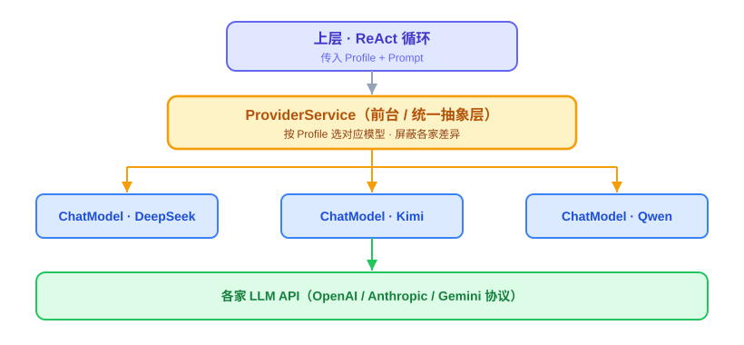
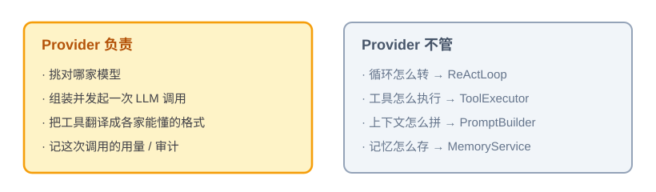
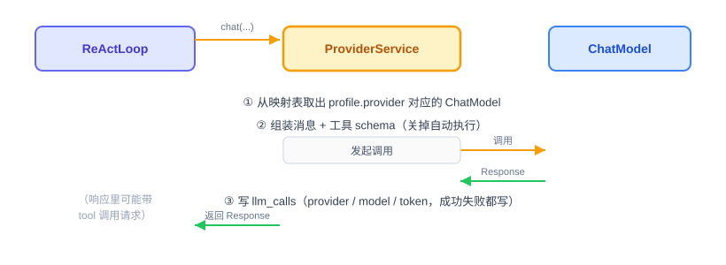

# Agent Provider：原理解析、实现与代码讲解

OryxOS 的第一块核心能力是 Provider，也就是对接大模型（LLM）的那一层。这节讲四件事：Provider 是什么、动手前该想清楚什么、代码怎么写、做完怎么验。

技术栈是 Go 1.26 + Eino core + Eino-ext。下面的代码是示意，`model.ToolCallingChatModel` 的确切 API 以你用的 Eino 版本为准。

---

## 一、Provider 是什么，干嘛用的

一句话：**Provider 就是 Agent 和大模型之间的一个前台。**

上层要跟大模型说话，但它不想操心"这次到底是调 DeepSeek 还是 MiniMax、每家的接口格式还不一样"。于是这些事全交给 Provider：上层把要说的话递进去，Provider 负责挑对模型、用对方听得懂的格式发出去、再把回话拿回来。

放到 Agent 的整体里看会更清楚。我们说 Agent = LLM + Tools + Memory + Loop + Environment，其中 **LLM 是那个做决策的大脑**。Provider 就是把这个大脑接进系统的工程封装——ReAct 循环每转一圈，都要通过 Provider 调一次大模型。

具体怎么工作：上层传两样东西进来，一个 **Profile**（一份配置，写了这次用哪个 provider、哪个 model），一段 **Prompt**（要发给模型的内容，即 `[]*schema.Message`）。Provider 按 Profile 挑出对应的模型，调用，把结果原样返回。好处是：以后想换模型，只改配置，ReAct 那边一行都不用动。



图里 `model.ToolCallingChatModel` 是 Eino 里代表"一个具体大模型"的接口，一个 provider 对应一个。Provider 干的事，就是从上往下选一条路走通。

这里还有一个容易搞混的点：**工具（Tool）这件事，Provider 只做翻译，不做执行。**

大模型能"调用工具"（业界叫 Function Calling），意思是：我们在发请求时，顺带告诉模型"你手上有哪些工具能用、每个工具要传什么参数"——这份工具说明叫 **schema**（即 `[]*schema.ToolInfo`）。模型看完可能回一句："我想调 `http_get`，参数是这些。" 注意，模型只是**说它想调**，并不会真去调。Provider 拿到这个请求后，原样交回给上层的循环，真正去执行 `http_get` 的是后面的 ToolExecutor。Provider 全程只负责把工具翻译成模型看得懂的格式，不碰执行。

---

## 二、动手前先想清楚几件事

写这种适配层，别急着敲代码。先把下面几件事定下来，代码基本就顺着出来了。

**第一，把职责划窄。** Provider 要做的事其实很少：挑对模型、发起一次调用、把结果拿回来。就这些。循环怎么转、工具怎么执行、上下文怎么拼，都不归它管。这个边界不划清楚，Provider 会越写越胖，最后和 ReActLoop 缠在一起分不开。



**第二，哪些不自己造。** 各家大模型的协议不一样，OpenAI、Anthropic、Gemini 的工具格式各写各的。这些转换 Eino 和 Eino-ext 已经做好了，我们直接用，不重复造。我们要写的只是薄薄一层 `ProviderService`，套在它上面。

**第三，三个坑——这几个直接决定了架构长什么样。**

*坑一：多个 provider 时，怎么区分谁是谁。* 你同时配了 DeepSeek 和 MiniMax，它们在 Go 里都是 `model.ToolCallingChatModel` 类型，光靠类型根本分不清哪个是哪个。工厂必须维护 **provider 名 → 构造函数** 的显式映射；模型实例则按 `Profile.name` 保存，避免两个都使用 DeepSeek 的 Profile 因模型、温度或凭证不同而串配置。

*坑二：Eino 的 ADK 会"自作主张"帮你执行工具。* Eino 的 ADK（Agent Development Kit）自带一套自动执行工具的机制——模型说想调 `http_get`，它会自己跑个小循环，直接把工具执行了，再把结果喂回模型。听起来省事，但我们自己写了 ReActLoop 和 ToolExecutor 来管这件事。两套一起跑，工具会被调两次，而且执行绕过了我们的沙箱检查，出了事都不知道谁干的。所以**必须关掉 ADK 的自动执行**，只留 Eino 的协议转换和 schema 生成，执行权攥在自己手里。

*坑三：教程里的 provider 名字不能替代依赖验证。* 核心阶段固定接 DeepSeek 和 MiniMax：DeepSeek 使用 Eino-ext 原生 connector，MiniMax 使用 Eino-ext OpenAI connector 对接官方 OpenAI 兼容 API。动手前必须用 `go.mod`、模块缓存和 `go doc` 核实两个 connector 在锁定版本中的真实构造函数、配置字段和工具调用行为；示例代码不能作为 API 存在性证据。

这三个坑想清楚，Provider 长什么样就定了：一个薄薄的抽象层，只管一次调用，靠一张表显式选模型，关掉自动执行，接哪家提前验证过依赖能用。

---

## 三、代码怎么写

核心就一个结构体 `ProviderService`，外加两个配角：一个把工具转成 Eino 格式的适配器，一个写审计日志的。对外只露一个方法：`Chat(ctx, sessionID, profile, messages)`。

一次调用从头到尾是这样走的：



对着这个流程，先补一个前置，再分四步写。

**第零步（前置）：Profile 的解析加载，这节一并交付。** Provider 是整个系统里第一个消费 Profile 的模块（要从里面读 provider 名、model、温度），所以 Profile 从 YAML 变成 Go 结构体这件事归这节负责，包含三样：

- **`Profile`**：一个承载全部字段的结构体——`Name`、`Description`、`Identity`、`Provider`（Name/Model/Temperature）、`Tools`、`Skills`、`MCPServers`、`Channels`、`NotifyChannels`、`Schedules`、`Bootstrap`、`Settings`。后面每节用到哪个字段就取哪个字段，结构体本身这节就建全。
- **`ProfileLoader`**：启动时扫 `.oryxos/profiles/` 下所有 YAML，用 `gopkg.in/yaml.v3` 解析成 `Profile`，逐个做合法性校验（本节先校验"provider 名能在全局层找到"这一条，后面各节的字段各自补自己的校验规则）。坏的 Profile 记错误日志、不阻断启动。
- **`ProfileRegistry`**：解析好的 Profile 放进内存索引（`map[string]*Profile`），按 Name 查找。29 节会给它补运行时 `Register()` 方法，现在只有启动扫描这一条注册路径。

**第一步：配置分两层，别搞混。** Provider 相关的配置其实分两层，职责不一样：

- **全局层**（环境变量 + 启动参数）：声明这个实例上到底接了哪些 provider、每家的凭证从哪个环境变量读。解决的是"连不连得上"的问题。
- **Profile 层**（每个 Agent 自己的 YAML）：声明这个 Agent 具体用哪个 provider、哪个 model、什么温度。解决的是"这个 Agent 怎么用"的问题。
```yaml
# global.yaml —— 进程级启动配置，不属于 .oryxos/ 初始化文件
providers:
  - name: deepseek
    api_key: ${DEEPSEEK_API_KEY}
  - name: minimax
    api_key: ${MINIMAX_API_KEY}
```

```yaml
# .oryxos/profiles/ops-agent.yaml —— Profile 层：这个 Agent 具体怎么用
provider:
  name: deepseek        # 必须能在全局层的 providers 列表里找到同名项
  model: deepseek-chat  # 用哪个模型，Profile 自己定
  temperature: 0.7
```

两层各管一段：全局层只管"启用与凭证"（provider 存不存在、key 有没有），Profile 层管"调用参数"（用哪个 model、什么温度）。明确命名的 Provider 所用 connector、协议适配和官方 API 地址由对应工厂封装，不要求用户提供 `base_url`，也不允许把 `minimax` 改指向任意 OpenAI 兼容服务。Profile 引用的 `provider.name` 如果在全局层找不到同名项，必须直接报错，不能悄悄用错或者留空跑过去。

`${DEEPSEEK_API_KEY}` 表示运行时从环境变量取，代码和配置文件里都不会出现真实 key。

**第二步：注册工厂，再按 Profile 创建实例。** 工厂表按 `provider.name` 选择 DeepSeek 原生 connector 或 OpenAI connector；加载合法 Profile 时，把全局连接信息与 Profile 的 model/temperature 合并，创建独立模型实例并以 `Profile.name` 保存。这样厂商选择显式可见，同时相同厂商的多个 Profile 也不会共享配置。

```go
type ModelFactory func(context.Context, ProviderConfig) (model.ToolCallingChatModel, error)

type ProviderRegistry struct {
	factories map[string]ModelFactory               // key: provider.name
	models    map[string]model.ToolCallingChatModel // key: profile.name
}
```

工厂注册示例：

```go
const miniMaxOpenAIBaseURL = "https://api.minimax.io/v1"

// 工厂注册时，每个 name 对应一个构造函数。
factories["deepseek"] = func(ctx context.Context, cfg ProviderConfig) (model.ToolCallingChatModel, error) {
	return deepseek.NewChatModel(ctx, &deepseek.ChatModelConfig{
		APIKey:      cfg.APIKey,
		Model:       cfg.Model,
		Temperature: cfg.Temperature,
	})
}
factories["minimax"] = func(ctx context.Context, cfg ProviderConfig) (model.ToolCallingChatModel, error) {
	temperature := cfg.Temperature
	return openai.NewChatModel(ctx, &openai.ChatModelConfig{
		APIKey:      cfg.APIKey,
		Model:       cfg.Model,
		BaseURL:     miniMaxOpenAIBaseURL,
		Temperature: &temperature,
	})
}
```

这里展示的是“厂商名选择构造函数”的结构：DeepSeek 使用原生 connector 自带的官方默认地址，因此不传 `BaseURL`；MiniMax 借用 OpenAI connector，所以由 `minimax` 工厂固定官方兼容地址。`ProviderConfig` 只合并 `Name/Model/APIKey/Temperature`，不含 `BaseURL`。字段已按锁定的稳定版 Eino-ext DeepSeek `v0.1.7` 和 OpenAI `v0.1.13` 本地源码核验；Eino core 锁定为 `v0.9.19`。

**第三步：写 Chat 方法。** 这是整个 Provider 的核心，骨架长这样：

```go
func (p *ProviderService) Chat(ctx context.Context, sessionID string, profile *Profile, messages []*schema.Message) (*schema.Message, error) {
    cm, ok := p.registry.models[profile.Name]            // 按 Profile 取隔离实例
    if !ok {
        return nil, fmt.Errorf("provider not found: %s", profile.Provider.Name)
    }
    toolInfos := adapter.ToEinoToolInfos(profile.Tools)   // 只翻译，不执行
    modelWithTools, err := cm.WithTools(toolInfos)        // 绑定工具 schema
    if err != nil {
        return nil, fmt.Errorf("bind tools failed: %w", err)
    }
    startedAt := time.Now()
    resp, err := modelWithTools.Generate(ctx, messages,    // 发起真正的调用
        model.WithTemperature(profile.Provider.Temperature),
        model.WithModel(profile.Provider.Model),
    )
    duration := time.Since(startedAt)
    if err != nil {
        p.audit.Record(ctx, sessionID, profile.Provider.Name, profile.Provider.Model,
            nil, false, err.Error(), duration.Milliseconds())  // 调用失败也留痕
        return nil, err
    }
    p.audit.Record(ctx, sessionID, profile.Provider.Name, profile.Provider.Model,
        resp.ResponseMeta.Usage, true, "", duration.Milliseconds())  // 调用成功记一笔
    return resp, nil
}
```

一行行看它在干嘛：

- `Chat(ctx, sessionID, ...)`——多传一个 sessionID，是因为审计记录要落到 `llm_calls` 表，那张表按 session 关联，方法签名不带这个参数，审计那一步就没法写。
- `p.registry.models[profile.Name]`——按 Profile 唯一运行时标识取启动阶段创建好的独立模型实例。Provider 名只用于选工厂，不作为模型实例缓存键。
- `cm.WithTools(toolInfos)`——把这次能用的工具翻译成 Eino 的 `[]*schema.ToolInfo` 格式（只生成 schema，也就是工具说明，不执行）。`WithTools` 返回一个新的不可变模型实例，不影响原始模型。
- `modelWithTools.Generate(ctx, messages, ...)`——发起真正的调用。通过 `model.WithTemperature` 和 `model.WithModel` 传入调用参数。
- `p.audit.Record(..., true, "", ...)`——调用**成功**，把用了哪个 provider、哪个 model、花了多少 token、耗时多久记一笔，`success` 记 `true`。
- `p.audit.Record(..., false, err.Error(), ...)`——调用**失败**（超时、限流、模型报错）同样要记一笔，`success` 记 `false`、把错误信息存进 `error_message`，再把错误继续往上返回。**这一步很容易漏**：只记成功不记失败，一次真实事故在系统里就完全没留下痕迹。
- 最后返回 `*schema.Message`。响应里可能带着模型"想调某个工具"的请求（`resp.ToolCalls`），但执行不在这儿——原样交回上层。

> `Generate` 和 `WithTools` 的确切写法跟 Eino 版本有关，动手前先核一下你用的版本怎么写。

**第四步：工具适配和审计。** 适配器负责把我们自己的 `OryxTool` 的参数说明（`GetInputSchema()`）转成 Eino 的 `*schema.ToolInfo`——注意，还是只翻译、不执行。

审计要记两种情况：调用**成功**，把 provider、model、token 用量写进 `llm_calls`；调用**失败**（超时、限流、模型报错），也要写一条，`success` 记 `false`、`error_message` 记原因。所以 `llm_calls` 表本身得有 `success`/`error_message` 这两列——不然模型调用失败时，这次事故在数据库里完全没有痕迹，跟工具那边的 `tool_invocations` 表比就不对称，"可审计"这个卖点就打了折扣。这张表的 GORM Model、Repository 和建表脚本也归这节交付；注意 SQLite 的 `ALTER TABLE` 很弱，建表用手工维护的脚本，别指望 GORM `AutoMigrate` 做迁移。

**有几样先别做。** fallback（一家挂了换另一家）、hedge racing（同时发几家抢最快的）、熔断，这些都放到扩展阶段；现在故障就直接把错误返回给上层。成本看板也放后面，眼下只落 `llm_calls` 这张表，够审计用就够了。核心阶段的目标是"能稳定调通一次"，别一上来就求全。

**本节交付物**（Spec-Kit 拆解锚点）：

- 代码：`Profile`、`ProfileLoader`、`ProfileRegistry`、`ProviderService`（含 `Chat(ctx, sessionID, Profile, messages)`）、工具格式适配器、`LlmCall` GORM Model + `LlmCallRepository`
- 测试：`ProfileLoaderTest`、`ProviderServiceTest`、`ToolSchemaAdapterTest`、`LlmCallRepositoryTest`、`ProviderSmokeIT`（见第四部分的验收 harness）
- 配置：全局层的 providers 声明；Profile YAML 的 `provider` 段
- 表：`llm_calls`（含 `success`/`error_message` 列，手工建表脚本）

---

## 四、验收 harness：把验收标准变成可执行的测试

第 6 节讲过：SDD 给目标，**Harness 给边界**。这一节的 Harness 就是一套测试——AI 写的实现对不对，不靠人盯着代码看，靠这套测试跑绿。所以测试清单要在实现之前（或同时）定下来，`/speckit-implement` 产出的代码必须让它们全绿，这就是"验收"的工程化形态。

**先定分层：什么用单测，什么用集成冒烟。** 判断标准就一条——要不要碰真实网络：

- **单测（默认全跑）**：路由、校验、审计、翻译，全部把 `model.ToolCallingChatModel` mock 掉，不花一分钱、不依赖网络，秒级跑完。这是 harness 的主体。
- **集成冒烟（加 `// +build integration` 标签，本地手动跑）**：真调一次模型，验证"key 对、依赖对、真的通"。CI 里默认跳过——不能让外部 API 的可用性变成自己流水线的可用性。

**四个单测文件，逐条对应验收标准：**

| 测试文件 | 覆盖的验收点 |
|---|---|
| `profile_loader_test.go` | 合法 YAML 全字段解析；引用不存在的 provider 报错清晰；坏文件不阻断其余加载；全局 Provider 凭证的 `${ENV}` 占位正确解析 |
| `provider_service_test.go` | DeepSeek/MiniMax 工厂路由不串台；同一 Provider 的两个 Profile 实例隔离；未知名返回错误；成功/失败都落审计；自动执行关闭 |
| `tool_schema_adapter_test.go` | `OryxTool` 的 schema 翻译成 Eino 格式后字段一一对齐；只翻译、产物里不含任何执行逻辑 |
| `llm_call_repository_test.go` | 手工建表脚本建出的 `llm_calls` 能存能读，`success`/`error_message` 两列真实存在 |

**最值钱的三个测试方法，写出来看。** 都在 `provider_service_test.go` 里，mock 两个 `model.ToolCallingChatModel` 就能测：

```go
func TestRoutesDeepSeekAndMiniMaxByProviderName(t *testing.T) {
    deepseek := &mockChatModel{}
    minimax := &mockChatModel{}
    service := NewProviderService(map[string]model.ToolCallingChatModel{
        "ops-agent": deepseek, "support-agent": minimax,
    }, adapter, audit)

    service.Chat(context.Background(), "s-1", profileNamed("support-agent", "minimax"), prompt)

    if minimax.callCount != 1 {
        t.Errorf("expected minimax to be called once, got %d", minimax.callCount)
    }
    if deepseek.callCount != 0 {
        t.Errorf("expected deepseek to never be called, got %d", deepseek.callCount)
    }
}

func TestRecordsFailedLLMCallBeforeReturningError(t *testing.T) {
    chatModel := &mockChatModel{err: errors.New("connect timeout")}
    service := NewProviderService(map[string]model.ToolCallingChatModel{
        "ops-agent": chatModel,
    }, adapter, audit)

    _, err := service.Chat(context.Background(), "s-1", profileNamed("ops-agent", "deepseek"), prompt)
    if err == nil {
        t.Fatal("expected error, got nil")
    }

    if audit.lastRecord == nil {
        t.Fatal("expected audit record, got nil")
    }
    if audit.lastRecord.Success {
        t.Error("expected success=false in audit record")
    }
    if !strings.Contains(audit.lastRecord.ErrorMessage, "timeout") {
        t.Errorf("expected error message to contain 'timeout', got %s", audit.lastRecord.ErrorMessage)
    }
}

func TestBindsToolSchemasWithoutExecutingTools(t *testing.T) {
    chatModel := &mockChatModel{}
    service := NewProviderService(map[string]model.ToolCallingChatModel{
        "ops-agent": chatModel,
    }, adapter, audit)

    service.Chat(context.Background(), "s-1", profileNamed("ops-agent", "deepseek"), promptWithTools(httpGetTool))

    if len(chatModel.lastToolInfos) == 0 {
        t.Error("expected tool infos to be passed, got none")
    }
    // 坑二的回归测试：确认我们用的是 WithTools 绑定 schema，
    // 而不是依赖 ADK 自动执行——工具执行权在 ReActLoop + ToolExecutor 手里
}
```

第一个测的是坑一（DeepSeek/MiniMax 工厂映射）；同文件还必须增加“两个 Profile 都用 DeepSeek 但配置不串台”的实例隔离测试。第三个测的是坑二（关自动执行）——**每个"想清楚"阶段点过名的坑，都应该有一个对应的回归测试**。第二个测的是最容易漏的失败审计路径：断言“返回了错误**并且**审计先落了账”。

**`llm_call_repository_test.go` 的一个讲究**：建表要走那份手工脚本（测试里执行 `schema.sql`），不要让 GORM `AutoMigrate` 自动建——不然测试绿了、生产上跑真脚本时列名对不上，白测。

**集成冒烟 `provider_smoke_test.go`**：分别覆盖 DeepSeek 原生 connector 和 MiniMax OpenAI 兼容 connector；读取环境变量里的真 key，调用一次并断言拿到非空响应且 `llm_calls` 多了一条 `success=true`。跑法：

```bash
go test ./...                                     # 日常：只跑单测，全绿才算实现完成
DEEPSEEK_API_KEY=xxx MINIMAX_API_KEY=xxx go test -tags=integration ./internal/provider/...  # 手动：两条路径冒烟验真
```

---

## 五、做完怎么验

harness 全绿之后，剩下这几条需要人工确认（自动化覆盖不到或不值得自动化的部分）：

- 用到的 provider，对应的 Eino-ext connector 模块已确认在 `go.mod` 里能下载、能解析——不是照着教程的名字就假设一定能用（`go mod tidy` 看一眼）。
- 集成冒烟真跑过一次：配真 key，`provider_smoke_test.go` 通过，拿到过真实响应。
- key 走环境变量：`grep -r "sk-"`（或你的 key 前缀）在代码和配置里搜不到明文。
- 其余验收点——双 provider 路由、错误名报错、成功/失败审计、自动执行关闭、只翻译不执行——已由第四部分的单测覆盖，`go test ./...` 绿就等于打勾。

Provider 自己没有独立入口，它要和下一节的 ReAct 一起，才能撑起 Demo 一（每日天气）的对话版（问天气、给穿搭建议）。所以这块跑通的标准很直接：能撑住 Demo 一里的那次大模型调用。
