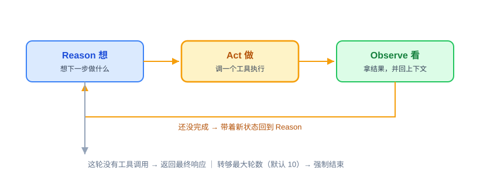
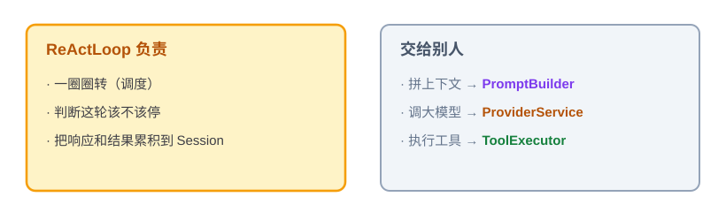
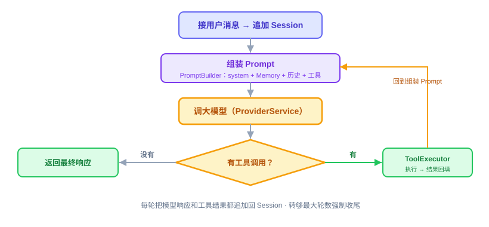

# ReAct：原理解析、实现与代码讲解

ReAct 是 OryxOS 的第二块核心能力，也是整个 Agent 最关键的一段代码。这节讲四件事：ReAct 是什么、动手前该想清楚什么、代码怎么写、做完怎么验。

它依赖上一节的 Provider——每转一圈都要通过 Provider 调一次大模型。技术栈还是 Go 1.26 + Eino core；Eino-ext 只留在 Provider 工厂层，ReAct Runtime 不直接依赖具体厂商 connector。

---

## 一、ReAct 是什么，干嘛用的

一句话：**ReAct 就是让大模型像人做事一样，在一个循环里反复“想一步、做一步、看结果”，直到把事办成。**

单独调一次大模型，就是个 chatbot——你问一句、它答一句，完事。但很多事一句话答不了，比如“看看今天天气，帮我决定穿什么”，模型得先去查天气、拿到结果、再根据结果给建议。**ReAct 干的就是把“想—做—看”串成一个循环**：模型想下一步该干嘛、调个工具去做、拿到结果看一眼，不够就再来一轮，够了就给最终答复。这个模式叫 ReAct（Reasoning + Acting），2022 年提出来，现在是事实标准，Claude Code、Cursor、LangChain 跑的都是它。

一轮里的动作是固定的三步：



什么时候停？看模型这一轮的反应：**它没提出要调工具，就说明它觉得能给最终答复了**，循环返回结果；万一它一直要调工具停不下来，就靠“最大轮数”兜底，转够了强制收尾。

放回 Agent 整体：ReAct 是那个“大脑循环”，它自己不实现模型协议、也不实现具体工具，而是负责指挥——想的时候通过上一节的 `ProviderService` 调一次大模型，做的时候把工具交给 `ToolExecutor`。

---

## 二、动手前先想清楚几件事

ReAct 有个反直觉的地方：它是 Agent 的灵魂，但主循环的代码其实很短，就几十行。难的不是“写个 for 循环”，而是循环里要照顾的那些边界。所以动手前先把两件事定下来：职责怎么拆、有哪些坑。

**第一，把职责拆干净。** 循环本身只该做一件事——**调度**。它负责转圈、判断该不该停、把每轮的结果攒起来。至于每轮要拼的 prompt、要调的模型、要执行的工具，全都交出去，让专门的模块干。循环里塞的东西越少，它越好读、越不容易出 bug。



**第二，为什么自己写，不用框架现成的循环。** Eino ADK 带有现成的 Agent / ReAct 封装，拿来就能跑。但循环恰恰是 Agent 最需要自己掌控的地方——什么时候停、工具失败了怎么办、上下文太长了怎么截断、哪几步想换个模型，这些都得能自己调。用框架的黑盒，这些就动不了。所以核心阶段我们自己写这几十行，只复用 Eino core 的 `model.ToolCallingChatModel` 和 Tool schema，把控制权攥在手里。

**第三，几个坑，提前想到。** 这块最容易出事的就那么几处：

- 不设轮数上限，模型可能反复要调工具，**陷进死循环**下不来。
- 不管上下文长度，转几轮 context 就**撑爆**了（每次调模型都把全部历史带上，越滚越大）。
- 每轮不把模型的完整 assistant 响应和对应 Tool message **累积回 Session**，事后就没法审计，下一轮也接不上前一轮；MiniMax/OpenAI 兼容路径还可能因此丢失 tool call ID。

这三条不是写完再补，是设计时就得定死的。想清楚了其实就几句话：循环短、职责拆出去、自己掌控、边界（停止 / 错误 / 取消 / 上下文）提前定。

---

## 三、代码怎么写

拆成三个模块，各干各的：`ReActLoop` 管调度，`PromptBuilder` 管拼上下文，`ToolExecutor` 管执行工具。调大模型用的是上一节的 `ProviderService`。CLI、Web、Scheduler 则统一从 `AgentService.Invoke` 进入，不另建业务执行链。

一轮的流转是这样：



**先看主角 ReActLoop。** 输入是贯穿调用链的 `context.Context`、一个 Session（存着这次对话的全部状态）、用户这句话和当前 Profile，输出是最终响应。骨架长这样：

```go
func (l *ReActLoop) Run(
	ctx context.Context,
	session *Session,
	userMessage string,
	profile *profile.Profile,
) (string, error) {
	session.Append(&schema.Message{Role: schema.User, Content: userMessage})

	for i := 0; i < profile.Settings.MaxIterations; i++ { // 默认 10，防死循环
		messages, err := l.promptBuilder.Build(ctx, session, profile)
		if err != nil {
			return "", err
		}

		resp, err := l.providerService.Chat(ctx, session.ID, profile, messages)
		if err != nil {
			return "", err
		}
		session.Append(resp) // 保存完整 assistant 响应，包括 ToolCalls

		if len(resp.ToolCalls) == 0 {
			return resp.Content, nil // 没有工具调用，收尾
		}

		for _, call := range resp.ToolCalls { // 按模型返回顺序串行执行
			result, err := l.toolExecutor.Execute(ctx, session.ID, profile, call)
			session.AppendToolMessage(call.ID, result, err)
			if err != nil {
				return "", err
			}
		}
	}

	return "", ErrMaxIterations
}
```

这段代码是职责和流程示意，具体 Session 与 Tool 结果类型以本项目最终接口为准；Eino API 必须以 `go.mod` 锁定版本的 `go doc` 和模块源码为准，不能把课件示例当成 API 存在性证据。

一行行看它在干嘛：

- `Run(ctx, ...)`——`context.Context` 从 CLI / Web / Scheduler 一路传到 LLM 和 Tool，用于取消与超时，不能在中途换成 `context.Background()`。
- `for i < profile.Settings.MaxIterations`——这就是那个“最大轮数”的兜底，默认 10。循环不是无限转的，转够就返回明确的迭代上限错误并保存现场，坑一（死循环）在这拦住。
- `promptBuilder.Build(...)`——把这一轮要发给模型的消息和上下文拼好（下面细讲）。
- `providerService.Chat(ctx, session.ID, profile, messages)`——通过上一节的 Provider 调一次大模型，拿回 `*schema.Message`。这里要传 `session.ID`：上一节 Provider 的 `Chat` 方法签名带了 `sessionID`，因为 `llm_calls` 审计表按 Session 关联，这里不传，Provider 那边就没法写这一列。
- `session.Append(resp)`——**先把完整响应存回 Session 再说**，不能只保存 `resp.Content`。Tool Call 的 ID 和参数也在 assistant 消息里，下一轮和事后审计都需要它，对应坑三。
- `len(resp.ToolCalls) == 0`——模型这轮没要调工具，说明它能给答复了，直接返回，循环结束。这就是前面说的“停止条件”。
- `for _, call := range resp.ToolCalls`——模型一次返回多个 Tool Call 时，严格按原顺序逐个交给 `ToolExecutor` 执行；同样带上 `session.ID`，因为 `tool_invocations` 表也要关联 Session。每个结果都转成与 call ID 对应的 Tool message 追加回 Session，然后进入下一轮。执行权只在 `ReActLoop + ToolExecutor`，不能交给 Eino ADK，也不并行执行。

**配角一：PromptBuilder。** 每轮开始，它按固定优先级把上下文组装成带清晰标签的消息：`RUNTIME_RULES`、`AGENTS.md` 项目规则、`Profile.identity.prompt + SOUL.md`、Profile 引用的 `SKILL.md`、`USER.md`、`MEMORY.md`（最多 4000 字）、最近的会话历史、当前用户消息，最后绑定当前 Profile 可用的 Tool schemas。末尾还要附上当前日期时间——模型自己不知道今天几号，后面定时场景里的“今天”全靠这一行。运行时安全约束优先级最高，Memory 只能提供事实和偏好，不能覆盖指令。

注意“长期记忆”和“会话历史”是两码事，别混在一起说：长期记忆是跨会话都在的 `MEMORY.md`，会话历史只是这一次对话到目前为止的往来记录。会话历史先只留最近 N 轮，默认 20；如果仍超过模型上下文上限，再继续截断早期消息——这是坑二的解法。拼 prompt 的逻辑全在这里，循环那边不用操心。

**配角二：ToolExecutor。** 从 `ToolRegistry` 里精确找到模型要调的工具，先做 JSON 参数 schema、当前 Profile 可用 Tool 列表和 Sandbox / 白名单检查（Sandbox 的完整设计在第 23、24 节细讲），再调用 Eino `tool.InvokableTool.InvokableRun` 或 MCP client，把结果包装成 Tool message 返回，同时写一条调用记录——**成功要记、失败也要记**。`tool_invocations` 表本来就有 `success` / `error_message` 两列，跟上一节 Provider 的审计是同一个口径：一次工具调用不管成没成，事后都得能查到。

工具执行只在这一个地方发生——这也是上一节为什么不能使用 Eino ADK 自动执行的原因：执行权必须收在这里，不能有第二条路。只有错误明确可重试，并且工具幂等或带可靠幂等键时才允许有限重试；`write_file`、`shell`、`http_post`、`notify`、`save_memory` 默认不自动重试。`tool_invocations` 的 GORM Model、Store 和手工 SQL migration 也归这节交付；SQLite 继续使用 `github.com/glebarez/sqlite`，保持 `CGO_ENABLED=0` 可构建。

**编排者 AgentService，这节一并交付。** 循环之上还差薄薄一层：三种触发源（CLI、Web、Scheduler）最终都调同一个 `AgentService.Invoke`，它是一次处理的编排者。Go 不照搬 Java 的 `ThreadLocal ProfileContext`；当前 Profile 和请求生命周期通过参数显式传递，`context.Context` 只承载取消、超时和关联信息，不把业务配置藏进全局变量。骨架很短：

```go
func (s *agentService) Invoke(ctx context.Context, req AgentRequest) (AgentResponse, error) {
	selected, ok := s.profiles.Get(req.ProfileName)
	if !ok {
		return AgentResponse{}, fmt.Errorf("profile %q not found", req.ProfileName)
	}

	session, err := s.sessions.GetOrCreate(ctx, req.Channel, req.UserID, selected.Name)
	if err != nil {
		return AgentResponse{}, err
	}

	reply, runErr := s.loop.Run(ctx, session, req.Message, selected)
	if saveErr := s.sessions.Save(context.WithoutCancel(ctx), session); saveErr != nil {
		return AgentResponse{}, errors.Join(runErr, saveErr)
	}
	if runErr != nil {
		return AgentResponse{}, runErr
	}
	return AgentResponse{SessionID: session.ID, Content: reply}, nil
}
```

这段骨架只突出 Profile 的显式传递和 Session 现场保存；完整实现还要由 `SessionService` 按 `AgentRequest.SessionID`、`Stateless` 以及 `channel + user_id + profile.name` 的既定规则解析或创建 Session，不能在 `AgentService` 里自行拼 `session_id`。

为什么要显式传 Profile：Go 没有 Java 虚拟线程上的 `ThreadLocal` 请求上下文；用包级变量或 goroutine-local 模拟，既容易串请求，也会把依赖藏起来。`AgentService` 在入口按 `Profile.name` 找到不可变的运行时选择，再显式交给 `ReActLoop` 和 `ToolExecutor`。以后 `notify` 需要读取当前 Profile 的 `notify_channels`，也走同一条参数链，不另开隐式通道。

**供给上下文的 BootstrapLoader 与 SkillLoader，也归这节。** `PromptBuilder` 的项目规则、人格和 Skill 段由它们提供：`BootstrapLoader` 按 Profile 的 `bootstrap` 顺序读取 `.oryxos/` 下的 Bootstrap 文件，`SkillLoader` 只加载 Profile 显式引用的 `SKILL.md`。Profile 未指定 Bootstrap 时使用 `AGENTS.md`、`SOUL.md`、`USER.md` 三个默认文件；显式引用的 Bootstrap 或 Skill 缺失必须报错，默认模板文件允许为空。加载出的每段内容都要带清晰边界，不能静默拼成一团。

核心阶段的 Profile、Bootstrap 和 Skill 配置修改后通过重启生效，不实现文件监听或热重载。这样 `ProfileRegistry` 可以保存不可变的 `ProfileRuntime` 快照，也避免同一次调用在不同轮次读到两套配置。

**有几样先别做。** 工具并行调用、Agent 之间互相委托、流式输出、LLM 总结压缩，这些核心阶段都先不做。上下文先用“只留最近 N 轮，再按模型上限截断早期消息”这种简单办法顶着，够用就行，总结压缩留到扩展阶段。

**本节交付物**（Spec-Kit 拆解锚点）：

- 代码：`internal/runtime` 下的 `ReActLoop`、`PromptBuilder`、`AgentService`；`internal/tool` 下的 `ToolExecutor`；`internal/bootstrap` 下的 `BootstrapLoader`；`internal/skill` 下的 `SkillLoader`；`internal/store` 下的 `ToolInvocation` GORM Model + Store
- 测试：`react_loop_test.go`、`prompt_builder_test.go`、`executor_test.go`、`agent_service_test.go`、`loader_test.go`（分别放在对应 Go package，见验收 harness）
- 表：`tool_invocations`（含 `success` / `error_message` 列，使用手工 SQL migration）
- 约定：最大轮数默认 10；历史截断默认 20 轮；prompt 末尾附当前日期时间；Tool Call 按模型返回顺序串行执行；`context.Context` 贯穿整条调用链

---

## 四、验收 harness：把验收标准变成可执行的测试

这节的东西全部不碰真实网络——`ProviderService`、工具和文件加载都能用 fake 或临时目录替代，所以 harness 全是 Go 单测，`go test ./...` 秒级跑完。测试文件对应本节交付物：

| 测试文件 | 覆盖的验收点 |
|---|---|
| `react_loop_test.go` | 无 Tool Call 一轮收尾；有 Tool Call 则按顺序执行并回填进下一轮；**转满最大轮数强制停**（坑一回归）；每轮完整 assistant 响应和 Tool message 都累积进 Session（坑三回归）；取消和不可恢复错误原样传播 |
| `prompt_builder_test.go` | 各段顺序和冲突优先级正确；历史超 N 轮被截断（坑二回归）；Memory 最多 4000 字；prompt 末尾含当前日期时间；Tool schema 只来自当前 Profile |
| `executor_test.go` | 多个 Tool Call 串行且顺序不变；成功写审计 `success=true`；失败也写 `success=false` 带脱敏原因，错误不吞；非幂等 Tool 不误重试 |
| `agent_service_test.go` | CLI / Web / Scheduler 形式的请求都进入同一个 `Invoke`；Profile 显式传递且不同请求不串；循环失败时仍保存已经累积的 Session 现场 |
| `loader_test.go` | 默认 Bootstrap 顺序正确；显式引用的 Skill / Bootstrap 缺失报错；内容有清晰边界；启动后使用不可变快照，不实现文件监听或热重载 |
| `tool_invocation_repository_test.go` | 手工 migration 建出的 `tool_invocations` 能存能读；成功和失败记录都能按 `session_id` 查询；字段与三表契约完全一致 |

两个最值钱的回归测试写出来：

```go
func TestReActLoopStopsAtMaxIterations(t *testing.T) {
	provider := &fakeProvider{response: responseWithToolCall(httpGetCall)} // 每轮都要调工具，永不收敛
	loop := newTestLoop(t, provider)

	_, err := loop.Run(context.Background(), session, "查天气", profileWithMaxIterations(10))

	if !errors.Is(err, ErrMaxIterations) {
		t.Fatalf("expected ErrMaxIterations, got %v", err)
	}
	if provider.callCount != 10 {
		t.Fatalf("expected exactly 10 model calls, got %d", provider.callCount)
	}
}

func TestReActLoopPreservesAssistantToolCallAndMatchingToolMessage(t *testing.T) {
	provider := &fakeProvider{responses: []*schema.Message{
		responseWithToolCall(toolCallWithID("call-1")),
		{Role: schema.Assistant, Content: "穿薄外套"},
	}}
	loop := newTestLoop(t, provider)

	_, err := loop.Run(context.Background(), session, "查天气", profile)
	if err != nil {
		t.Fatalf("run ReAct loop: %v", err)
	}

	assertAssistantToolCall(t, session.Messages, "call-1")
	assertMatchingToolMessage(t, session.Messages, "call-1")
}
```

第二个测试守的是最阴险的一类兼容性 bug：如果只保存 assistant 的文本、不保存完整 `ToolCalls`，或者 Tool message 没带回对应的 call ID，下一轮模型就接不上前一轮。这个问题尤其要在 MiniMax/OpenAI 兼容路径回归里钉死。

---

## 五、做完怎么验

harness 全绿后，剩下的人工确认：

- Demo 一（每日天气）的对话版（问天气、给穿搭建议）用真模型跑通一次：多轮对话里，Agent 调了 `http_get` 工具、拿到数据、给出建议。
- 循环是 OryxOS 自己实现的，没有使用 Eino ADK 的 Agent / 自动 Tool 执行封装（code review 确认，单测不能完全证明不存在另一条执行路径）。
- 用 MiniMax/OpenAI 兼容路径确认多轮 Tool Calling 中 assistant 完整响应、tool call ID 和 Tool message 正确累积。
- 其余验收点——死循环兜底、消息累积、历史截断、取消传播、失败审计、Tool 串行执行——已由 harness 覆盖；交付前还必须执行 `go test ./...`、`go vet ./...` 和 `CGO_ENABLED=0 go build ./cmd/oryxos`。

ReAct 要和上一节的 Provider 一起，才撑得起 Demo 一。所以这块跑通的标准很直接：Demo 一能从头到尾完整走下来。
