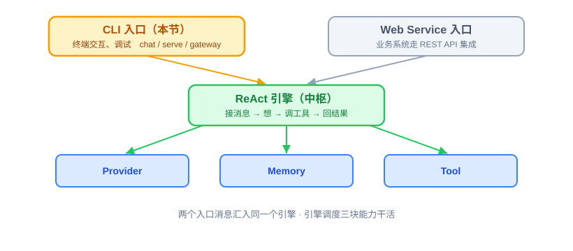
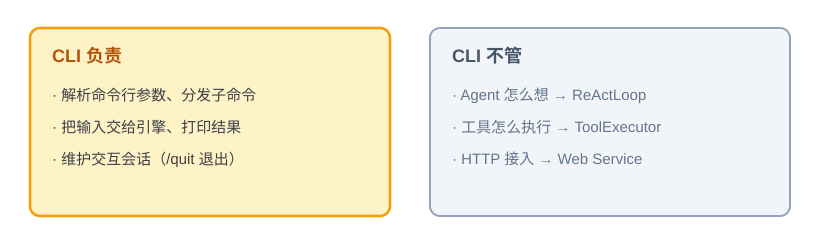
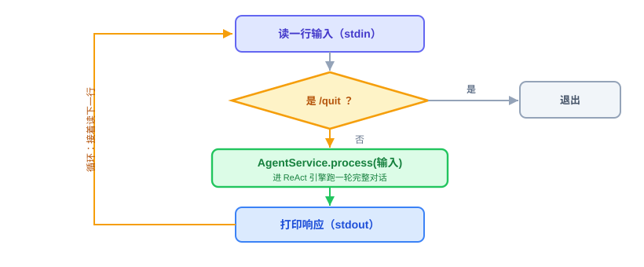

# CLI：功能概述、实现思路与代码讲解

有了 Provider（会调模型）和 ReAct（会思考的循环），OryxOS 的“大脑”已经能转了，但还缺一个能亲手操作它的入口。这节讲四件事：CLI 是什么、动手前该想清楚什么、代码怎么写、怎么用和怎么验。

技术栈是 Go 1.26 + Cobra。OryxOS 最终编译为不依赖 JVM、Python 或系统 SQLite 的单二进制；下面的代码是示意。

---

## 一、CLI 是什么，干嘛用的

一句话：**CLI 就是 OryxOS 的命令行入口——你在终端里敲命令，跟 Agent 对话、把服务跑起来、查配置和状态。**

OryxOS 打包出来是一个可执行文件，`cmd/oryxos/main.go` 是整个程序的入口。所有操作都通过 Cobra 子命令来做，核心阶段固定有 12 个叶子命令：

- **跑 Agent**：`chat`（在终端里交互式对话）、`serve`（启动 Gin Web Service 和 Scheduler）、`gateway`（承载常驻 Agent Runtime 和 Scheduler；多 Channel 宿主属于扩展阶段）。
- **看情况**：`status`、`profile list/create/show/delete`、`provider list`、`tool list`、`session list`。
- **起项目**：`init`（初始化一个 OryxOS 工作区）。

其中三个是**运行模式**，区别只在“消息从哪进来、进程以什么方式常驻”：`chat` 走终端，`serve` 提供 HTTP API，`gateway` 承载常驻 Runtime 和 Scheduler。三种模式共享同一个 `Application` 组装根、ProfileRegistry、AgentService 和 SessionStore，底下的引擎是同一个。

放到整体架构里看，OryxOS 有两个“人推”入口：**CLI 管本地交互和调试，Web Service 管业务系统通过 REST API 集成**；第 25 节还会加上第三种触发源——定时任务的“钟推”。所有入口的消息最后都汇进同一个 `AgentService.Invoke`，再进入 ReAct 引擎。



所以 CLI 在这一层的角色很清楚：**它是消息进出的门，不是干活的人。** 干活的是 AgentService 和下面的 Runtime、Provider、Tool。

---

## 二、动手前先想清楚几件事

CLI 看着杂（12 个命令），但每个命令要做的事都很浅。动手前先把四件事定下来。

**第一，CLI 只做“入口”，不碰 Agent 逻辑。** 一个 `chat` 命令的活其实就三步：读用户输入 → 组装 `AgentRequest` 并调用 `AgentService.Invoke` → 把结果打印出来。它自己不想、不调模型、不执行工具，这些全在统一服务链路里。想清楚这个边界，CLI 的代码就薄得下来。



**第二，命令按依赖深浅组装，为的是职责清楚、启动够快。** Go 单二进制本身没有 Spring ApplicationContext 的启动成本，但仍不该让所有命令都初始化 Provider、SQLite、MCP 和 Runtime：

- **轻命令**（如 `init`、`profile list`）：只组装完成任务所需的文件或配置依赖，不创建模型连接，也不启动常驻服务。
- **重命令**（如 `chat`、`serve`、`gateway`）：通过同一个 `Application` 组装根加载完整 Runtime；`serve` 和 `gateway` 还负责常驻生命周期与优雅关闭。

这个分流不是为了模仿 Java 的“是否启动 Spring”，而是让依赖和副作用按命令最小化。轻命令必须能在没有 Provider 凭证、没有数据库连接的情况下完成其职责；重命令则要在启动前完成严格配置校验和必要 migration。

**第三，别自己解析命令行参数，用 Cobra。** 子命令、参数、帮助信息、参数错误，这些 Cobra 都帮你做好了。根命令只负责挂载子命令和统一输出；每个命令使用 `RunE` 返回错误，不在深层调用 `os.Exit`，最终只由 `main` 决定进程退出码。

**第四，Session 身份只能由 SessionService 管。** CLI 只提供 `channel="cli"`、当前 `user_id` 和 `Profile.name`，不能自己拼 `session_id`。同一三元组应找到同一个 `active` Session；归档后允许创建新 Session，所以数据库只建立普通复合索引 `(channel, user_id, profile_name, status)`，不能建立会阻断归档后新建会话的全量唯一索引。

想清楚就这几句：CLI 是薄薄的入口层，只管进出不管干活；命令按依赖深浅组装；参数解析交给 Cobra；Session 身份和持久化统一交给 SessionService。

---

## 三、代码怎么写

入口是 `cmd/oryxos/main.go`，它创建 Cobra 根命令并执行，底下挂固定 12 个叶子命令。命令可以按文件和命令组组织，但不得额外增加需求未定义的 Agent、Memory 或 Schedule 管理命令。

先看最典型、也最能说明问题的 `chat` 命令。它的交互流程是这样：



**chat 命令（CLI Channel）。** 它读 stdin、写 stdout，每收到一行就构造统一请求交给 `AgentService`，直到用户输入 `/quit`。`--message` 存在时只发送一次然后退出，便于人工补跑和脚本调用。骨架大概长这样：

```go
func newChatCommand(deps ChatDependencies) *cobra.Command {
	var profileName string
	var message string

	cmd := &cobra.Command{
		Use:   "chat",
		Short: "在终端里和 Agent 交互式对话",
		RunE: func(cmd *cobra.Command, _ []string) error {
			invoke := func(content string) error {
				resp, err := deps.AgentService.Invoke(cmd.Context(), runtime.AgentRequest{
					ProfileName: profileName,
					Channel:     "cli",
					UserID:      deps.CurrentUser(),
					Message:     content,
				})
				if err != nil {
					return err
				}
				_, err = fmt.Fprintln(cmd.OutOrStdout(), resp.Content)
				return err
			}

			if strings.TrimSpace(message) != "" {
				return invoke(message)
			}
			return runInteractive(cmd, invoke) // 逐行读取，/quit 时退出
		},
	}
	cmd.Flags().StringVar(&profileName, "profile", "default", "Profile name")
	cmd.Flags().StringVar(&message, "message", "", "发送一条消息后退出")
	return cmd
}
```

一行行看它在干嘛：

- `cobra.Command{Use: "chat"}`——声明 `chat` 子命令，参数、帮助和错误由 Cobra 统一处理。
- `cmd.Context()`——调用方取消和进程关闭信号通过 `context.Context` 一直传到 AgentService、LLM 和 Tool。
- `AgentRequest{Channel: "cli", UserID: ..., ProfileName: ...}`——CLI 只交出 Session 身份三元组，不拼接 `session_id`；SessionService 负责查找或创建 active Session。
- `AgentService.Invoke(...)`——**关键的一步**：所有模式都进入同一个服务，里面跑的是上一节的 ReAct 循环。CLI 到这里就撒手了，等结果。
- `cmd.OutOrStdout()`——不直接写死 `os.Stdout`，这样命令测试可以注入 buffer；错误通过 `RunE` 返回，便于统一处理退出码。
- `--message` 与交互循环——单次模式调用一次就退出；交互模式不断读输入，只有 `/quit` 属于 CLI 自己判断的控制命令。

看得出来，`chat` 命令通篇没有任何“Agent 智能”，它就是个读—转交—打印的壳。这正是我们要的。

**SessionService 和 sessions 表，这节一并交付。** CLI 是第一个真正“用起来” Session 的入口，所以会话持久化归这节负责：

- `Session` GORM Model 严格对应三表契约：`session_id` 主键、`profile_name`、`channel`、`user_id`、`messages_json`、`status`、`created_at`、`last_active_at`、可空的 `archived_at`。
- `SessionStore` 负责短事务读写；SQLite 使用 `github.com/glebarez/sqlite`，启用 WAL 和合理的 `busy_timeout`，migration 使用仓库维护的手工 SQL，不调用 `AutoMigrate`。
- `SessionService` 负责按 Session 规则获取或创建、查询、保存和归档；同一 `session_id` 的消息追加需要串行化，不能在数据库事务里等待 LLM 或 Tool。
- 对话历史整体序列化成 JSON 存在 `messages_json` 一列，核心阶段不按消息拆表，也不增加 Session 之外的第四张业务表。

**轻命令怎么分流。** 像 `profile list` 只需要 ProfileLoader 或只读快照，不需要创建模型和启动常驻组件：

```go
func newProfileListCommand(registry *profile.Registry) *cobra.Command {
	return &cobra.Command{
		Use: "list",
		RunE: func(cmd *cobra.Command, _ []string) error {
			for _, selected := range registry.List() {
				fmt.Fprintln(cmd.OutOrStdout(), selected.Name)
			}
			return nil
		},
	}
}
```

判断标准很简单：这个命令需要哪些依赖，就只组装哪些依赖。不要让查询文件的命令意外发起网络连接，也不要为每个重命令另造一套 Runtime。

**其余命令。** `serve` 启动 Gin REST API 和 Scheduler（第 26、25 节细讲），`gateway` 启动常驻 Runtime 和 Scheduler；`status` / `session list` / `tool list` 做查询。命令 Handler 只负责解析参数、调用应用服务和格式化输出。

**本节交付物**（Spec-Kit 拆解锚点）：

- 代码：`cmd/oryxos` 下的 Cobra 根命令和固定 12 个叶子命令；`internal/channel/cli` 下的 CLI Channel；`internal/session` 下的 `SessionService` / `SessionStore`；`internal/store` 下的 `Session` GORM Model
- 测试：Cobra 命令树与 `chat` 行为测试、`session_service_test.go`、`session_store_test.go`（见验收 harness）
- 表：`sessions`，使用手工 SQL migration；普通复合索引为 `(channel, user_id, profile_name, status)`，不设唯一约束
- 约定：轻命令只组装最小依赖；重命令共享 `Application` 组装根；Session ID 只能由 SessionService 生成；`context.Context` 贯穿调用链

---

## 四、验收 harness：把验收标准变成可执行的测试

CLI 本身是薄壳，最值得自动化的是命令边界和这节交付的会话层——它是后面所有入口共用的地基，出口径问题最难查，所以在这就钉死：

| 测试文件 | 覆盖的验收点 |
|---|---|
| `root_test.go` / `commands_test.go` | 命令树恰好包含 12 个叶子命令；`--help` 可执行；参数错误通过 `RunE` 返回；没有额外管理命令 |
| `cli_test.go` | `chat` 把 profile/channel/user/message 原样映射为 `AgentRequest`；`--message` 单次退出；交互模式 `/quit` 不调用 AgentService；输出可注入测试 |
| `session_service_test.go` | 同一三元组的 active Session 幂等；channel/user/profile 任一不同则隔离；归档后可创建新 Session；ID 只由 SessionService 生成 |
| `session_store_test.go` | 手工 migration 建出的 `sessions` 能存能读；`messages_json` 回读完整；新建 Store 模拟重启后历史仍在；复合索引不是唯一约束 |

关键的一个：

```go
func TestGetOrCreateReusesOnlyTheActiveSession(t *testing.T) {
	first, err := sessions.GetOrCreate(ctx, "cli", "wang", "default")
	if err != nil {
		t.Fatal(err)
	}
	second, err := sessions.GetOrCreate(ctx, "cli", "wang", "default")
	if err != nil {
		t.Fatal(err)
	}
	if first.SessionID != second.SessionID {
		t.Fatalf("expected active session reuse: %q != %q", first.SessionID, second.SessionID)
	}

	if err := sessions.Archive(ctx, first.SessionID); err != nil {
		t.Fatal(err)
	}
	next, err := sessions.GetOrCreate(ctx, "cli", "wang", "default")
	if err != nil {
		t.Fatal(err)
	}
	if next.SessionID == first.SessionID {
		t.Fatal("expected a new session after archive")
	}
}
```

这个测试既守住多轮对话复用，也防止误建唯一索引后“归档了却永远开不了新会话”。

---

## 五、怎么用，做完怎么验

装好之后，常用的几条命令：

```bash
oryxos init
oryxos profile list
oryxos chat
oryxos chat --profile weather
oryxos chat --profile weather --message "查今天的天气"
oryxos serve
oryxos status
```

`chat` 进去后就是一问一答，输入 `/quit` 退出。

harness 全绿后，剩下的人工确认：

- `oryxos chat` 能进入交互，完成一次多轮对话，`/quit` 正常退出；Demo 一的对话版能从头走通。
- `init`、`profile list` 等轻命令不要求 Provider 凭证，也不建立外部连接；`chat`、`serve`、`gateway` 使用同一个 Application 组装根。
- `serve` 启动 Gin 和 Scheduler；`gateway` 启动常驻 Runtime 和 Scheduler，不把多 IM Channel 提前带入核心阶段。
- 12 个叶子命令都能执行 `--help`，数量不多不少。
- Session 会话幂等、隔离、归档后新建和跨重启持久化已由 harness 覆盖。
- 交付前运行 `go test ./...`、`go vet ./...` 和 `CGO_ENABLED=0 go build ./cmd/oryxos`。

CLI 是 Provider、ReAct 之后第一个“看得见摸得着”的东西——到这一步，你能在终端里真正跟自己搭的 Agent 说上话了。它和 Provider、ReAct 一起，撑起 Demo 一的完整体验。
