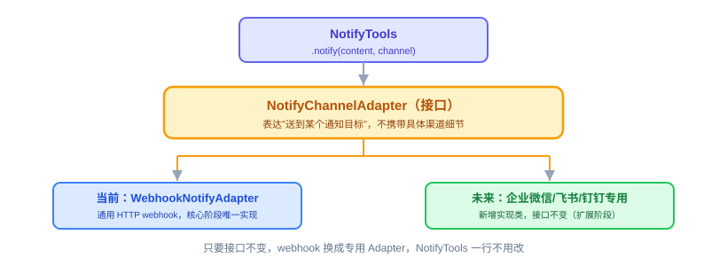

# Notify：原理解析、实现与代码讲解

CLI（18 节）给了 Agent 一个能亲手操作的入口，但目前这个入口只会“同步回话”——你问一句它答一句，答完就完了。定时模块（25 节）和日报 Agent 这类场景不一样：到点自动触发，没有人在等着看响应，Agent 必须**主动**把结果送到人能看到的地方。这节讲四件事：Notify 是什么、动手前该想清楚什么、代码怎么写、怎么用和怎么验。

---

## 一、Notify 是什么，干嘛用的

一句话：**入站有 Channel 负责“消息怎么进来”，Notify 补的是对称的另一半——“结果怎么主动送出去”。**

CLI 和 Web Service 都是“人推”：有人发起一次调用，Agent 处理完直接把响应返回给发起者，走的是同一条请求—响应链路，不需要额外的推送机制。但一旦触发源变成“到点自动”（定时查天气、每天汇总科技新闻），这条链路就断了——没有人在另一端等着接收响应，Agent 必须自己决定把结果送到哪、怎么送。


**如果没有这个模块会怎样。** 每个业务方定义 Agent 时都要自己在 Skill 里手写“调 `http_post` 打这个 webhook URL”，或者自己找一个企业微信/飞书的 MCP server 配上——每个 Skill 各写一份，重复且不统一。`notify` 内置 Tool 就是要把“往外推一条消息”这件最常见的事统一掉——这也是后面 Memory（21、22 节）、Sandbox（23、24 节）会反复用到的“边界先行”设计习惯的第一次亮相。

---

## 二、动手前先想清楚几件事

**第一，先定意图边界，别先绑定某家渠道。** Tool 表达的是“把一条内容送到某个通知目标”，元数据和执行入口遵守 OryxOS `InvokableTool`；真正发送的组件只接收中立的 `NotifyTarget`，不在接口里出现“企业微信”“飞书”这类某一档实现特有的词。核心阶段只挂通用 Webhook，以后加专用渠道时替换发送实现，不改 `notify(content, channel?)` 的 Tool 契约。

**第二，核心阶段只做通用 Webhook，不逐家接专用 API。** 企业微信、飞书、钉钉的群机器人都提供 Webhook 地址，核心阶段用一个通用的 Webhook sender 覆盖最短链路，不接每家的签名算法、AccessToken 刷新或专用 SDK——那些留给扩展阶段按需要再加。

**第三，安全校验先占位，具体怎么做留给 Sandbox 那节。** `notify` 发出去的是一次 HTTP 请求，必须跟 `http_post` 一样经过 scheme 和域名白名单，而且每次重定向后都重新校验目标。白名单具体实现是第 23、24 节 Sandbox 模块的内容——这里先依赖 `Sandbox.ValidateURL` 这道统一边界，不能另写一套，也不能因为它是“往外推”就绕过去。

**第四，具体推到哪，配置在 Profile，不暴露在对话里。** Webhook URL 是运行时配置，不是模型需要知道的信息。LLM 调用时大多数情况只传 `content` 就够了，`channel` 是可选参数，对应 Profile 中按名称唯一的 `notify_channels`。

渠道选择规则必须完全确定：

- 没有配置通知渠道：返回配置错误，不发送。
- 只有一个渠道：`channel` 可以省略，自动选唯一渠道。
- 有多个渠道：必须传 `channel`，按 `notify_channels[].name` 精确匹配。
- 名称不存在或重复：返回配置错误；核心阶段不广播。

想清楚就这几句：Tool 契约表达意图，不表达厂商实现；核心阶段只填通用 Webhook 这一档；安全校验和审计走统一机制；具体推到哪是 Profile 配置，不是对话内容。

> **实现顺序说明（授课顺序 ≠ 构建顺序）**：本节的目标选择与 Webhook 发送逻辑可以立即实现、独立单测；但 `notify` 作为 OryxOS `InvokableTool` 注册到 `ToolRegistry` 依赖第 20 节，完整 Sandbox 接线依赖第 24 节。因此本节先把边界和行为钉死，第 20 节完成 Tool 注册，第 24 节完成真实安全校验，27/28 节串联时做全量验证。Go 版本不使用 Java `ThreadLocal ProfileContext`；ProfileRuntime 组装时把当前 Profile 的不可变通知配置绑定到该 Profile 专属的 `NotifyTool` 实例中。

---

## 三、代码怎么写

**通知发送边界。** Go 接口只保留调用方真正依赖的一个动作：

```go
type NotifySender interface {
	Send(ctx context.Context, target NotifyTarget, content string) error
}

type NotifyTarget struct {
	Name string
	Type string
	URL  string
}
```

`NotifyTarget` 对应 Profile 中已经完成环境变量展开和严格校验的 `name/type/url`。URL 只用于实际发送和安全校验，不能写入模型 Prompt、普通日志或错误响应；日志需要标识目标时只记 `Name` 和 `Type`。

**WebhookSender（核心阶段唯一实现）。**

```go
type WebhookSender struct {
	client  *http.Client
	sandbox Sandbox
}

func (s *WebhookSender) Send(ctx context.Context, target NotifyTarget, content string) error {
	u, err := url.Parse(target.URL)
	if err != nil {
		return fmt.Errorf("parse notify target %q: %w", target.Name, err)
	}
	if err := s.sandbox.ValidateURL(u); err != nil {
		return err
	}

	body, err := json.Marshal(map[string]string{"content": content})
	if err != nil {
		return fmt.Errorf("encode notify payload: %w", err)
	}
	req, err := http.NewRequestWithContext(ctx, http.MethodPost, u.String(), bytes.NewReader(body))
	if err != nil {
		return fmt.Errorf("create notify request: %w", err)
	}
	req.Header.Set("Content-Type", "application/json")

	resp, err := s.client.Do(req)
	if err != nil {
		return sanitizeNotifyError(target.Name, err) // 保留错误类别，不泄漏 URL/认证信息
	}
	defer resp.Body.Close()
	if resp.StatusCode < 200 || resp.StatusCode >= 300 {
		return fmt.Errorf("notify webhook returned status %d", resp.StatusCode)
	}
	return nil
}
```

这段代码只展示核心顺序。正式实现还必须给 `http.Client` 设置超时、请求体与响应体大小限制，并通过 `CheckRedirect` 对每次重定向目标重新执行 `ValidateURL`；不能用默认 Client 绕过重定向检查。

**NotifyTool（九个内置 Tool 之一）。** 它实现 OryxOS `InvokableTool`：`Info(ctx)` 提供名为 `notify` 的 `llm.ToolDefinition`，`Invoke` 接收 JSON 参数并返回给模型看的字符串结果。下面省略 `Info` 的 schema 构造，只展开最关键的选择与调用逻辑：

```go
type notifyInput struct {
	Content string `json:"content"`
	Channel string `json:"channel,omitempty"`
}

type NotifyTool struct {
	channels []profile.NotifyChannelConfig // 当前 Profile 的不可变副本
	sender   NotifySender
}

func (t *NotifyTool) Invoke(
	ctx context.Context,
	argumentsInJSON string,
) (string, error) {
	var input notifyInput
	if err := json.Unmarshal([]byte(argumentsInJSON), &input); err != nil {
		return "", fmt.Errorf("decode notify arguments: %w", err)
	}
	if strings.TrimSpace(input.Content) == "" {
		return "", fmt.Errorf("notify content is required")
	}

	target, err := resolveNotifyTarget(t.channels, input.Channel)
	if err != nil {
		return "", err
	}
	if err := t.sender.Send(ctx, target, input.Content); err != nil {
		return "", err
	}
	return "已推送", nil
}
```

一行行看关键的三步：`json.Unmarshal` 只解析模型允许提供的 `content/channel`，Webhook URL 不在 Tool schema 里；`resolveNotifyTarget` 严格执行无渠道、单渠道、多渠道的选择规则；`sender.Send` 内先过 Sandbox，再发 HTTP。`notify` 默认非幂等，`OryxTool.Idempotent=false`，因此即使网络错误看起来可重试，`ToolExecutor` 也不能自动重发，避免同一消息重复推送。



调用成功或失败都由统一 `ToolExecutor` 写一条 `tool_invocations`，而不是由 `NotifyTool` 自己另写审计链路。记录中的输入和错误必须脱敏，绝不能把 Webhook URL 或认证信息写进 `input_json`、`result_json`、`error_message` 或日志。

**Profile 配置示例：**

```yaml
notify_channels:
  - name: team
    type: webhook
    url: ${TEAM_WEBHOOK_URL}
```

ProfileLoader 在启动时展开 `${TEAM_WEBHOOK_URL}` 并严格校验 `name/type/url`；同一 Profile 内名称必须唯一。配置修改核心阶段重启生效，不做热重载。

**本节交付物**（Spec-Kit 拆解锚点）：

- 代码：`internal/tool/builtin` 下的 `NotifyTool`、目标选择逻辑和通用 `WebhookSender`；完整注册接入第 20 节，Sandbox 实现接入第 24 节
- 测试：目标选择测试、`webhook_sender_test.go`、`notify_test.go`（见验收 harness；依赖 Tool/Sandbox 的部分在对应课程完成后补跑）
- 配置：Profile 的 `notify_channels` 条目固定为 `name/type/url`，URL 推荐使用环境变量占位
- 约定：核心阶段只支持通用 Webhook；不广播；默认非幂等且不自动重试；成功失败统一写 `tool_invocations`

---

## 四、验收 harness：把验收标准变成可执行的测试

跟“实现顺序说明”对应，harness 也分两批。

**第一批（本节立即可跑）——目标选择和 `WebhookSender`。** 使用 `httptest.Server` 在本地起一个假 Webhook（不算外网依赖，仍是单测层）：发送后断言收到的 POST body 里带 `content`、URL 来自目标配置而不是硬编码；服务返回 5xx 时错误向上返回、不静默吞掉；超时可取消；重定向到白名单外地址时再次校验并拦截。

**第二批（第 20/24 节接线后补跑）——`NotifyTool` 与统一执行器。**

| 测试点 | 守住的验收项 |
|---|---|
| `notify_channels` 未配置 → 明确报错 | Agent 不会误以为消息已经发出 |
| 单渠道且 `channel` 省略 → 选唯一渠道 | 大多数场景只传 `content` 即可 |
| 多渠道且 `channel` 省略 → 明确报错 | 不猜默认值、不广播 |
| 多渠道按唯一名称精确匹配 | 不会把消息推错渠道 |
| Sandbox 校验先于 HTTP 请求 | “主动推送”不能绕过白名单 |
| 发送失败仍写 `success=false` | 失败调用可追溯且错误已脱敏 |
| 可重试错误也只发送一次 | `notify` 非幂等，不自动重试 |

顺序断言这条最关键，可以用记录调用顺序的 fake 钉死：

```go
func TestWebhookSenderValidatesBeforeSending(t *testing.T) {
	events := []string{}
	sandbox := &fakeSandbox{onValidate: func() { events = append(events, "validate") }}
	transport := roundTripFunc(func(*http.Request) (*http.Response, error) {
		events = append(events, "send")
		return okResponse(), nil
	})
	sender := newTestWebhookSender(sandbox, transport)

	if err := sender.Send(context.Background(), target, "hello"); err != nil {
		t.Fatal(err)
	}
	if !slices.Equal(events, []string{"validate", "send"}) {
		t.Fatalf("unexpected call order: %v", events)
	}
}
```

---

## 五、怎么用，做完怎么验

配好 `notify_channels` 之后，Agent 在 ReAct 中自己决定要不要调用，不需要业务方把 URL 写进 Skill：

```text
用户：每天早上帮我看看天气，穿搭建议直接发到我们群里
Agent：好的（之后每天到点自动查天气 → 调 notify 推送到 Profile 配置的群）
```

也可以在对话里直接测试：

```text
用户：把“测试消息”推送一下
Agent：（调用 notify(content="测试消息")）已推送
```

harness 全绿后，剩下的人工确认：

- `notify` 调用真的能把消息送到配置好的真实 Webhook，群里收到；本地假 Webhook 只验证协议和调用顺序，真实 Webhook 验证外部配置。
- 模型只看见 `content/channel` schema，看不见 URL；日志、错误和 `tool_invocations` 中没有泄漏完整 Webhook 地址或认证信息。
- 无渠道、单渠道、多渠道选择规则逐项符合约定，核心阶段不会广播。
- Sandbox 对初始 URL 和每次重定向都生效，发送失败不会自动重试，却仍写 `success=false` 调用记录。
- 交付前运行 `go test ./...`、`go vet ./...` 和 `CGO_ENABLED=0 go build ./cmd/oryxos`。

Notify 补上的是“Agent 说完话还能主动送出去”这个出口。有了它，第 25 节的定时模块和第 31 节的天气、日报 Agent 才有地方把结果真正交出去，不然到点跑完一整套 ReAct 循环，结果却只能留在 Session 里没人看到。
