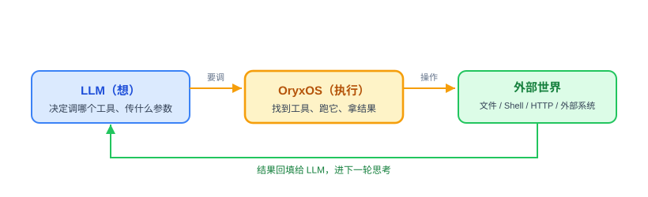
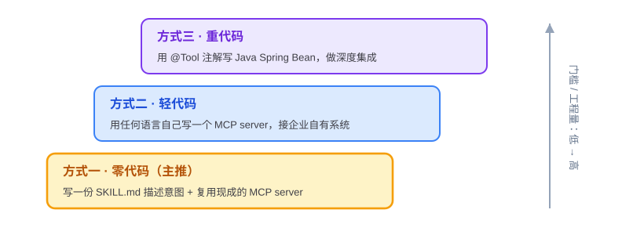
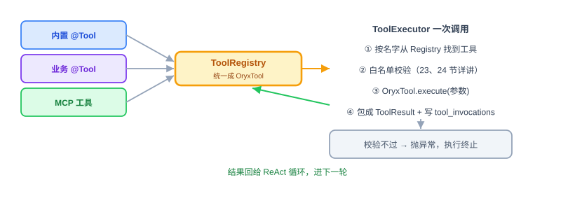

# Tool 体系：原理解析、实现与代码讲解

Provider 让 Agent 会调模型，ReAct 让它会思考，但到现在它还只会“想”和“说”。这节讲的 Tool，是让 Agent 真正能动手干事的那双手。四件事照旧：Tool 是什么、动手前该想清楚什么、代码怎么写、怎么用和怎么验。

技术栈是 Go 1.26 + Eino core 的 Tool 接口 + 官方 MCP Go SDK `github.com/modelcontextprotocol/go-sdk/mcp`。下面的代码是示意；第三方构造函数和类型必须在实现前用 `go.mod`、模块缓存和 `go doc` 核实，不能根据示例臆造。

---

## 一、Tool 是什么，干嘛用的

一句话：**Tool 就是 Agent 的手——LLM 负责想，Tool 负责真的去读文件、跑命令、调接口。**

大模型本身只会生成内容，它读不了你磁盘上的文件，也发不出一个 HTTP 请求。想让 Agent 真的干活，就得给它一批能操作外部世界的工具。**LLM 决定“调哪个工具、传什么参数”（靠第 16 节说过的 Function Calling），OryxOS 负责把这个工具真正执行掉、再把结果递回给 LLM。** 这正是 ReAct 循环里 Act 那一步干的事。



OryxOS 的 Tool 分两类：

- **内置 Tool**：OryxOS 自带的基础工具，核心阶段严格固定为九个——`read_file` / `write_file` / `list_dir`（文件，3 个）、`shell`（命令，1 个）、`http_get` / `http_post`（HTTP，2 个）、`save_memory` / `recall_memory`（Memory，2 个），再加第 19 节的 `notify`（通知，1 个）。它们覆盖“读写文件、跑命令、调 API、记事、主动通知”这条最短链路。
- **Plugin Tool**：业务方扩展的工具。企业要做运维助手、客服助手，靠的就是它——OryxOS 本身只给基础工具，真正的业务能力由业务方通过 Skill、MCP 或编译进二进制的 Go Tool 接进来。

这一节的重点，就在所有 Tool 如何进入同一个 Registry/Executor，以及 Plugin Tool 怎么设计。

---

## 二、动手前先想清楚几件事

**第一，先定统一的工具抽象，屏蔽“来源”。** 内置的、业务方用 Go 编译进来的、通过 MCP server 接进来的，来源五花八门。如果 ReAct 循环要分来源区别对待，代码会很快乱掉。所以所有可执行 Tool 最终都要实现 Eino `tool.InvokableTool`，再包装成 `OryxTool` 注册到同一个 `ToolRegistry`。**ReAct 循环只把模型返回的 Tool Call 交给 `ToolExecutor`，完全不感知背后是内置 Tool、Go Tool 还是 MCP Tool。**

Eino v0.9.19 的真实边界要分清：`tool.BaseTool.Info(ctx)` 只提供 `*schema.ToolInfo` 元数据；只有嵌入 `BaseTool` 并实现 `InvokableRun` 的 `tool.InvokableTool` 才能执行。只实现 `BaseTool` 会出现“模型看得见 schema，但系统根本执行不了”的悬空工具。

**第二，Plugin Tool 给三档接入方式，门槛从低到高。**



| 方式 | 门槛 | 推荐度 | 实现 |
|---|---|---|---|
| 写 SKILL.md + 复用 MCP server | 零代码 | ⭐⭐⭐ | Profile 引用 Skill 和 MCP server，LLM 自己组合能力 |
| 自己实现 MCP server | 轻代码 | ⭐⭐ | 任意语言实现，OryxOS 使用官方 Go SDK 作为 MCP client |
| 编写 Go Tool | 重代码 | ⭐ | 实现 Eino `tool.InvokableTool`，编译进 OryxOS 二进制 |

选择标准就一句话：**能用方式一就不用方式二，能用方式二就不用方式三。** 方式一让业务方只描述“想干什么”，具体调哪个 Tool、怎么组合交给 LLM。Skill 是 Prompt 上下文，不是 Tool，不能注册进 `ToolRegistry`。

**第三，所有 Tool 执行都走统一的安全和记录链路。** Tool 能读文件、跑命令、发请求，一旦被乱调就是事故。核心阶段由 `ToolExecutor` 统一做参数 schema 校验、当前 Profile 可用列表校验、Sandbox、超时、有限重试和 `tool_invocations` 记录。具体 Tool 内部仍要在外部副作用发生前调用对应 Sandbox 能力，但不能各写一套白名单逻辑。

**第四，副作用决定能不能重试。** 只有错误明确可重试，并且 Tool 本身幂等或本次调用带可靠幂等键时，`ToolExecutor` 才能指数退避、最多重试三次。`write_file`、`shell`、`http_post`、`notify`、`save_memory` 默认不重试，避免重复写入、执行或推送。

想清楚就这几句：统一使用 `InvokableTool + OryxTool`；Plugin 给三档接入；所有执行经过 Registry/Executor/Sandbox/审计；重试同时受错误可重试性和幂等性约束。

---

## 三、代码怎么写

Tool 相关代码按职责放在 `internal/tool`：内置 Tool 在 `internal/tool/builtin`，MCP 适配在 `internal/tool/mcp`，Registry 和 Executor 留在包根。外部 MCP SDK 只能出现在 MCP 适配层，Runtime 不直接依赖它。

**先看统一包装 OryxTool。** Eino 接口提供元数据和执行能力，OryxOS 包装运行策略：

```go
type OryxTool struct {
	Tool       tool.InvokableTool
	Retryable  bool
	Idempotent bool
	Timeout    time.Duration
}
```

- `Tool.Info(ctx)` 返回名称、描述和 JSON 参数 schema，Provider 用它生成 Function Calling 定义。
- `Tool.InvokableRun(ctx, argumentsInJSON, opts...)` 执行一次调用，参数是模型返回的 JSON 字符串，结果是回填给模型的字符串。
- `Retryable` 表示该工具是否允许对明确的瞬时错误进入重试判定，不代表所有错误都重试。
- `Idempotent` 表示重复执行是否安全；有副作用的 Tool 默认是 `false`。
- `Timeout` 是每次工具执行的硬上限，不能无限占住 ReAct 循环。

**ToolRegistry 负责注册和按 Profile 过滤。** 注册时先调用 `Info(ctx)` 取得名称并验证非空，发现重名立即报错，不能后注册覆盖前注册。ProfileRuntime 组装时，根据 Profile 的 `tools` 和 `mcp_servers` 解析出精确可用集合；模型能看到的 schema 和 Executor 能调用的 Tool 必须来自同一集合，不能出现“模型看得到但执行器拒绝”或“执行器允许但模型没声明”的漂移。

```go
type Registry struct {
	tools map[string]OryxTool
}

func (r *Registry) Register(ctx context.Context, candidate OryxTool) error {
	if candidate.Tool == nil {
		return fmt.Errorf("register tool: invokable tool is nil")
	}
	info, err := candidate.Tool.Info(ctx)
	if err != nil {
		return fmt.Errorf("read tool info: %w", err)
	}
	if info == nil || strings.TrimSpace(info.Name) == "" {
		return fmt.Errorf("register tool: name is required")
	}
	if _, exists := r.tools[info.Name]; exists {
		return fmt.Errorf("register tool %q: duplicate name", info.Name)
	}
	r.tools[info.Name] = candidate
	return nil
}
```

**ToolExecutor 负责唯一执行入口。** 它接收 `context.Context`、`session_id`、当前 Profile 允许的 Tool 集合和模型 Tool Call，按以下顺序执行：

1. 按名称精确查找，确认当前 Profile 允许使用；
2. 按 `ToolInfo` 的 JSON schema 校验参数；
3. 创建带 `OryxTool.Timeout` 的子 Context；
4. 进入具体 Tool，由 Tool 在副作用前调用统一 Sandbox；
5. 只在“错误明确可重试 + Tool 幂等/有幂等键”时最多重试三次；
6. 生成 Tool message，保留模型的 tool call ID；
7. 成功或失败都写一条最终 `tool_invocations`，每次实际尝试另写结构化日志。

数据库短事务只包调用记录写入，不能把外部 Tool 调用放在事务里。参数、结果和错误入库前统一做大小限制和脱敏。

**一个内置 Tool 长什么样。** 拿 `http_get` 举例，它必须实现 `Info` 和 `InvokableRun`：

```go
type HTTPGetTool struct {
	sandbox Sandbox
	client  *http.Client
}

func (t *HTTPGetTool) Info(ctx context.Context) (*schema.ToolInfo, error) {
	return httpGetToolInfo(), nil // name/description/params schema 均非空
}

func (t *HTTPGetTool) InvokableRun(
	ctx context.Context,
	argumentsInJSON string,
	_ ...tool.Option,
) (string, error) {
	var input struct {
		URL string `json:"url"`
	}
	if err := json.Unmarshal([]byte(argumentsInJSON), &input); err != nil {
		return "", fmt.Errorf("decode http_get arguments: %w", err)
	}
	target, err := url.Parse(input.URL)
	if err != nil {
		return "", fmt.Errorf("parse http_get URL: %w", err)
	}
	if err := t.sandbox.ValidateURL(target); err != nil { // 外部请求前先校验
		return "", err
	}
	return executeBoundedGET(ctx, t.client, target) // 超时、响应大小限制、重定向重检
}
```

这段示意里最重要的是执行顺序，不是辅助函数名字：参数先解析、URL 先校验、通过后才发请求；每次重定向还要重新校验。文件 Tool 要规范化路径并拒绝软链接逃逸；新文件校验最近存在父目录的真实路径；Shell 必须使用 executable + argv 调用，禁止拼接 Shell 字符串。

**MCP Tool 怎么接入。** `.oryxos/mcp_servers.yaml` 是 MCP 连接唯一来源：

```yaml
servers:
  - name: local-files
    transport: stdio
    command: local-files-mcp
    args: ["--root", "./data"]
    env:
      TOKEN: ${LOCAL_FILES_TOKEN}

  - name: company-api
    transport: remote
    url: https://mcp.example.com/mcp
    auth:
      bearer_token: ${COMPANY_MCP_TOKEN}
```

stdio 要求 `name/transport/command`，可选 `args/env`；remote 要求 `name/transport/url`，认证通过环境变量注入。Profile 的 `mcp_servers` 只引用名称，不复制连接细节。配置名称必须唯一，未知 transport、缺字段或缺环境变量在启动加载阶段明确失败并脱敏；配置修改重启生效。

`McpClientService` 使用官方 MCP Go SDK 为 Profile 引用的 server 建立或复用 client，调用 `tools/list`，再把每个 MCP Tool 包装成实现 `tool.InvokableTool` 的 `McpToolAdapter` 注册到同一个 Registry。进程关闭时统一释放 client。因为官方 SDK API 会随锁定版本变化，课件不臆造构造函数；实现前必须在加入 `go.mod` 的实际版本中核实 stdio、remote、`tools/list` 和 `tools/call` API。

```go
type McpToolAdapter struct {
	client MCPToolCaller // 对官方 SDK client 的窄内部端口
	info   *schema.ToolInfo
	name   string
}

func (a *McpToolAdapter) Info(context.Context) (*schema.ToolInfo, error) {
	return a.info, nil
}

func (a *McpToolAdapter) InvokableRun(
	ctx context.Context,
	argumentsInJSON string,
	_ ...tool.Option,
) (string, error) {
	return a.client.CallTool(ctx, a.name, argumentsInJSON)
}
```

关键就两条：**注册时**把 MCP 返回的名称、描述、输入 schema 无损映射到 Eino `ToolInfo`，并在重名时失败；**执行时**原样转发 JSON 参数，把结果归一化为 Tool message。MCP Tool 也必须经过当前 Profile 过滤、统一超时、Sandbox 策略和 `tool_invocations`，不能另开旁路。

实例级 MCP 配置非法时启动 fail-fast；某个已正确配置的外部 server 临时连接失败时记录脱敏 WARN、隔离该连接并让其他 server 继续初始化，引用它的 Profile 在使用相关 Tool 时得到明确不可用错误，不能静默换成别的 Tool。



**有几样先别做。** 完整 Tool Policy、工具过多时的按需/LRU 加载、把 OryxOS 自己作为 MCP server 对外暴露、容器/K8s/WASM 强隔离、一次模型响应里的多个 Tool Call 并行执行，都放扩展阶段。核心阶段只用 Profile 精确列表 + 应用层 Sandbox，并保持 Tool 串行执行。

**本节交付物**（Spec-Kit 拆解锚点）：

- 代码：`OryxTool`、`ToolRegistry`、`ToolExecutor`；`read_file` / `write_file` / `list_dir`、`shell`、`http_get` / `http_post`；官方 MCP Client 适配、`McpToolAdapter`；把第 19 节 `notify` 注册为 `InvokableTool`
- 测试：Tool 契约测试、Registry/Executor 测试、文件/Shell/HTTP Tool 测试、MCP 配置与适配测试（见验收 harness）
- 配置：`.oryxos/mcp_servers.yaml` 支持 stdio 和 remote；Profile 的 `tools` / `mcp_servers` 只做名称引用
- 说明：`save_memory` / `recall_memory` 的具体实现归第 22 节；Sandbox 完整实现归第 24 节，但本节必须把统一调用位置接好

---

## 四、验收 harness：把验收标准变成可执行的测试

Tool 体系的 harness 分四块，真实网络和真实 MCP server 不进入默认单测：

| 测试文件 | 覆盖的验收点 |
|---|---|
| `registry_test.go` | 注册的每个 Tool 都是 `tool.InvokableTool`；`Info` 的 name/description/params schema 非空；重名失败；按 Profile 过滤后集合不多不少 |
| `executor_test.go` | 名称和参数校验；多个 Tool Call 串行且顺序不变；超时/取消传播；成功失败均写审计；仅可重试且幂等时最多重试三次；非幂等 Tool 只执行一次 |
| `file_test.go` / `shell_test.go` / `http_test.go` | 每个 Tool 都覆盖“正常执行 + 越界拦截 + 输入/输出限制”；路径逃逸、Shell 字符串拼接、HTTP 重定向绕过都有回归测试 |
| `config_test.go` / `adapter_test.go` / `client_test.go` | stdio/remote 严格解析、环境变量脱敏；`tools/list` schema 映射；`tools/call` 参数原样转发；重名检测；一个 server 失联不影响其他合法连接 |

两个最值钱的测试：

```go
func TestEveryRegisteredToolHasExecutableContract(t *testing.T) {
	for _, registered := range registry.All() {
		if registered.Tool == nil {
			t.Fatal("registered tool is not invokable")
		}
		info, err := registered.Tool.Info(context.Background())
		if err != nil {
			t.Fatal(err)
		}
		if info == nil || info.Name == "" || info.Desc == "" || info.ParamsOneOf == nil {
			t.Fatalf("incomplete tool metadata: %#v", info)
		}
	}
}

func TestExecutorDoesNotRetryNonIdempotentTool(t *testing.T) {
	invokable := &fakeInvokableTool{err: retryableError()}
	executor := newTestExecutor(OryxTool{
		Tool: invokable, Retryable: true, Idempotent: false,
	})

	_, err := executor.Execute(ctx, sessionID, profile, toolCall)
	if err == nil {
		t.Fatal("expected error")
	}
	if invokable.callCount != 1 {
		t.Fatalf("expected one attempt, got %d", invokable.callCount)
	}
	assertFailedInvocationRecorded(t, recorder, sessionID)
}
```

按 Profile 过滤的测试有个“不多不少”的讲究：断言最终集合**恰好等于**声明和引用解析出的列表，多一个意味着越权，少一个意味着配置与模型 schema 不一致。

MCP 真实互操作另用 `//go:build integration` 测试显式运行，验证锁定版本的官方 SDK 能连一个真实 stdio 或 remote server；默认 CI 不依赖外部服务可用性。

---

## 五、怎么用，做完怎么验

给 Agent 加工具，对着三档来：

```text
方式一（零代码）：在 .oryxos/skills/ 写 SKILL.md，Profile 的 skills 引用它，
                  mcp_servers 引用要复用的 MCP server。
方式二（轻代码）：在 .oryxos/mcp_servers.yaml 声明自己实现的 MCP server，
                  OryxOS 作为 client 连接。
方式三（重代码）：用 Go 实现 Eino tool.InvokableTool，包装成 OryxTool 后编译注册。
```

工作区不创建 `tools/` 目录。Go Tool 由代码注册，MCP 连接只来自 `mcp_servers.yaml`，业务语义放在 SKILL.md。用 `oryxos tool list` 查看当前注册并对所选 Profile 可用的 Tool。

harness 全绿后，剩下的人工确认：

- 方式一真跑一次：写一份 SKILL.md，连接一个真实 MCP server，Agent 能理解意图并调用外部 Tool 完成任务。
- 方式三真跑一次：编译进二进制的 Go `InvokableTool` 在 `tool list` 可见，Agent 能调通。
- 用本地模块证据核实官方 MCP Go SDK 的实际版本和 API，并显式运行 MCP integration 测试。
- 九个内置 Tool 名称和数量最终严格不变；没有把 Skill/Bootstrap/Memory 包装成 Tool，也没有新增 `.oryxos/tools/`。
- Registry/Executor 统一执行、Profile 精确过滤、Sandbox 拦截、重试判定、成功失败调用记录均由 harness 覆盖。
- 交付前运行 `go test ./...`、`go vet ./...` 和 `CGO_ENABLED=0 go build ./cmd/oryxos`。

Tool 是 Agent“能干事”的关键。到这一步，配合 Provider、ReAct、CLI，Demo 一（每日天气）的对话版里那个“真的去查天气”的动作，就落地了；第 22 节补齐 Memory Tool、第 24 节补齐 Sandbox 后，九个内置 Tool 的核心链路完整闭合。
